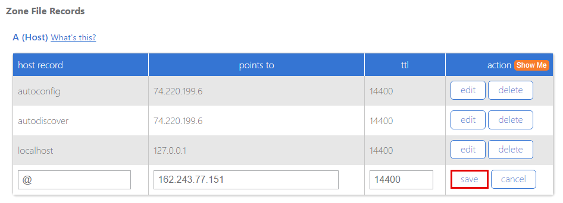
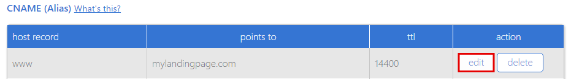
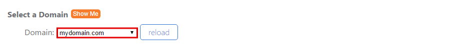

=====================
Set up your domain with BlueHost.com
=====================

If you purchased a domain from BlueHost, you can use it for your BitBlox Landing Page by following a process called domain/ subdomain mapping. In this process, you'll change a few settings in your BlueHost account to tell the domain/ subdomain where to point.

		
.. contents::
    :local:
    :backlinks: top

	
Set up your domain with BlueHost
------

1. `Log in to your BlueHost account <https://www.bluehost.com/>`__ 
2. In **Main Menu** click **zone editor**

	.. class:: screenshot

		|bluehost-click-zone-editor|
		

3. In the **Select a Domain** section,from the drop down menu click on the domain you want to update

	.. class:: screenshot

		|bluehost-select-domain|

4. Click **reload** button

5. In the **A (Host)** table, click **edit** in the **@** row 

    .. class:: screenshot

		|bluehost-edit-a-record|

6. Change the **points to** field to BitBlox's IP ``162.243.77.151`` 
7. Click **save**

    .. class:: screenshot

		|bluehost-save-a-record|
		

8. In the **CNAME (Alias)** table, click **edit** in the **www** row:

	.. class:: screenshot

		|bluehost-edit-cname-record|

9. In the **points to** field enter your domain name(ex: ``my-landing-page.com``)
10. Click **save**

	.. class:: screenshot

		|bluehost-save-cname-record|
		
11. Claim your custom domain in BitBlox [LINK]

    .. note::

		After you've claimed your domain, it can take up to 48 hours for changes to take effect. If it takes more than 48 hours, you should contact your custom domain provider.

		

Set up your subdomain with BlueHost
------

1. `Log in to your BlueHost account <https://www.bluehost.com>`__ 
2. In **Main Menu** click **zone editor**

	.. class:: screenshot

		|bluehost-click-zone-editor|

3. In the **Select a Domain** section,from the drop down menu click on the domain you want to update

	.. class:: screenshot

		|bluehost-select-subdomain|

4. In the **A (Host)** table, click **edit** in the **@** row 

	.. class:: screenshot

		|bluehost-edit-a-subdomain|

		
5. In the **host record** column, enter your subdomain prefix (if you picked ``promo.mydomain.com`` as your sudomain, enter ``promo``)
6. In the **points to** column enter BitBlox's IP ``162.243.77.151`` 
7. Click **save**

	.. class:: screenshot

		|bluehost-a-record-save-subdomain|	

		
8. Claim your custom domain in BitBlox [LINK]

    .. note::

	After you've claimed your domain, it can take up to 48 hours for changes to take effect. If it takes more than 48 hours, you should contact your custom domain provider.
		

Getting more help
------

For more help with settings in your Bluehost account, contact their `support team <https://my.bluehost.com/hosting/help>`__ . 

.. |bluehost-click-zone-editor| image:: _images/bluehost-click-zone-editor.png
.. |bluehost-select-domain| image:: _images/bluehost-select-domain.png
.. |bluehost-edit-a-record| image:: _images/bluehost-edit-a-record.png

.. |bluehost-save-cname-record| image:: _images/bluehost-save-cname-record.png

.. |bluehost-edit-a-subdomain| image:: _images/bluehost-edit-a-subdomain.png
.. |bluehost-a-record-save-subdomain| image:: _images/bluehost-a-record-save-subdomain.png

