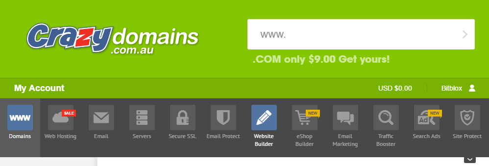

========
Set up your domain with Crazy Domains
========

If you purchased a domain from Crazy Domains, you can use it for your BitBlox Landing Page by following a process called domain/ subdomain mapping. In this process, you'll change a few settings in your Crazy Domains account to tell the domain/ subdomain where to point.

		
.. contents::
    :local:
    :backlinks: top

	
Set up your domain with Crazy Domains 
------

1. `Log in to your Crazy Domains account <https://www.crazydomains.com/>`__ 
2.  In the Main Menu, click **Zone Editor**:

	.. class:: screenshot

		|crazydomains-click-domains|
		

3. Click the **Settings** icon, and select **Manage DNS**

	.. class:: screenshot

		|godad|

4. In the **Record** section, click the **Edit Record** icon for the **A** record  

	.. class:: screenshot

		|godaddy-edit-a-record|

		
5. Enter BitBlox's IP address ``162.243.77.151`` in the **Points to** text box, then click **Save** 
 
    .. class:: screenshot
	
	    |godaddy-enter-ip|

6. Click the **Edit Record** icon in the row of the **www** host 

	.. class:: screenshot

		|godaddy-edit-cname|

		
7. Enter your domain name (ex: ``my-landing-page.com``) in the **Points to** text box, then click **Save**

	.. class:: screenshot

		|godaddy-enter-www|

		
8. Claim your custom domain in BitBlox [LINK]

    .. note::

		After you've claimed your domain, it can take up to 48 hours for changes to take effect. If it takes more than 48 hours, you should contact your custom domain provider.

		

Set up your subdomain with GoDaddy
------

1. `Log in to your GoDaddy account <https://sso.godaddy.com/?realm=idp&app=mya&path=?ci=>`__ 
2. In the **Domains** section, click **Manage**

	.. class:: screenshot

		|godaddy-click-manage|
		

3. Scroll dowmn to **DNS Settings**, and select **Add Record** from the menu  

	.. class:: screenshot

		|godaddy-manage-dns-subdomain|

4. Click the **ADD** icon

	.. class:: screenshot

		|godaddy-add-new-record-subdomain|

		
5. In the **Type** column, use the drop-down menu to select **A Record** 
6. Enter your subdomain prefix (if you picked ``promo.mydomain.com`` as your sudomain, enter ``promo``) in the **Host** text box, and BitBlox's IP ``162.243.77.151`` in the **Points To** text box, then click **Save**

	.. class:: screenshot

		|godaddy-enter-subdomain|	

		
7. Claim your custom domain in BitBlox [LINK]

.. note::

	After you've claimed your domain, it can take up to 48 hours for changes to take effect. If it takes more than 48 hours, you should contact your custom domain provider.
		

Getting more help
------

For more help with settings in your Namecheap account, contact their `support team <https://www.namecheap.com/support.aspx>`__ . 

.. |godaddy-click-manage| image:: _images/godaddy-click-manage.png 
.. |godaddy-manage-dns| image:: _images/godaddy-manage-dns.png
.. |godaddy-edit-a-record| image:: _images/godaddy-edit-a-record.png
.. |godaddy-enter-ip| image:: _images/godaddy-enter-ip.png
.. |godaddy-edit-cname| image:: _images/godaddy-edit-cname.png
.. |godaddy-enter-www| image:: _images/godaddy-enter-www.png
.. |godaddy-manage-dns-subdomain| image:: _images/godaddy-manage-dns-subdomain.png 
.. |godaddy-add-new-record-subdomain| image:: _images/godaddy-add-new-record-subdomain.png
.. |godaddy-enter-subdomain| image:: _images/godaddy-enter-subdomain.png