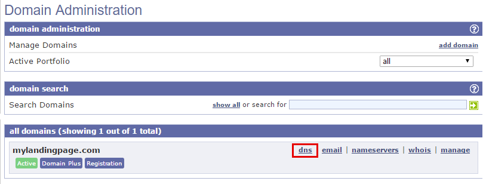
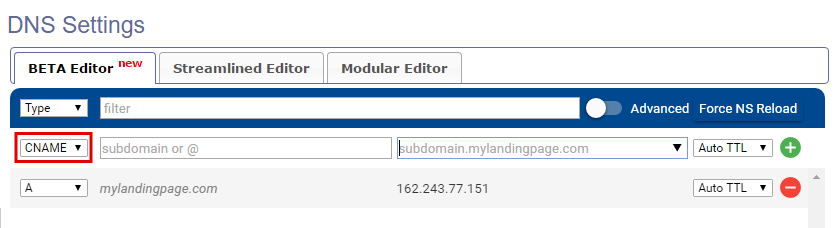
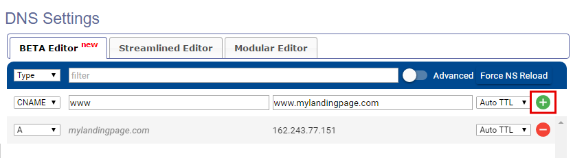
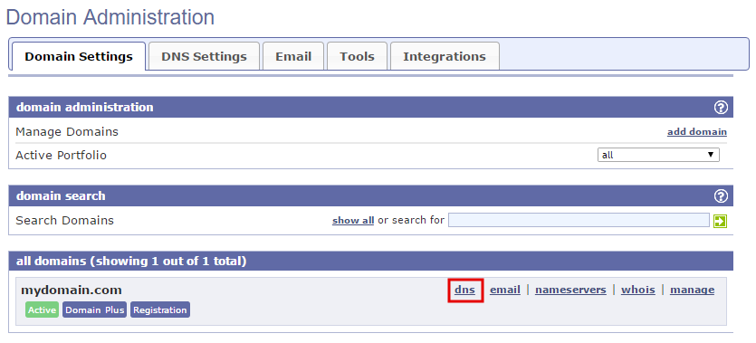

========
Set up your domain with EasyDns
========

If you purchased a domain from EasyDns, you can use it for your BitBlox Landing Page by following a process called domain/ subdomain mapping. In this process, you'll change a few settings in your EasyDNS account to tell the domain/ subdomain where to point.

		
.. contents::
    :local:
    :backlinks: top

	
Set up your domain with EasyDNS
------

1. `Log in to your EasyDNS account <https://cp.easydns.com/login.php>`__ 
2. Click **DNS** next to your domain name:

	.. class:: screenshot

		|easydns-open-domain|
		

3. In the **Type** drop-down menu, select **A** Record

	.. class:: screenshot

		|easydns-select-a-record|

4. In the **subdomain or @** box enter **@**
5. In the **IPv4 address** box enter BitBlox's IP ``162.243.77.151``
6. Click **+** icon

	.. class:: screenshot

		|easydns-save-a-record|

7. In the **Type** drop-down menu, select **CNAME** Record 

    .. class:: screenshot

		|easydns-select-cname-record|
		
		
8. In the **subdomain or @** box enter **www**
9. In the **subdomain.mylandingpage.com** box, enter **www.mylandingpage.com**
10. Click **+** icon

	.. class:: screenshot

		|easydns-save-cname-record|

	
		
11. Claim your custom domain in BitBlox [LINK]

    .. note::

		After you've claimed your domain, it can take up to 48 hours for changes to take effect. If it takes more than 48 hours, you should contact your custom domain provider.

		

Set up your subdomain with EasyDNS
------

1. `Log in to your EasyDNS account <https://cp.easydns.com/login.php>`__
2. Click **DNS** next to your domain name:

	.. class:: screenshot

		|easydns-open-subdomain|
		

3. In the **Type** drop-down menu, select **A** Record

	.. class:: screenshot

		|easydns-select-a-record-subdomain|

4. In the **subdomain or @** box enter your subdomain prefix, (if you picked ``promo.mydomain.com`` as your sudomain, enter ``promo``)
5. In the **IPv4 address** box enter BitBlox's IP ``162.243.77.151``

6. Click **+** icon

	.. class:: screenshot

		|easydns-save-a-record-subdomain|

		
7. Claim your custom domain in BitBlox [LINK]

.. note::

	After you've claimed your domain, it can take up to 48 hours for changes to take effect. If it takes more than 48 hours, you should contact your custom domain provider.
		

Getting more help
------

For more help with settings in your EasyDNS account, contact their `support team <https://www.easydns.com/support-3/>`__ . 

.. |easydns-select-a-record| image:: _images/easydns-select-a-record.png
.. |easydns-save-a-record| image:: _images/easydns-save-a-record.png

.. |easydns-select-a-record-subdomain| image:: _images/easydns-select-a-record-subdomain.png
.. |easydns-save-a-record-subdomain| image:: _images/easydns-save-a-record-subdomain.png

