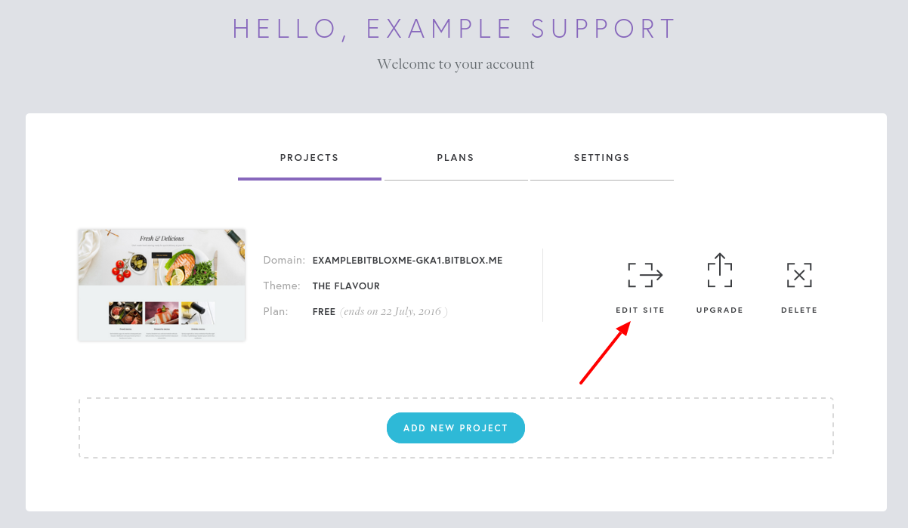
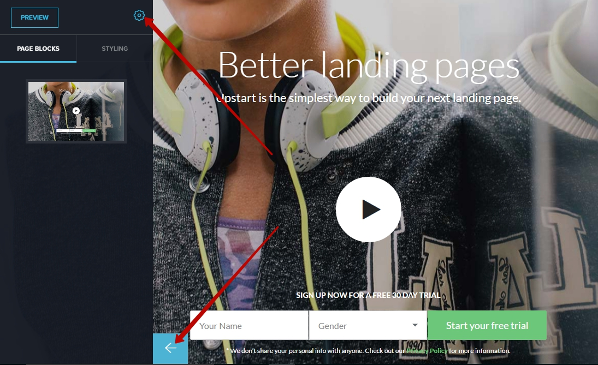
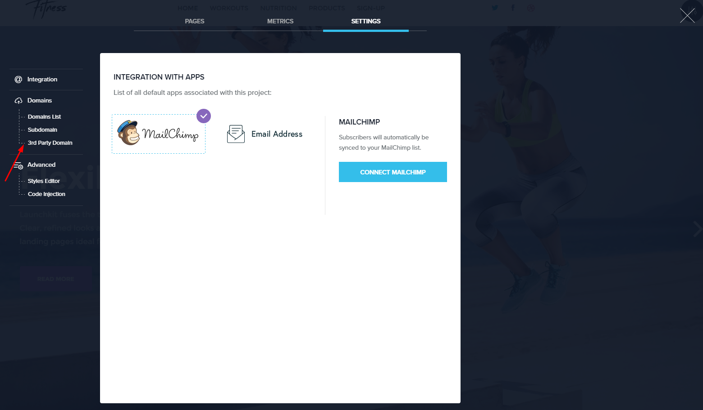
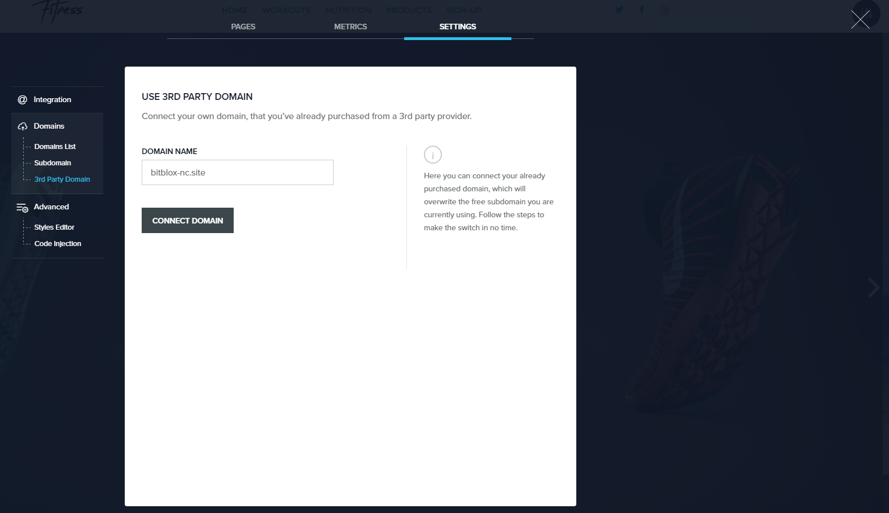
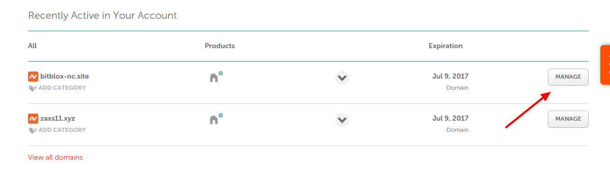
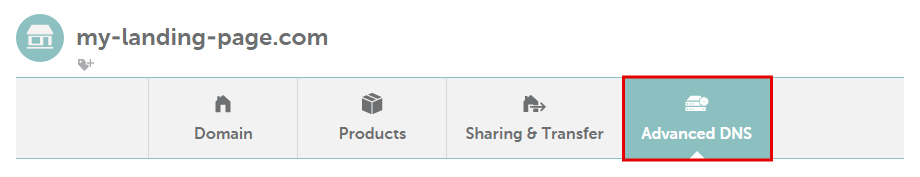
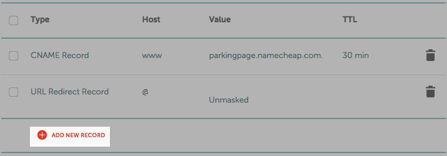
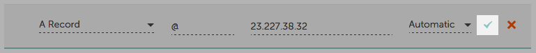
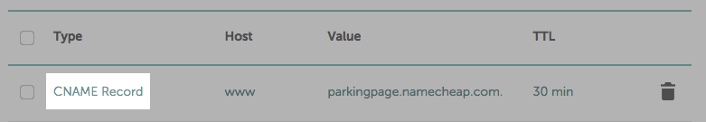
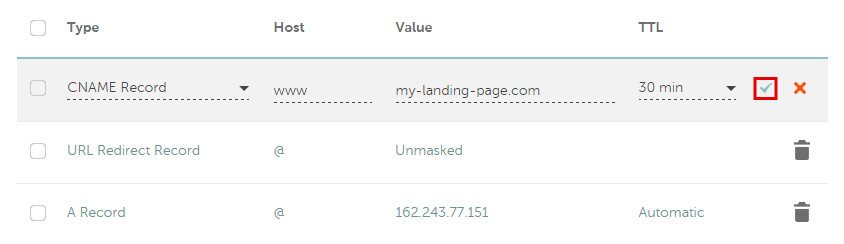

========
Namecheap
========

========
Set up your domain or subdomain with Namecheap
========

If you purchased a domain from Namecheap, you can use it for your BitBlox Landing Page by following a process called domain/ subdomain mapping. In this process, you'll change a few settings in your Namecheap account to tell the domain/ subdomain where to point.

		
.. contents::
    :local:
    :backlinks: top

	
Set up your domain with Namecheap
------

To set up your domain with Namecheap:

1. `Log in to your Namecheap account <https://namecheap.com/myaccount/login.aspx>`__ 
2. Click **Manage** next to your domain name:

	.. class:: screenshot

		|namecheap-manage-dns|
		

3. On the domain **Details** page, click **Advanced DNS**

	.. class:: screenshot

		|namecheap-dns-panel|

4. Click **Add new record** 

	.. class:: screenshot

		|namecheap-add-new-record|

		
5. In the **Type** column, use the drop-down menu to select **A Record** 
6. Enter ``@`` in the **Host** text box, and BitBlox's IP ``162.243.77.151``  in the **Value** text box
7. Click the **Save Changes** icon: 

	.. class:: screenshot

		|namecheap-a-record-save|

8. In the **Type** column, click **CNAME Record**:

	.. class:: screenshot

		|namecheap-edit-cname|

10. Enter your domain address (ex: ``my-landing-page.com``) in the **Value** text box
11. Click the **Save Changes** icon:

	.. class:: screenshot

		|namecheap-cname-record-save|
		
12. Claim your custom domain in BitBlox [LINK]

    .. note::

		After you've claimed your domain, it can take up to 48 hours for changes to take effect. If it takes more than 48 hours, you should contact your custom domain provider.

		

Set up your subdomain with Namecheap
------

To set up your subdomain with Namecheap:

1. `Log in to your Namecheap account <https://namecheap.com/myaccount/login.aspx>`__ 
2. Click **Manage** next to your domain name:

	.. class:: screenshot

		|namecheap-manage-dns|
		

3. On the domain **Details** page, click **Advanced DNS**

	.. class:: screenshot

		|namecheap-dns-panel|

4. Click **Add new record** 

	.. class:: screenshot

		|namecheap-add-new-record|

		
5. In the **Type** column, use the drop-down menu to select **A Record** 
6. Enter your subdomain prefix (if you picked ``promo.mydomain.com`` as your sudomain, enter ``promo``) in the **Host** text box, and BitBlox's IP ``162.243.77.151`` in the **Value** text box
7. Click the **Save Changes** icon: 

	.. class:: screenshot

		|namecheap-a-record-save|	

		
12. Claim your custom domain in BitBlox [LINK]

    .. note::

		After you've claimed your domain, it can take up to 48 hours for changes to take effect. If it takes more than 48 hours, you should contact your custom domain provider.
		

Getting more help
------

For more help with settings in your Namecheap account, contact their `support team <https://www.namecheap.com/support.aspx>`__ . 

.. |namecheap-dns-settings| image:: _images/namecheap-dns-settings.png

