========
Set up your domain with Namecheap
========

If you purchased a domain from Namecheap, you can use it for your BitBlox Landing Page by following a process called domain/ subdomain mapping. In this process, you'll change a few settings in your Namecheap account to tell the domain/ subdomain where to point.

		
.. contents::
    :local:
    :backlinks: top

	
Set up your domain with Namecheap
------

1. `Log in to your Namecheap account <https://namecheap.com/myaccount/login.aspx>`__ 
2. Click **Manage** next to your domain name:

	.. class:: screenshot

		|namecheap-manage-dns|
		

3. On the domain **Details** page, click **Advanced DNS**

	.. class:: screenshot

		|namecheap-dns-panel|

4. Click **Add new record** 

	.. class:: screenshot

		|namecheap-add-new-record|

		
5. In the **Type** column, use the drop-down menu to select **A Record** 
6. Enter ``@`` in the **Host** text box, and BitBlox's IP ``162.243.77.151``  in the **Value** text box
7. Click the **Save Changes** icon: 

	.. class:: screenshot

		|namecheap-a-record-save|

8. In the **Type** column, click **CNAME Record**:

	.. class:: screenshot

		|namecheap-edit-cname|

9. Enter your domain name (ex: ``my-landing-page.com``) in the **Value** text box
10. Click the **Save Changes** icon:

	.. class:: screenshot

		|namecheap-cname-record-save|
		
11. Claim your custom domain in BitBlox [LINK]

Link your domain to BitBlox project

1. `Log in to your BitBlox account <https://www.bitblox.me/welcome/>`__ 
2. Find the project you want to link to your domain, click **Edit Site** 

    .. class:: screenshot

		|namecheap-click-edit-site-bitblox|

.. note::

	If you're new to BitBlox - click **add new project**. Click a template to learn more or to view a larger preview, then click **start with this design**

3. In **Page Panel** click **Settings** icon

    .. class:: screenshot

		|namecheap-in-page-pane-click-settings|

4. Click **Settings**

    .. class:: screenshot

		|namecheap-click-settings|

5. Click **3rd Pary Domain**

   .. class:: screenshot

		|namecheap-click-3rd-party-domain|

6. In **Domain Name** box, enter the full domain name you own from a third-pary domain provider
7. Click **Connect Domain**

   .. class:: screenshot

		|namecheap-click-connect-domain|

8. After you connect your domain, a new panel will open with your IP address  ``162.243.77.151``

   .. class:: screenshot

		|namecheap-bitblox-ip|

9. After changing your records, return to the Domains Panel and click **Refresh** below the records

   .. class:: screenshot

		|namcheap-click-refresh|

10. If all records are entered correctly, the **Current Data** will change the color into green

   .. class:: screenshot

		|namecheap-ip-green|

    .. note::

		After you've claimed your domain, it can take up to 48 hours for changes to take effect. If it takes more than 48 hours, you should contact your custom domain provider.

		

Set up your subdomain with Namecheap
------

1. `Log in to your Namecheap account <https://namecheap.com/myaccount/login.aspx>`__ 
2. Click **Manage** next to your domain name:

	.. class:: screenshot

		|namecheap-manage-dns-subdomain|
		

3. On the domain **Details** page, click **Advanced DNS**

	.. class:: screenshot

		|namecheap-dns-panel-subdomain|

4. Click **Add new record** 

	.. class:: screenshot

		|namecheap-add-new-record|

		
5. In the **Type** column, use the drop-down menu to select **A Record** 
6. Enter your subdomain prefix (if you picked ``promo.mydomain.com`` as your sudomain, enter ``promo``) in the **Host** text box, and BitBlox's IP ``162.243.77.151`` in the **Value** text box
7. Click the **Save Changes** icon: 

	.. class:: screenshot

		|namecheap-a-record-save-subdomain|	

		
8. Claim your custom domain in BitBlox [LINK]

.. note::

	After you've claimed your domain, it can take up to 48 hours for changes to take effect. If it takes more than 48 hours, you should contact your custom domain provider.
		

Getting more help
------

For more help with settings in your Namecheap account, contact their `support team <https://www.namecheap.com/support.aspx>`__ . 

.. |edit-landing-page| image:: _images/edit-landing-page.png
.. |pagepanel| image:: _images/pagepanel.jpg
.. |open3rdpartdomain| image:: _images/open3rdpartdomain.png
.. |enter-domain| image:: _images/enter-domain.png

.. |namecheap-manage-dns| image:: _images/namecheap-manage-dns.png
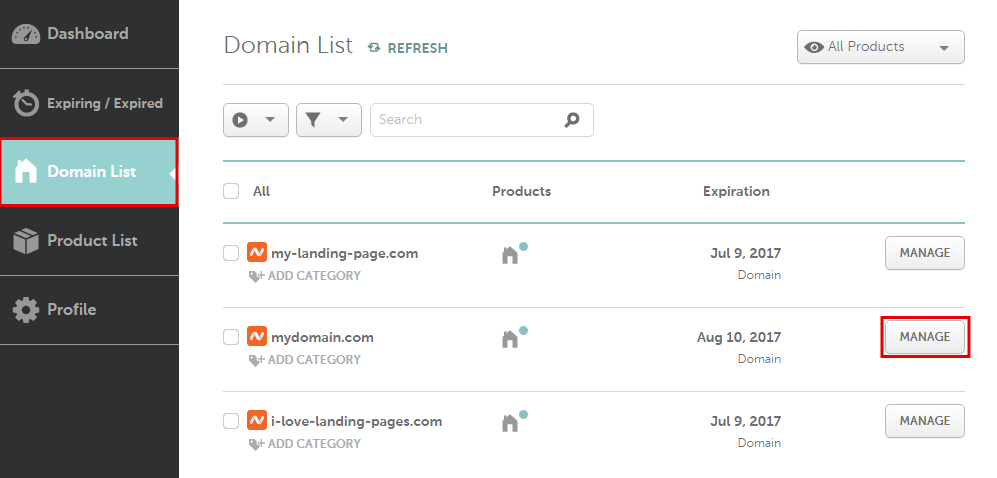
.. |namecheap-dns-panel| image:: _images/namecheap-dns-panel.png
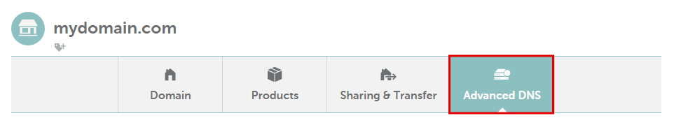
.. |namecheap-add-new-record| image:: _images/namecheap-add-new-record.png
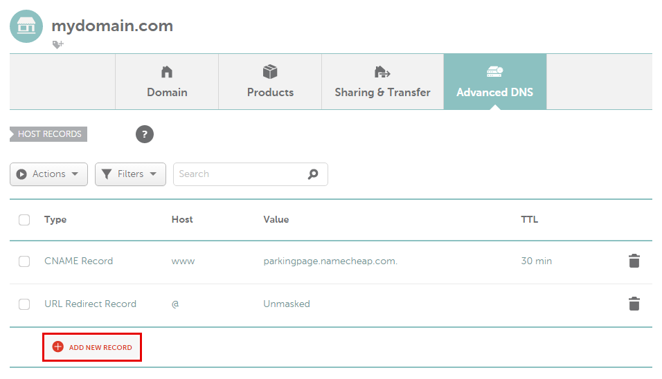
.. |namecheap-a-record-save| image:: _images/namecheap-a-record-save.png
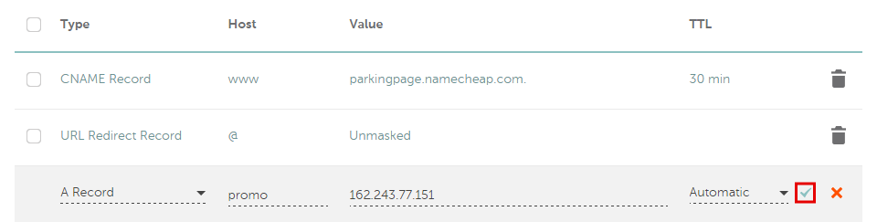
.. |namecheap-edit-cname| image:: _images/namecheap-edit-cname.png
.. |namecheap-cname-record-save| image:: _images/namecheap-cname-record-save.png

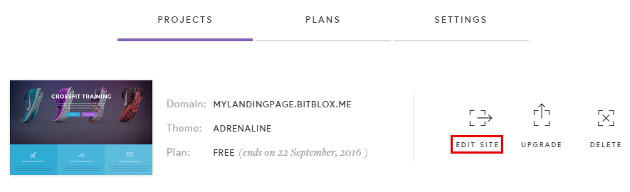
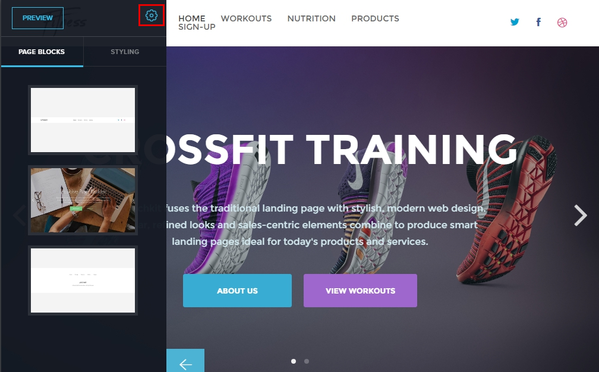
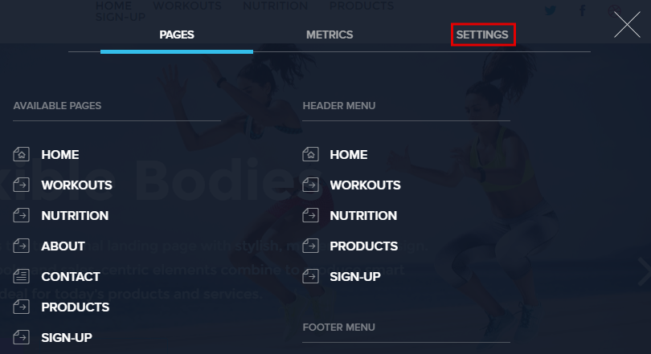
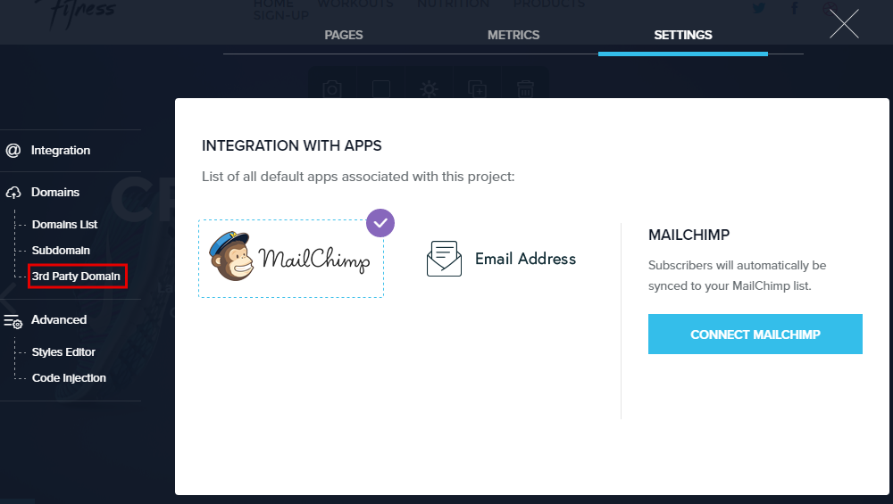
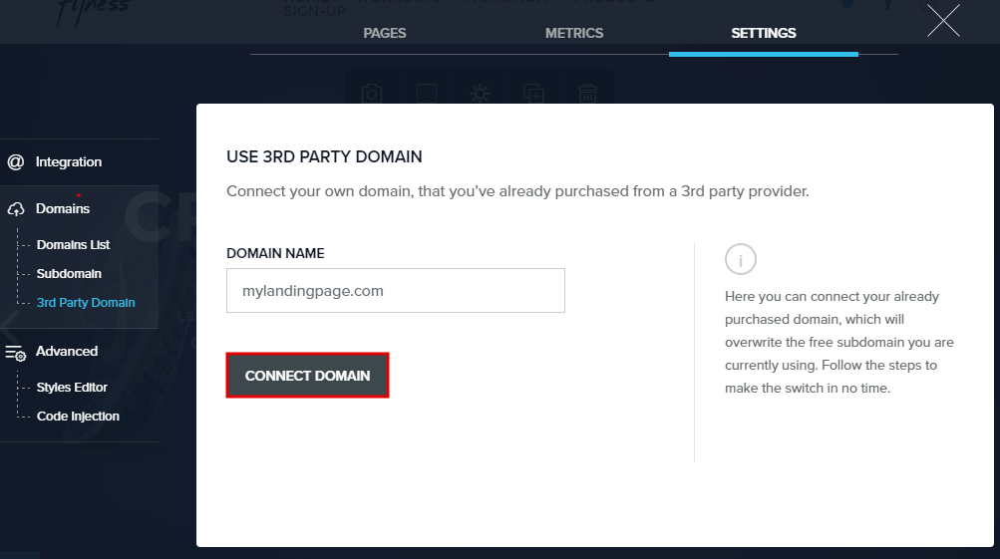
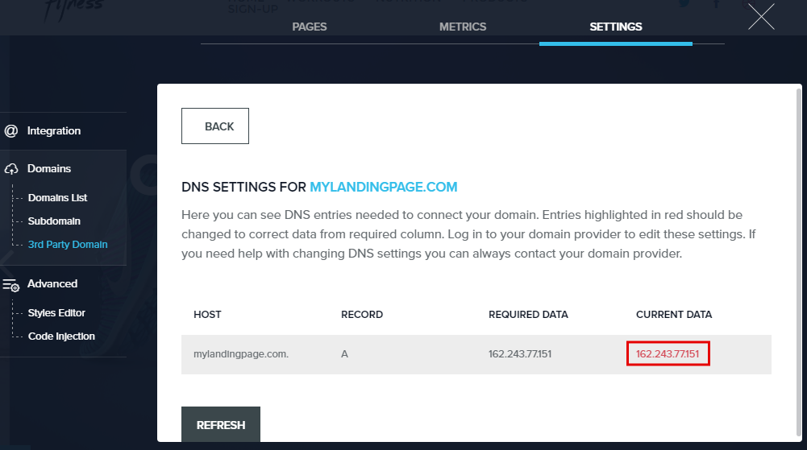
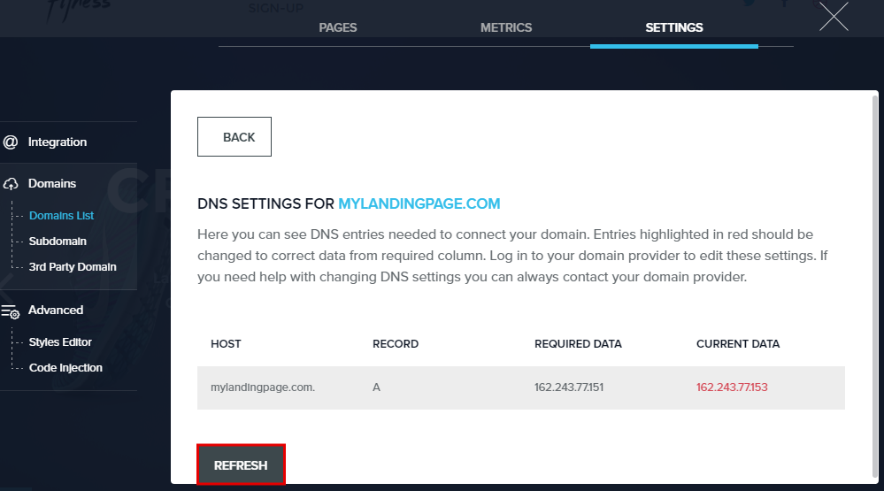
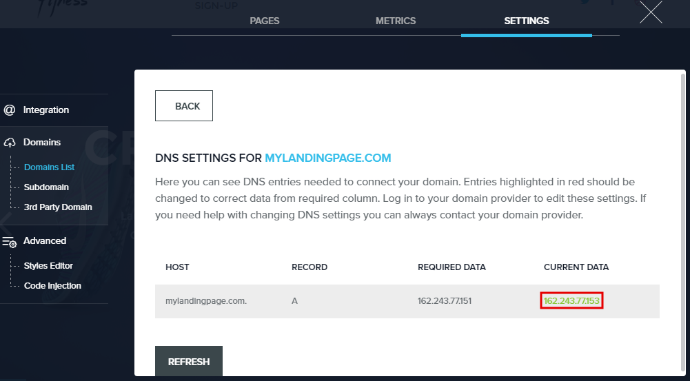

