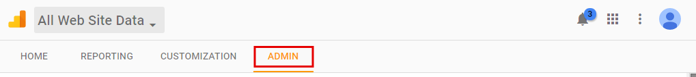
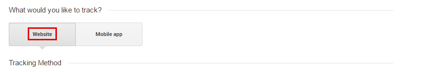
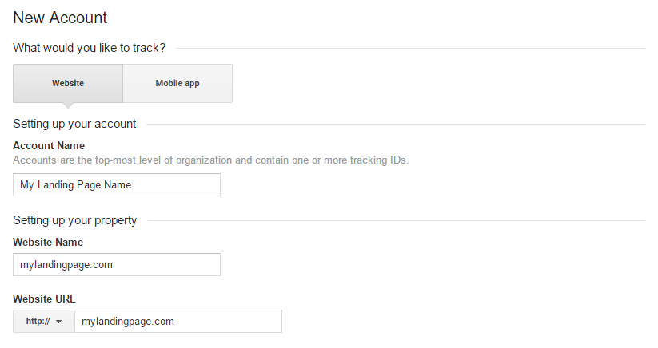
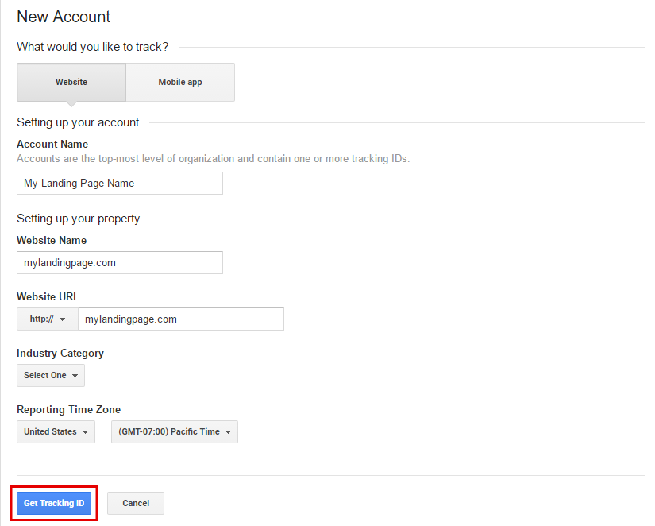
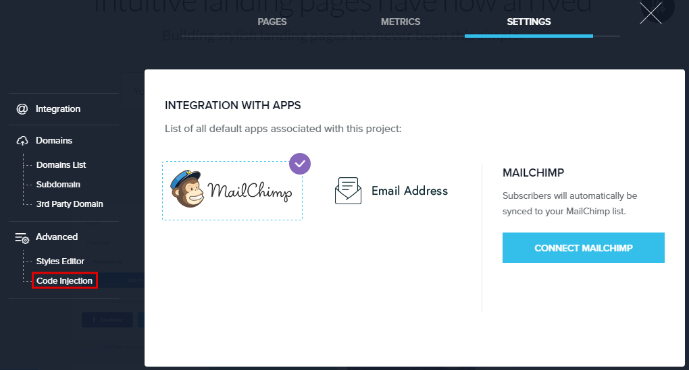
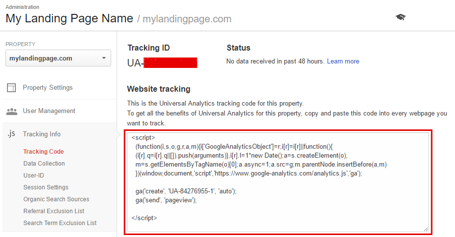
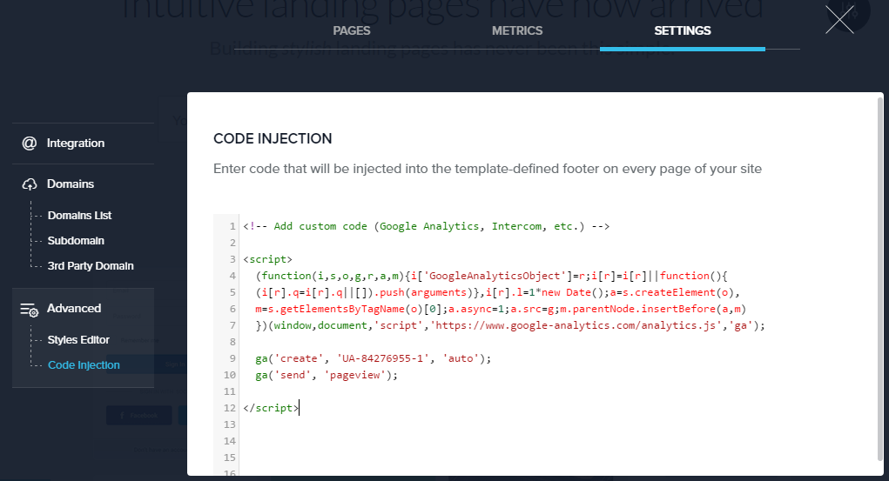

=====================
Integrating Landing Pages with Google Analytics
=====================

When you integrate Google Analytics with BitBlox, you can get a quick idea of what customers are looking for in your landing page, which information get the most traffic, and where your customers spend their time in your landing page. You can use this information to drive content in your pages.

To integrate Google Analytics with your landing page, you'll first have to create a new property in your Analytics account:

1. You can do this from the **Admin** section after you login to Google Analytics
2. Click on **Create a new property** under any of your existing accounts. If this is the first time you're using Google Analytics, you'll have to set up a new account and the create a new property.
 

    .. class:: screenshot

		|google-admin|

3. Under **what would you like to track**, choose **website**

    .. class:: screenshot

		|google-website|

4. Enter your landing page name, also specify your URL.

    .. class:: screenshot

		|google-enter-name|

5. Choose your timezone and click the **Get Tracking ID** button
		

    .. class:: screenshot

		|google-get-tracking-id|
		
		
6. Login in BitBlox account.
7. Under your project, click  **Edit Site**
8. Open the **Page Panel** and then open **Code Injection** Tab

    .. class:: screenshot

		|google-code-injection|

	
9. 	Select and copy the tracking code from yout Google Analytics Administration Panel
	
	.. class:: screenshot

		|google-copy-code|	
		
10. Paste the tracking code into your landing page's **Code Injection** tab		
		
	.. class:: screenshot

		|google-paste-code|		
		

That's it! The stats from your Landing Page should start appearing in your Analytics account in a while. Please note that this information will not show up in your BitBlox account, but only in Google Analytics. You can learn hot to enable site search so that you can track search terms `over here <https://support.google.com/analytics/answer/1012264?hl=en/>`__  
		

