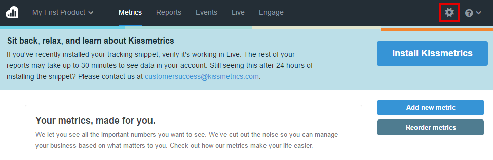
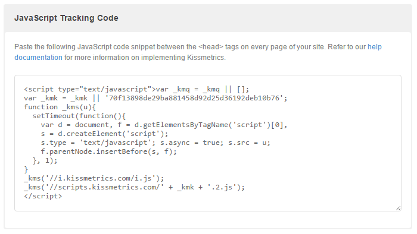
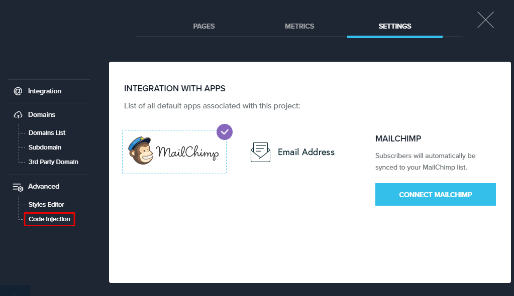
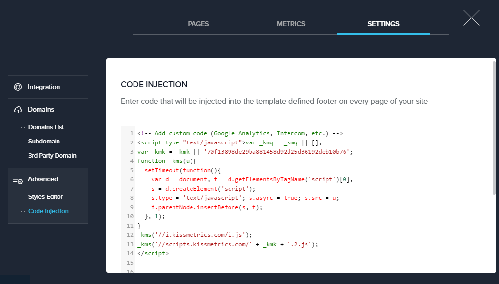

=====================
Integrating Landing Pages with KISSmetrics
=====================

KISSmetrics is a powerful platform that offer you to determine, monitor and enhance the metrics and other elements significant to your business. KISSmerics analyzes and tracks much more than bounce rates. It focuses on customer value, revenue, conversion rates and marketing attribution, and provides businesses with the information to improve their bottom line.

.. contents::
    :local:
    :backlinks: top

Get your API Key from KISSmetrics
------

1. Log in to your  `KISSmetrics account <https://www.kissmetrics.com/signin>`__ .
2. Click on **Settings** icon from administration panel.

    .. class:: screenshot

		|click-settings|

3. Scroll-down to JavaScript Tracking Code. Insert and Copy the KISSmetris API javascript code.

    .. class:: screenshot

		|copy-api-code|

		
Integrating with KISSmetrics
------

1. Log in to your `BitBlox account <https://www.bitblox.me/welcome/>`__ 
2. Navigate to **Code Injection** section of your account

    .. class:: screenshot

		|click-code-injection|

3. Paste the API code into the script dialogue
		
    .. class:: screenshot

		|paste-api-code|

		
4. This is it! You have now connected your Landing Page account with KISSmetrics		
		
		
		
Getting more help
------

For more help with settings in your KissMetrics account, contact their `support team <http://support.kissmetrics.com//>`__  
		

