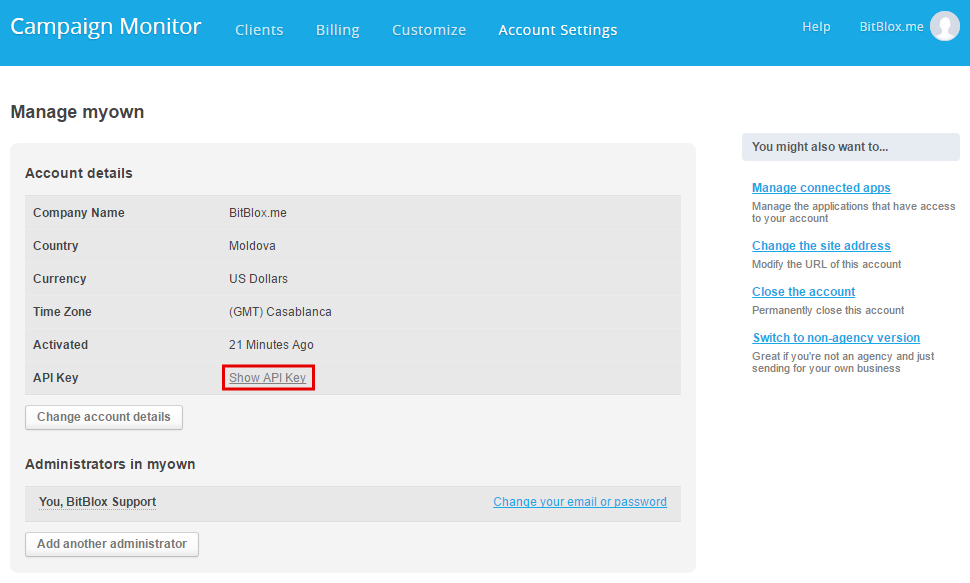

=====================
Integrating Landing Page with Campaign Monitor
=====================

Campaign Monitor makes it easy to run beautiful, professional email marketing campaigns to grow your buisness. You'll have all tools you need to test and optimize your e-mails for the best results and 24/7 support to ensure your success.
  

1. Log in to your `BitBlox account <https://www.bitblox.me/welcome/>`__ .
2. In the page panel, click **Settings**
3. Click **Integration** tab
4. Click **Campaign Monitor** 
5. Enter your Campaign Monitor **API Key** from your Campaign Monitor account  

    .. class:: screenshot

       |click-account-settings|

  
6. Click **Continue**
7. Wait for your API key to get authenticated with Campaign Monitor
8. Select the desired Campaign Monitor client
9. Wait for Campaign Monitor to send BitBlox the selected client's lists
10. Select the Campaign Monitor list you wish to use and click **Continue**
11. Wait for Campaign Monitor to confirm your selection
12. Your Landing Page is now connected with Campaign Monitor  
  

Once your account is configured, your are ready to start posting your BitBlox leads to your Campaign Monitor list. Further information you can find `support team <https://help.campaignmonitor.com/support?_ga=1.86273368.1140817287.1474366454>`__ .

