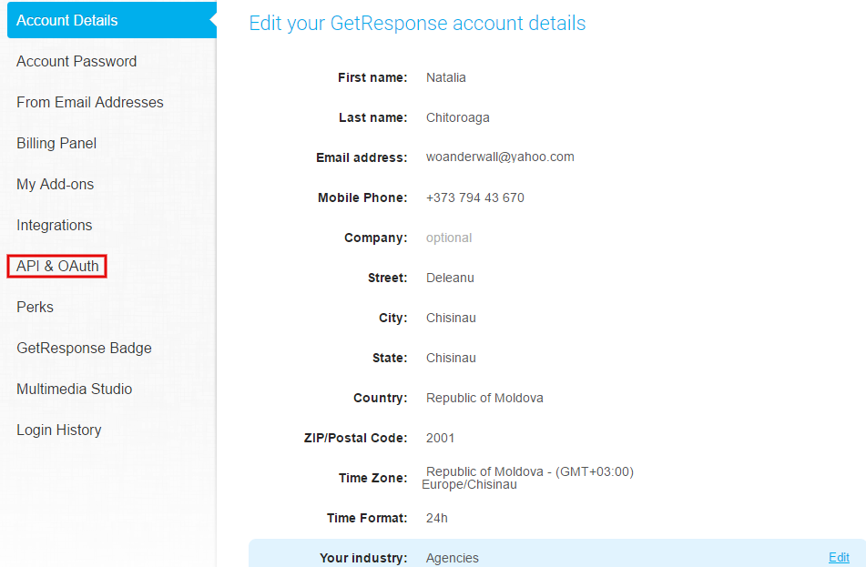
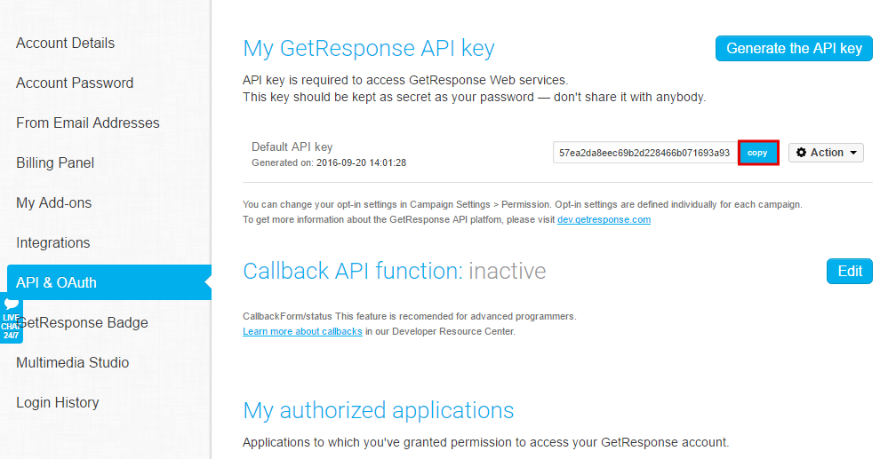

=====================
Integrating Landing Page with GetResponse
=====================

GetResponse is an eas-to-use email marketing service with good third-party contact integration, solid support, and a variety of advanced features that you can try for free.

1. Log in to your `BitBlox account <https://www.bitblox.me/welcome/>`__ .
2. In the page panel, click **Settings**
3. Click **Integration** tab
4. Click **GetResponse** 
5. In appeared tab, you must enter your **api Key**
6. Log in to your GetResponse account or click **Get your GetResponse API Key Here** link at the end of the tab
7. In your **Account Details** tab, click **API&OAuth**

    .. class:: screenshot

		|get-api-key|

		
8. Copy your API Key

    .. class:: screenshot

		|copy-api-key|

9. Return to BitBlox, enter the key and click **Login to GetResponse** button		
10.	Choose which email list your would like to use.
11. Click **Finish** button
12. Customize your Field Mapping with Email and Name details
13. Click **Continue** button
14. Click **Finish** button 
		

Once your account is configured, your are ready to start capturing the leads on your Landing Page.Further information you can find `support team <https://support.getresponse.com/?_ga=1.134187918.18888577.1474377735>`__ .

