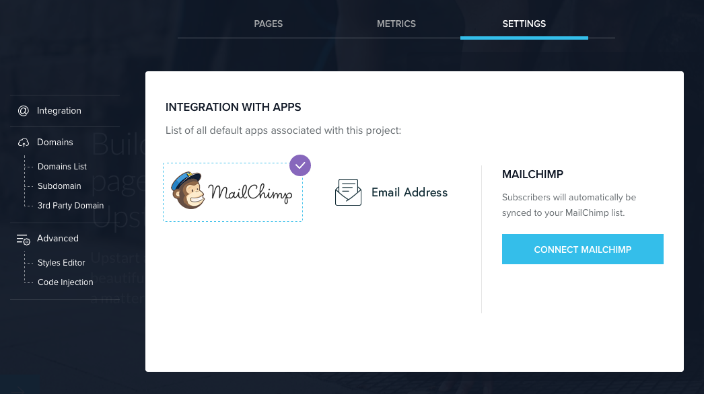
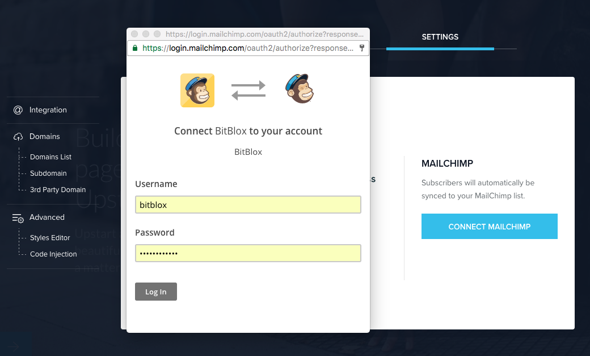
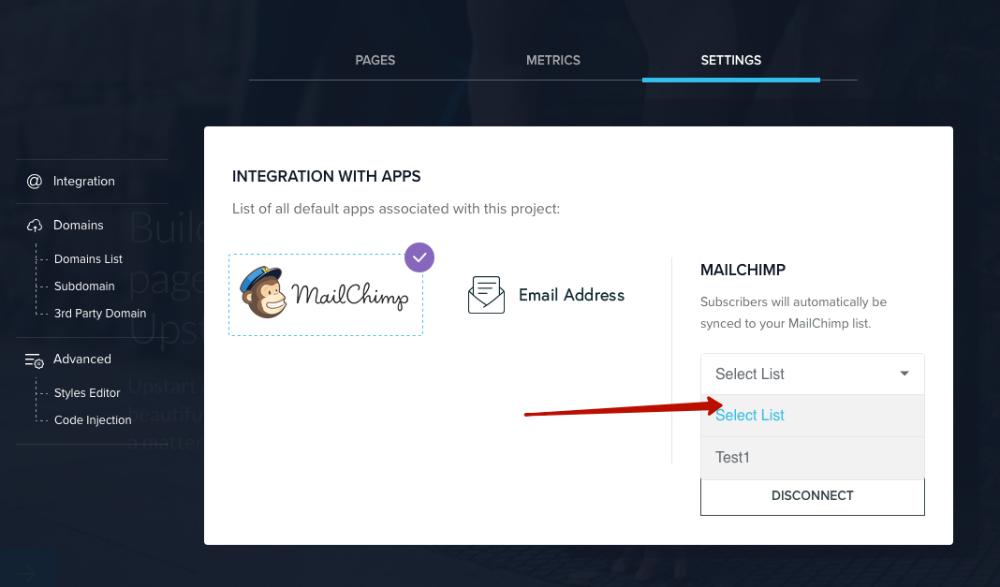
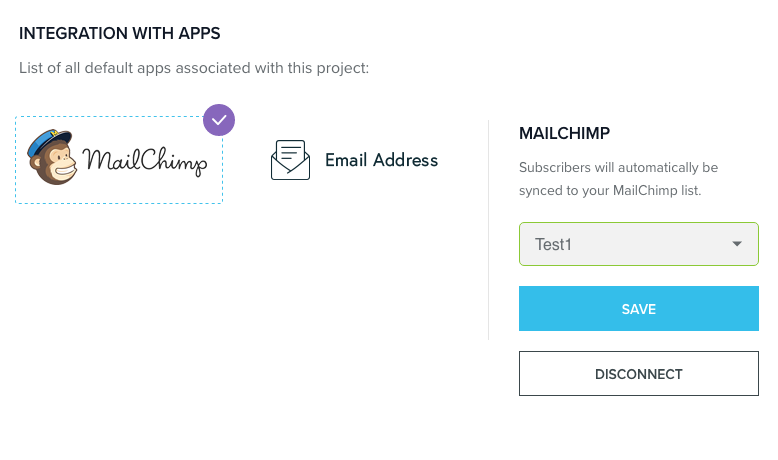

=====================
Using MailChimp with BitBlox
=====================

MailChimp is an email marketing service you can use to design and send email campaigns and newsletters. BitBlox offers an integration with MailChimp through the Form Blocks.

.. contents::
    :local:
    :backlinks: top

Connect a Form Block
------

You can use MailChimp as a storage option in the Form Block. This adds form submissions to a subscriber list in your MailChimp account.

1. In the **Form Block**, click the **Block Settings** icon, then click **Form Integration** button. In this example, we're using a Form Block.

	.. class:: screenshot

		|bitblox-settings|

2. In the **Settings** tab, click **MailChimp**, then click **Connect Mailchimp**.

	.. class:: screenshot

		|mailchimp-select-app|

3. Log in using your **MailChimp** username and password.

	.. class:: screenshot

		|mailchimp-login|

4. Select a **MailChimp list** for form submissions from the drop-down menu.

	.. class:: screenshot

		|mailchimp-list|

5. Click the **Save Changes** button

  .. class:: screenshot

    |mailchimp-save-list|

Connect multiple blocks to MailChimp
---------

Connecting multiple Form Blocks to a single MailChimp list can cause several issues, including dropped form submission data and disconnection from MailChimp. We recommend using a separate MailChimp list for each Form or Newsletter Block on your site when possible.

If you choose to connect multiple blocks to a single MailChimp list, each block must be absolutely identical. Any discrepancies between type, name, or arrangement of fields between blocks will create errors.

To troubleshoot errors resulting from multiple blocks connected to a MailChimp list, reset the MailChimp connection for each block, check each block to confirm all fields are identical, and then reconnect MailChimp as a storage option.

MailChimp's double opt-in policy
----------

As part of MailChimp's double opt-in process, visitors are required to confirm their subscription. This includes sending a final "Welcome" email. Learn more in MailChimp's knowledge base.

Getting more help
------

For more help with settings, contact their `support team <http://kb.mailchimp.com/?_ga=1.11196208.501154330.1472667559>`__ .

.. |bitblox-settings| image:: _images/bitblox-settings.gif

