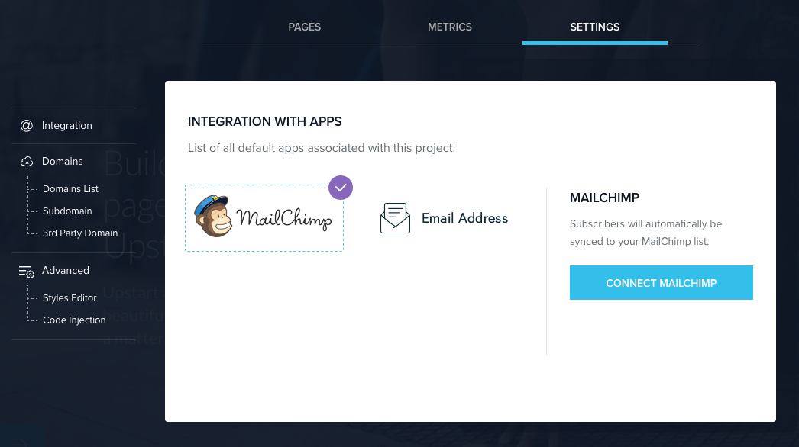
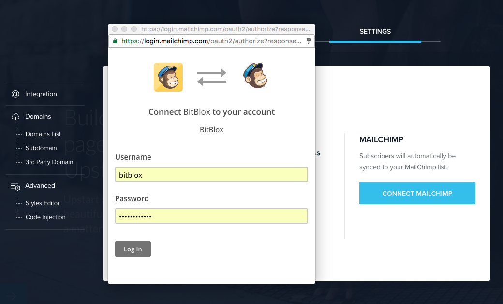
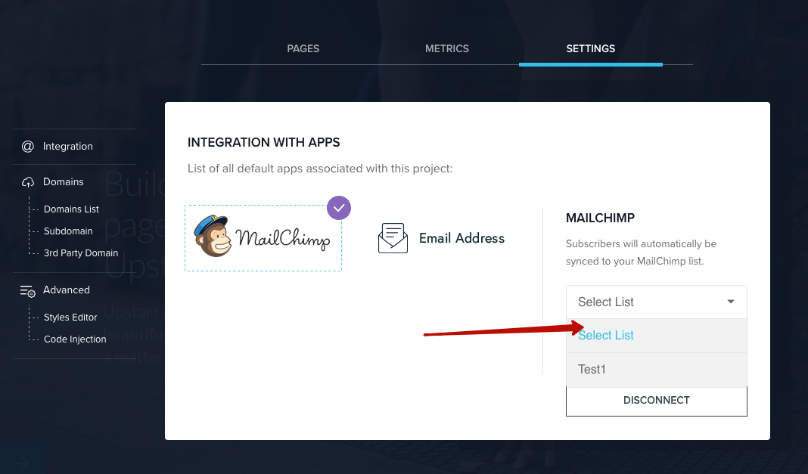

=====================
Using MailChimp with BitBlox
=====================

MailChimp is an email marketing service you can use to design and send email campaigns and newsletters. BitBlox offers an integration with MailChimp through the Form Blocks.

.. contents::
    :local:
    :backlinks: top

Connect a Form Block
------

You can use MailChimp as a storage option in the Form Block. This adds form submissions to a subscriber list in your MailChimp account.

1. In the **Form Block**, click the **Block Settings** icon, then click **Form Integration** button.

	.. class:: screenshot

		|bitblox-settings|

2. In the **Settings** tab, click **MailChimp**.

	.. class:: screenshot

		|select-mailchimp-app|

3. Log in using your **MailChimp** username and password.

	.. class:: screenshot

		|mailchimp-login|

4. Select a **MailChimp list** for form submissions from the drop-down menu.

	.. class:: screenshot

		|mailchimp-list|

4. Scroll down to **A/AAAA** and **CNAME Records** section, click **Other IP address (also valid for Managed Cloud Hosting)**

	.. class:: screenshot

		|1and1-click-other-ip|

5. In the box to the right of **IPv4 Address**, enter BitBlox's IP address ``162.243.77.151``. Leave any other boxes blank

    .. class:: screenshot

		|1and1-edit-a-record|

6. Scroll down and click **Save**

    .. class:: screenshot

		|1and1-save-a-record|

7. In the **Domains** page, click **Create Subdomain**

	.. class:: screenshot

		|1and1-click-create-subdomain|

8. In the **Create Subdomain** box, enter **www**
9. Click **Create Subdomain**

    .. class:: screenshot

		|1and1-create-subdomain|

10. Claim your custom domain in BitBlox [LINK]

    .. note::

		After you've claimed your domain, it can take up to 48 hours for changes to take effect. If it takes more than 48 hours, you should contact your custom domain provider.

Set up your subdomain with 1and1.com
------

1. `Log in to your 1and1.com account <https://www.1and1.com/login?__lf=Static/>`__
2. In **Your domain** section, click **Manage Domain**

	.. class:: screenshot

		|1and1-click-manage-subdomain|

3. In the **Domains** page, click **Create Subdomain**

	.. class:: screenshot

		|1and1-select-subdomain|

4. In the **Create Subdomain** box, enter subdomain prefix (if you picked ``promo.mydomain.com`` as your sudomain, enter ``promo``)
5. Click  **Create Subdomain**

	.. class:: screenshot

		|1and1-save-create-subdomain|

6. In the **Domains** page, click **Edit DNS Settings**

	.. class:: screenshot

		|1and1-click-edit-settings-subdomain|

7. Scroll down to **A/AAAA** and **CNAME Records**, click **Other IP address (also valid for Managed Cloud Hosting)**

	.. class:: screenshot

		|1and1-click-other-ip|

8. In the box to the right of **IPv4 Address**, enter BitBlox's IP address ``162.243.77.151``. Leave any other boxes blank

    .. class:: screenshot

		|1and1-edit-a-record|

9. Scroll down and click **Save**

    .. class:: screenshot

		|1and1-save-a-record|

10. Claim your custom domain in BitBlox [LINK]

.. note::

	After you've claimed your domain, it can take up to 48 hours for changes to take effect. If it takes more than 48 hours, you should contact your custom domain provider.

Getting more help
------

For more help with settings in your 1and1.com account, contact their `support team <http://help.1and1.com/?hc=website>`__ .

.. |bitblox-settings| image:: _images/bitblox-settings.gif

