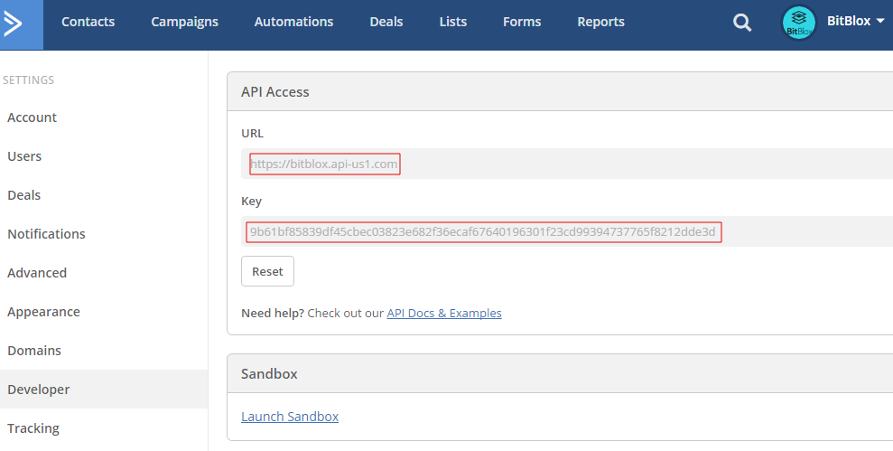

=====================
Integrating Landing Pages with ActiveCampaign 
=====================

ActiveCampaign combines all aspects of email marketing into a single and easy to use platform. Seamlessly create beautiful and engaging emails, send them to your segmented subscribers, and see what interactions and reactions occur in real time.

1. Login to your `ActiveCampaign account <http://www.activecampaign.com/>`__ .
2. In your administration panel, click **My Settings**
3. Click **Developer** tab 
4. Copy your **API URL** and **API Key** 

    .. class:: screenshot

		|copy-api-keys|

5. Log in to your `BitBlox account <https://www.bitblox.me//>`__ .
6. In the page panel, click **Settings**
7. Click **Integration** tab
8. Click **ActiveCampaign**
9. Add your API URL and API Key and click **Connect** button
10. Your BitBlox account is now connected with ActiveCampaign

Once your account is configured, your are ready to start posting your BitBlox leads to your ActiveCampaign list. Further information you can find `here <http://www.activecampaign.com/automation/>`__ .

		
		
		