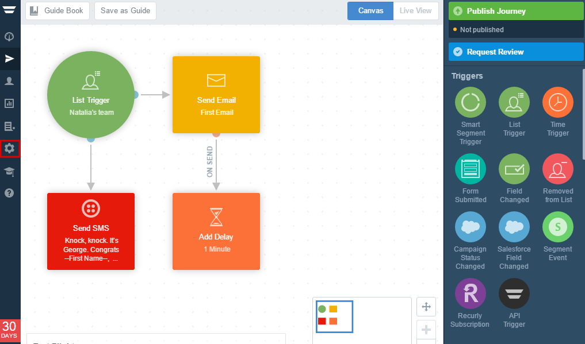

=====================
Integrating Landing Pages with Autopilot 
=====================

Autopilot is an easy-to-use application for your company's multi-channel marketing automation needs. Delight your customers and convert more leads by creating  personlized journeys for your contacts by sending texts, letters or emails to the right people and at the right time.

.. contents::
    :local:
    :backlinks: top

Get your API key from Autopilot
------

1. Login to your `Autopilot account <https://login.autopilothq.com/login>`__ .

2. In Administration Panel, click **Settings**
    .. class:: screenshot

		|click-settings|
		

1. Login to your `ActiveCampaign account <http://www.activecampaign.com/>`__ .
2. In your administration panel, click **My Settings**
3. Click **Developer** tab 
4. Copy your **API URL** and **API Key** 

    .. class:: screenshot

		|copy-api-keys|

5. Log in to your `BitBlox account <https://www.bitblox.me//>`__ .
6. In the page panel, click **Settings**
7. Click **Integration** tab
8. Click **ActiveCampaign**
9. Add your API URL and API Key and click **Connect** button
10. Your BitBlox account is now connected with ActiveCampaign

Once your account is configured, your are ready to start posting your BitBlox leads to your ActiveCampaign list. Further information you can find `here <http://www.activecampaign.com/automation/>`__ .

		
		
		