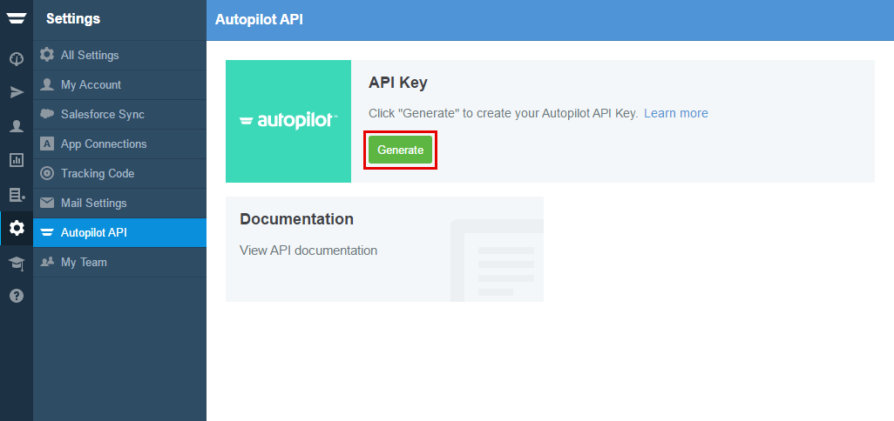

=====================
Integrating Landing Pages with Autopilot 
=====================

Autopilot is an easy-to-use application for your company's multi-channel marketing automation needs. Delight your customers and convert more leads by creating  personlized journeys for your contacts by sending texts, letters or emails to the right people and at the right time.

.. contents::
    :local:
    :backlinks: top

Get your API key from Autopilot
------

1. Login to your `Autopilot account <https://login.autopilothq.com/login>`__ .

2. In administration panel, click **Settings**
   
    .. class:: screenshot

		|click-settings|
		
3. Select the **Autopilot API** and click **Generate**
		
	   
    .. class:: screenshot

		|click-generate|	
		
Connect your Autopilat Account with BitBlox
------

4. Log in to your `BitBlox account <https://www.bitblox.me//>`__ .
5. In the page panel, click **Settings**
6. Click **Integration** tab
7. Click **Autopilot**
8. Enter your API Key and click **Connect** button
9. Your BitBlox account is now connected with your Autopilot account.

Once your account is configured, your are ready to start posting your BitBlox leads to your Autopilot campaign. Further information you can find `here <https://autopilothq.zendesk.com/hc/en-us/>`__ .

.. |click-settings| image:: _images/click-settings.png

		
		
		