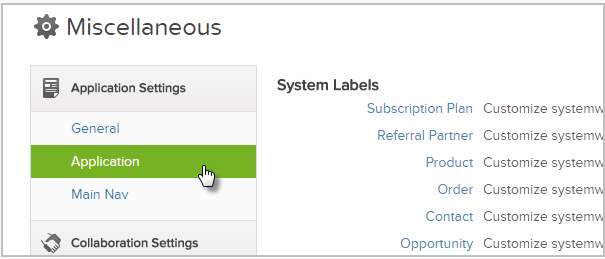
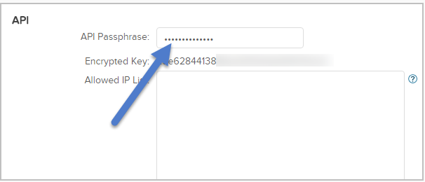
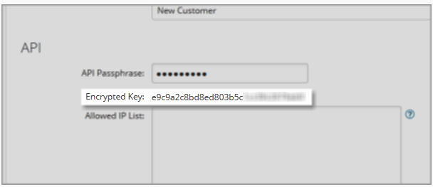

=====================
Integrating Landing Pages with Infusionsoft
=====================

Infusionsoft offers an online sales and marketing solution build exclusively for small businesses. If features lead generation tools and marketing automation, email and social media tools to engage and convert leads.

.. contents::
    :local:
    :backlinks: top

Create tags and leads in Infusionsoft
------

Before integrating Infustionsoft with your landing page, you will need to create a `Campaign <http://help.infusionsoft.com/userguides/campaigns-and-broadcasts/campaign-builder-primer/campaign-builder-terminology>`__  with a basic `Web Form <http://help.infusionsoft.com/userguides/campaigns-and-broadcasts/campaign-goals/create-a-web-form>`__ associated with your campaign.
Also, you need to setup few tags in Infusionsoft before you proceed to integrate into your landing page. More information on tags can be found `here <http://help.infusionsoft.com/?_ga=1.211185557.1284305066.1474456367>`__ .

Get your Infustionsoft API Key
------

1. Log in to your `Infusionsoft account <https://signin.infusionsoft.com/login?_ga=1.47195559.1284305066.1474456367>`__ .

2. Go to **Admin**, click **Settings** and then click **Aplication** in the seetings menu

	.. class:: screenshot

		|click-admin|

3. Scroll down to the API section and enter a passphrase in the text box

	.. class:: screenshot

		|enter-passphrase|

4. After you enter a Pahhphrase, click on the **Save** button to generate the API key

		
    .. class:: screenshot

		|click-save|		
		
		
		
5. Your API key is now available under the textbox where you entered the pass phrase		
	
    .. class:: screenshot

		|api-key|	
		
	
Connect Infustionsoft to your Landing Page
------

1. Log in to your `BitBlox account <https://www.bitblox.me//>`__ .
2. In the page panel, click **Settings**
3. Click **Integration** tab
4. Click **Infusionsoft**
5. Enter your Infusionsoft App Name and your Infusion API key, click **Authenticate with Infusionsoft** button
6. Wait for your Landing Page to authenticate with Infusionsoft.
7. Select the Infusion Tag you wish to use with your page
8. **Configure your field mapping** and click **Complete** to finish the integration

http://optinmonster.com/docs/connect-optinmonster-infusionsoft/#select-tag 
For more help with settings in your 1and1.com account, contact their `support team <http://help.1and1.com/?hc=website>`__ .

.. |click-save|	image:: _images/click-save.png

