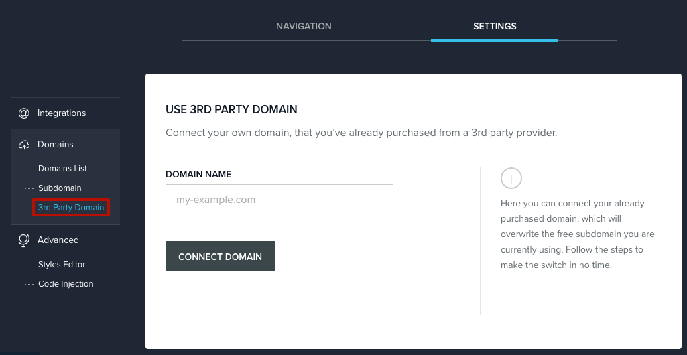
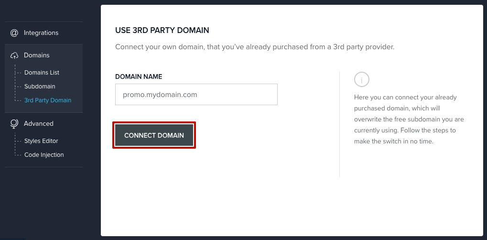
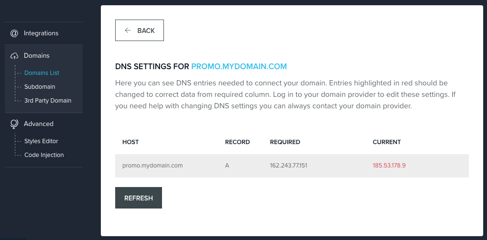
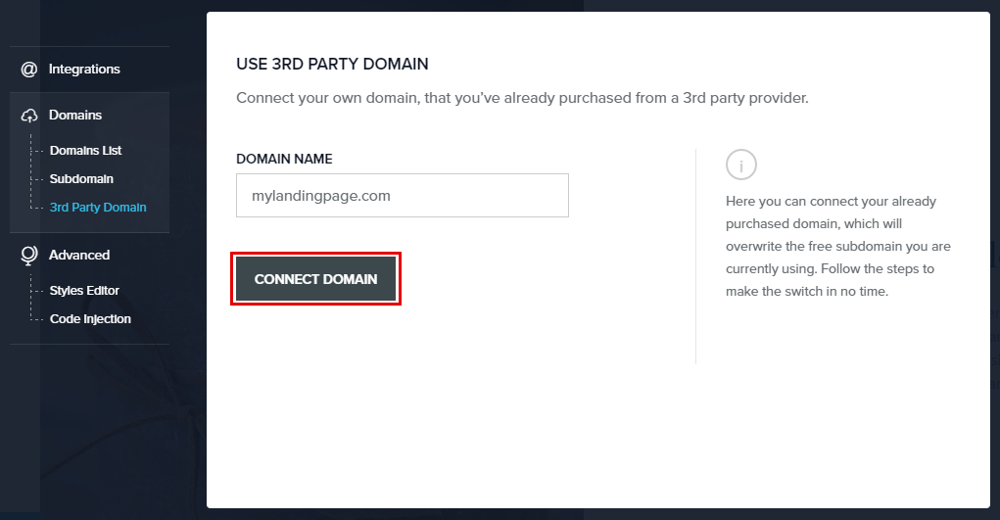
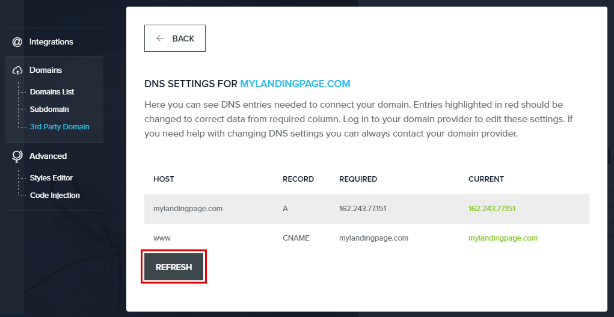

9. In your BitBlox account, click **Edit Page** on your landing page.

     .. class:: screenshot

		|bitblox-click-edit-page|

10. Open the **Sidebar** and click the **Settings** icon

     .. class:: screenshot

		|bitblox-click-settings|

11. Click **Settings** tab and then click **3rd Party Domain** tab

    .. class:: screenshot

		|bitblox-click-3-rd-party-domain|

12. In the **Domain Name** box enter the full domain name you want to link (ex: ``promo.mydomain.com``), and then click **Connect Domain** button

    .. class:: screenshot

		|bitblox-subdomain-click-connect-domain|

13. After you've claimed your domain, a new panel will be opened with the records from your provider domain account (it can take up to 48 hours for changes to take effect).

    .. class:: screenshot

		|bitblox-subdomain-dns-settings|

14. If your records are entered correctly, the **Current Data** will be green.

    .. class:: screenshot

		|bitblox-subdomain-refresh|

		.. note::

			After you've claimed your domain, it can take up to 48 hours for changes to take effect. If it takes more than 48 hours, you should contact your custom domain provider.

.. |godaddy-click-manage| image:: _images/godaddy-click-manage.png
.. |godaddy-manage-dns| image:: _images/godaddy-manage-dns.png
.. |godaddy-edit-a-record| image:: _images/godaddy-edit-a-record.png
.. |godaddy-enter-ip| image:: _images/godaddy-enter-ip.png
.. |godaddy-edit-cname| image:: _images/godaddy-edit-cname.png
.. |godaddy-enter-www| image:: _images/godaddy-enter-www.png
.. |godaddy-manage-dns-subdomain| image:: _images/godaddy-manage-dns-subdomain.png
.. |godaddy-add-new-record-subdomain| image:: _images/godaddy-add-new-record-subdomain.png
.. |godaddy-enter-subdomain| image:: _images/godaddy-enter-subdomain.png

.. |bitblox-click-edit-page| image:: _images/bitblox-click-edit-page.png
.. |bitblox-subdomain-refresh| image:: _images/bitblox-subdomain-refresh.png

.. |bitblox-dns-settings| image:: _images/bitblox-dns-settings.png

.. |bitblox-click-settings| image:: _images/bitblox-click-settings.jpg
