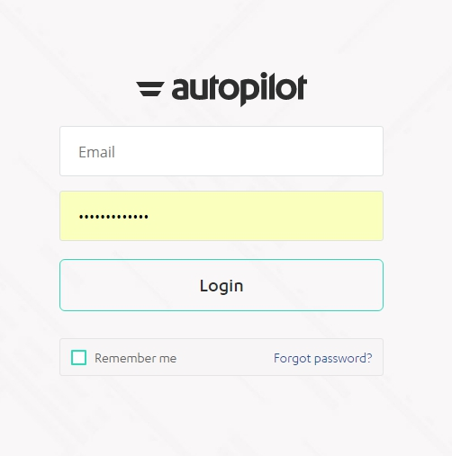
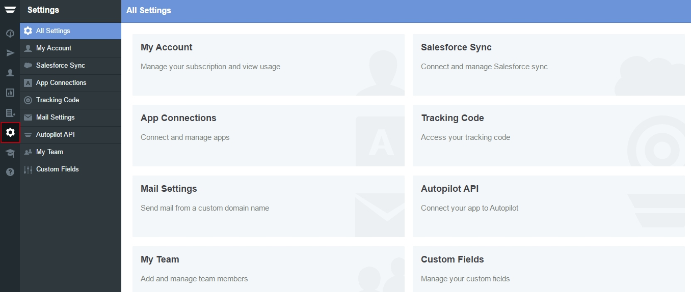

========
Autopilot Integration
========

	
.. contents::
    :local:
    :backlinks: top

	
Requirements / On the Autopilot Site
------

The only thing you will need on the Autopilot part is your API Key value:

1.  Log into your Autopilot account:

 	.. class:: screenshot

		|autopilot-log-in|
		
2.  Click on the **Settings** tab

	.. class:: screenshot

		|autopilot-click-settings-tab|
		

3. Click on the **Autopilot API** tab from the list

	.. class:: screenshot

		|autopilot-click-autopilot-api|

4. Click on the **Generate** button

	.. class:: screenshot

		|autopilot-generate-button|

5. Done! You've got your API Key
		

Connect a form to MailChimp
------

1.  Open your landing page and go to the **Form Block**  
2.  On the form button click on **Integration** icon

	.. class:: screenshot

		|mailchimp-open-integration|
		

3. Select **Mailchimp** integration from the list

	.. class:: screenshot

		|mailchimp-choose-mailchimp|

4. Click **Connect New Account**

	.. class:: screenshot

		|mailchimp-connect-new-account|

		
5. Log in to your MailChimp account. If this window doesn't appear, make sure your browser is not blocking popups from BitBlox 

 
    .. class:: screenshot
	
	    |mailchimp-login-in|

6. Select your account and click **Continue** 

	.. class:: screenshot
	
	    |mailchimp-continue-account|
		
		
7. Select a MailChimp list for form submission and click **Continue** 

	.. class:: screenshot
	
	    |mailchimp-continue-lists|
		
		
8. Match your form's fields and click **Continue**

	.. class:: screenshot
	
	    |mailchimp-continue-fields|
		
.. note::

	Map the fields in your form to the fields in your MailChimp list. If there are fields in your form that you haven't added to MailChimp yet, select "Auto Generate" from the dropdown and they will generate for you. 
		
		
9. Click **Close** 	
		
		

Connect Multiplies forms to Mailchimp
------

You can connect different accounts and lists from MailChimp to your landing page under different forms.

1. Open your landing page and go to the **Form Block** 
2. On the form button click on **Integration** icon

	.. class:: screenshot

		|mailchimp-open-integration|
		

3. Select **MailChimp** from the list. 

	.. class:: screenshot

		|mailchimp-choose-mailchimp|

4. Click **Connect New Account** 

	.. class:: screenshot

		|mailchimp-choose-new-account|

		
5. Log into your new MailChimp account. If this window doesn't appear, make sure your browser is not blocksing popups from BitBlox

	.. class:: screenshot

		|mailchimp-login-in|
		
 
6. Select your account and click **Continue**

	.. class:: screenshot

		|mailchimp-continue-account2|	

		
7. Select a MailChimp list for form submission and click **Continue** 

    .. class:: screenshot

		|mailchimp-continue-lists2|

8. Match your form's fields and click **Continue**

    .. class:: screenshot

		|mailchimp-continue-fields|
		

9. Click **Close** 

		

Disconnect the MailChimp integration
------

1. Open your landing page and go to the **Form Block** 
2. On the form button click on **Integration** icon

	.. class:: screenshot

		|mailchimp-open-integration|
		

3. Select **MailChimp** from the list. 

	.. class:: screenshot

		|mailchimp-choose-mailchimp|

4. Click on the delete **x** sign to the right of your account

	.. class:: screenshot

		|mailchimp-remove-account|

5. Your account has been removed and you have been disconnected from MailChimp	
		
	.. class:: screenshot

		|mailchimp-account-removed|	
		

Getting more help
------
If you have more questions or requests, `submit a ticket <https://www.bitblox.me/support/>`__ to BitBlox Customer Department

.. |mailchimp-open-integration| image:: _images/mailchimp-open-integration.jpg
.. |mailchimp-choose-mailchimp| image:: _images/mailchimp-choose-mailchimp.jpg
.. |mailchimp-connect-new-account| image:: _images/mailchimp-connect-new-account.jpg
.. |mailchimp-login-in| image:: _images/mailchimp-login-in.jpg
.. |mailchimp-continue-account| image:: _images/mailchimp-continue-account.jpg
.. |mailchimp-continue-lists| image:: _images/mailchimp-continue-lists.jpg
.. |mailchimp-continue-fields| image:: _images/mailchimp-continue-fields.jpg

.. |mailchimp-open-integration| image:: _images/mailchimp-open-integration.jpg
.. |mailchimp-choose-mailchimp| image:: _images/mailchimp-choose-mailchimp.jpg
.. |mailchimp-choose-new-account| image:: _images/mailchimp-choose-mailchimp.jpg
.. |mailchimp-login-in| image:: _images/mailchimp-login-in.jpg
.. |mailchimp-continue-account2| image:: _images/mailchimp-continue-account2.jpg	
.. |mailchimp-continue-lists2| image:: _images/mailchimp-continue-lists2.jpg
.. |mailchimp-continue-fields| image:: _images/mailchimp-continue-fields.jpg

.. |mailchimp-remove-account| image:: _images/mailchimp-remove-account.jpg
.. |mailchimp-account-removed| image:: _images/mailchimp-account-removed.jpg	

