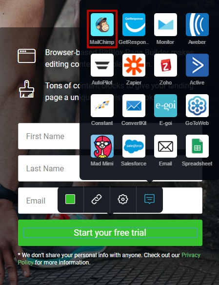
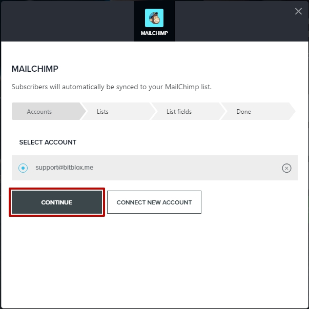

========
MailChimp Integration
========

MailChimp is an email marketing platform that delivers millions of emails a day. You can use the integration to send your subscribers product updates, event invitations, announcements or editorial content. Use MailChimp’s reports to improve your campaigns and learn more about your subscribers.
		
.. contents::
    :local:
    :backlinks: top

	
Connect a form to MailChimp
------

1.  Open your landing page and go to the **Form Block**. 
2.  On the form button click on **Integration** icon

	.. class:: screenshot

		|mailchimp-open-integration|
		

3. Select **Mailchimp** integration from the list.

	.. class:: screenshot

		|mailchimp-choose-mailchimp|

4. Click **Connect New Account**

	.. class:: screenshot

		|mailchimp-connect-new-account|

		
5. Log in to your MailChimp account. If this window doesn't appear, make sure your browser is not blocking popups from BitBlox 

 
    .. class:: screenshot
	
	    |mailchimp-login-in|

6. Select your account and click **Continue** 

	.. class:: screenshot
	
	    |mailchimp-continue-account|
		
		
7. Select a MailChimp list for form submission and click **Continue** 

	.. class:: screenshot
	
	    |mailchimp-continue-lists|
		
		
8. Match your form's fields and click **Continue**

	.. class:: screenshot
	
	    |mailchimp-continue-fields|
		
.. note::

	Map the fields in your form to the fields in your MailChimp list. If there are fields in your form that you haven't added to MailChimp yet, select "Auto Generate" from the dropdown and they will generate for you. 
		
		
9. Click **Close** 

		
		

Connect Multiplies forms to Mailchimp
------

You can connect different accounts and lists from MailChimp to your landing page under different forms.

1. Open your landing page and go to the **Form** 
2. On the form button, hover over **Edit** and click on **Integration List**

	.. class:: screenshot

		|mailchimp-open-integration|
		

3. Select **MailChimp** from the list. 

	.. class:: screenshot

		|mailchimp-choose-mailchimp|

4. In the new box that appears and click  **Connect New Account** 

	.. class:: screenshot

		|mailchimp-choose-new-account|

		
5. Log into your new MailChimp account. If this window doesn't appear, make sure your browser is not blocksing popups from BitBlox

	.. class:: screenshot

		|mailchimp-login-in|
		
 
6. Select your account and click **Continue**

	.. class:: screenshot

		|mailchimp-continue-account2|	

		
7. Select the MailChimp list you want to send to and click **Continue** 

    .. class:: screenshot

		|mailchimp-continue-lists2|

8. Edit your form's fields and click **Continue** 

    .. class:: screenshot

		|mailchimp-continue-fields|
		

9. Click **Close** 

		

MailChimp's double opt-in policy
------

As part of MailChimp's double opt-in process, visitors are required to confirm their subscription. This includes sending final “Welcome” email. To send final welcome emails, you need to:

 -  `Double Op-In must be enable for your campaign <http://kb.mailchimp.com/lists/growth/opt-in-methods-for-offline-subscribers/>`__ and `the Welcome Email option must be enabled in your MailChimp account <http://kb.mailchimp.com/lists/signup-forms/enable-or-disable-final-welcome-email/>`__
 -   If you choose not to enable the Welcome Email option or have disabled Double Opn-In for your campaign, you need to `setup an automation workflow in MailChimp <http://kb.mailchimp.com/automation/add-an-automation/>`__ that sends an email once someone subscribes to your list.

	
.. note::

	For help with creating and sending MailChimp campaigns, contact MailChimp at customersupport@mailchimp.com or visit their `Knowledge Base <http://kb.mailchimp.com/getting-started/getting-started-with-mailchimp/>`__ 
		

Disconnect the MailChimp integration
------

1. Open your landing page and go to the **Form** 
2. On the form button, hover over **Edit** and click on **Integration List**

	.. class:: screenshot

		|mailchimp-open-integration|
		

3. Select **MailChimp** from the list. 

	.. class:: screenshot

		|mailchimp-choose-mailchimp|

4. Select the remove **x** sign to the right of your account

	.. class:: screenshot

		|mailchimp-remove-account|

5. Your account has been removed and you have been disconnected from MailChimp	
		
	.. class:: screenshot

		|mailchimp-account-removed|	
		

Getting more help
------
If you have more questions or requests, `submit a ticket <https://www.bitblox.me/support/>`__ to BitBlox Customer Department

.. |mailchimp-login-in| image:: _images/mailchimp-login-in.jpg

.. |mailchimp-login-in| image:: _images/mailchimp-login-in.jpg

