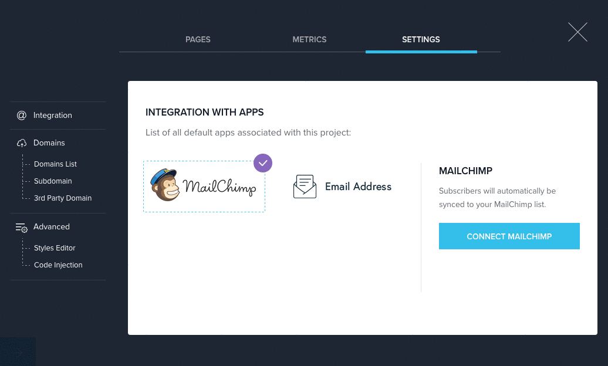
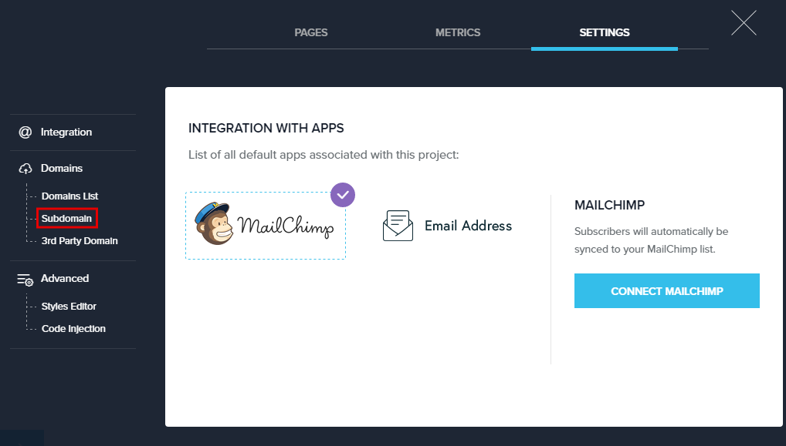

========
Set up your BitBlox subdomain
========

Registering a subdomain throught BitBlox avoids the need to register a domain with a third-party provider. 
All built-in domains are free and hosted with BitBlox platform. You can register your subdomain on any trial or paid plan.

Getting Started
------
	
1. From the **Page Panel**, open **Settings** tab
	
    .. class:: screenshot

		|bitblox-settings|

		
2. In the **Settings** tab, open **Subdomain** tab
		
    .. class:: screenshot

		|click-subdomain|
		
3. In the **Your subdomain name** text box, enter your subdomain name.
4. Click **Save Changes**
		
	.. class:: screenshot

		|click-save-changes|	
		
		

In Domain List, your subdomain will be seted as **primary domain**. The primary domain is the main address for your landing page.

    .. class:: screenshot

		|domain-list|

		

.. |click-save-changes| image:: _images/click-save-changes.png
.. |domain-list| image:: _images/domain-list.png
