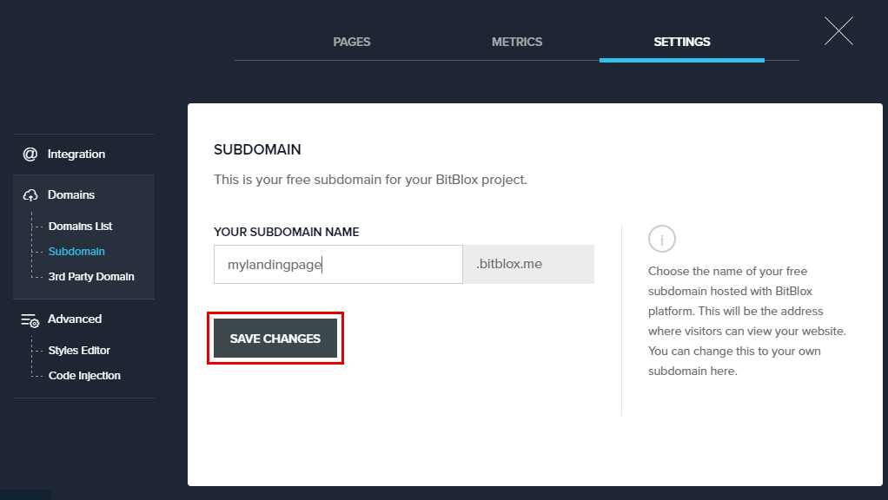
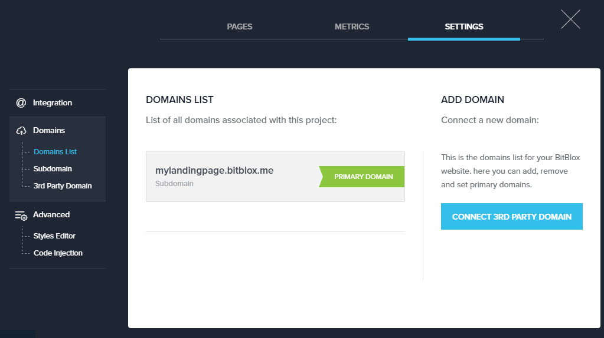

========
Set up your BitBlox subdomain
========

.. toctree::
    :hidden:
    :titlesonly:

    BitBlox Subdomain <bitblox-subdomain/index>
    Third-party Domains <third-party-domains/index>
    /*Publishing on Wordpress <publishing-on-wordpress/index>*/
    Publishing on Facebook Tab <publishing-on-facebook-tab/index>
    /*Publishing on Shopify <publishing-on-shopify/index>*/
    /*Publishing on Drupal <publishing-on-drupal/index>*/

Registering a subdomain throught BitBlox avoids the need to register a domain with a third-party provider.
All built-in domains are free and hosted with BitBlox platform. You can register your subdomain on any trial or paid plan.

Getting Started
------

1. In your BitBlox account, click **Edit Page** on your landing page

    .. class:: screenshot

		|bitblox-click-edit-page|

2. Open the **Sidebar** and click the **Settings** icon

    .. class:: screenshot

		|bitblox-click-settings|

3. In the **Your Subdomain Name** text box, enter the full subdomain name you want to link (ex: ``mylandingpage``) and then click **Save Changes** button.

	.. class:: screenshot

		|click-save-changes|

4. In **Domain List** tab, your subdomain will be seted as **Primary Domain**. The primary domain is the main address for your landing page.

    .. class:: screenshot

		|domain-list|

.. |bitblox-click-edit-page| image:: _images/bitblox-click-edit-page.png
.. |bitblox-click-settings| image:: _images/bitblox-click-settings.jpg

