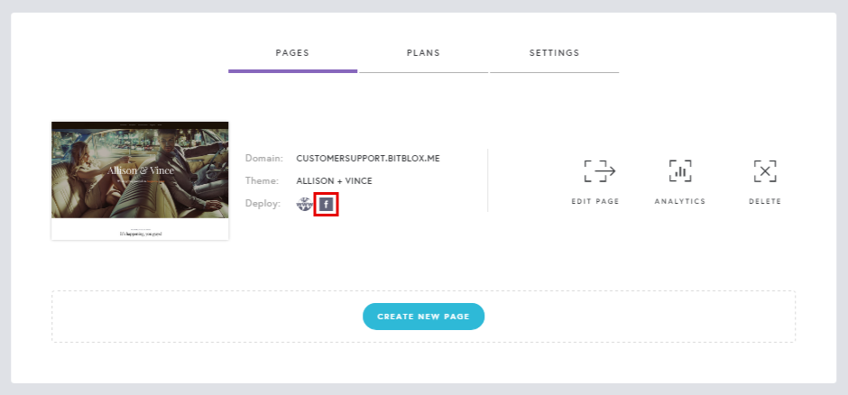
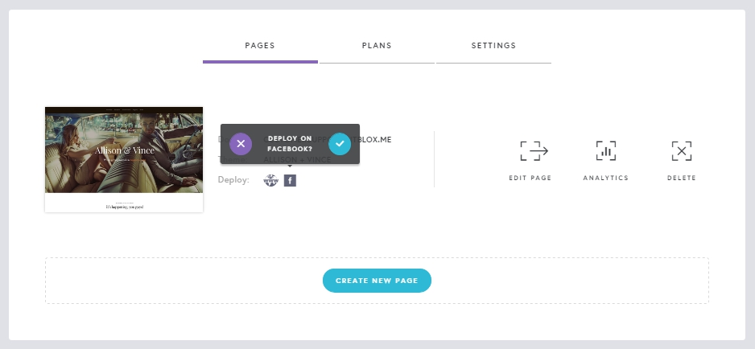
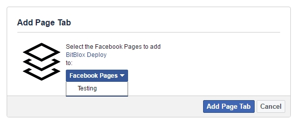
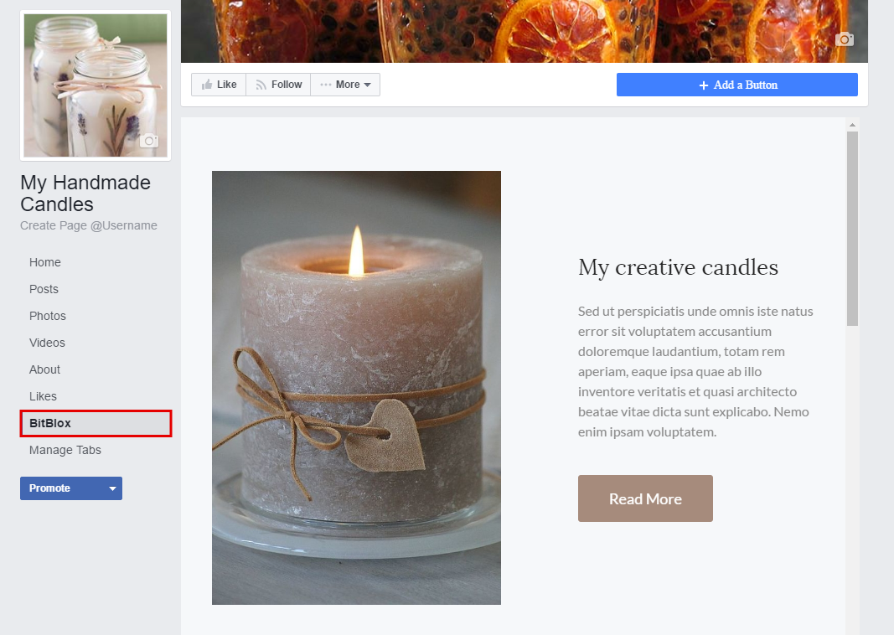
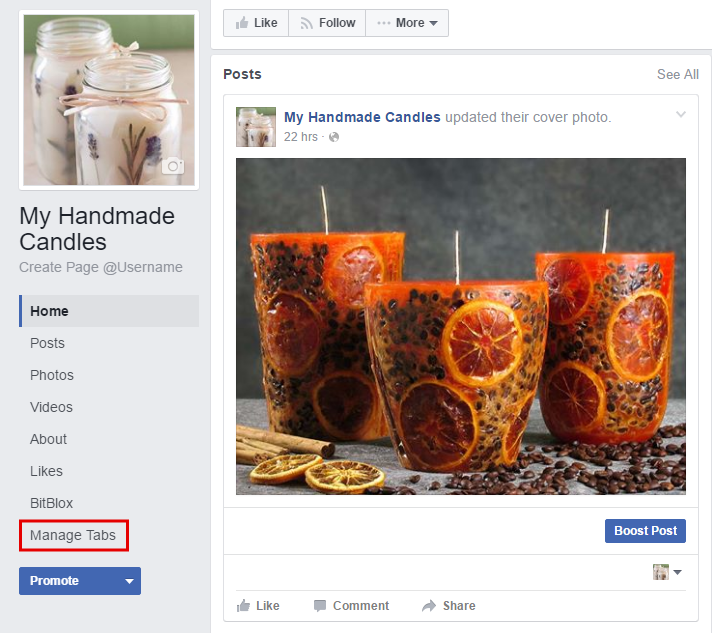
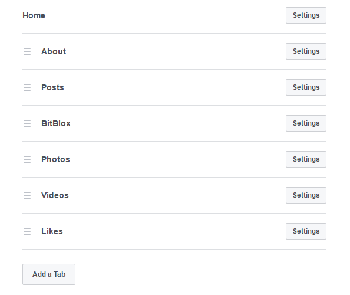

========
Publishing on Facebook Tab
========

By connecting your Facebook account to your BitBlox Landing Page, you can display social icons or share content from BitBlox to Facebook. You can also add BitBlox tabs to any Facebook page to your BitBlox account.

1. In your BitBlox account, click the **Facebook** icon

    .. class:: screenshot

		|bitblox-click-facebook-icon|

2. You will receive a message if you want to deploy your landing page on Facebook

    .. class:: screenshot

		|bitblox-click-facebook|
		
3. Select the preferred page from the drop-down menu. Click **Add Page Tab** 

    .. class:: screenshot
	
		|bitblox-choose-your-page|
		

4. Your Landing Page will be automatically published in your Facebook Tabs

    .. class:: screenshot
		
		|bitblox-facebook-tab|

5. Rearrange your Facebook Tabs (Optional). You can rearrange the order of your tabs so your new custom tab appears more prominently in the main navigation of your page. To rearrange your tabs, click **Manage Tabs**
 
    .. class:: screenshot
	
		|bitblox-click-manage-tabs|

6. In the **Settings** menu, drag and drop your tabs in the order you want them to appear 

    .. class:: screenshot
	
		|drag-and-drop|

For Facebook's official documentation about customizing your Facebook Page tabs, click `here <https://developers.facebook.com/docs/pages/tabs/>`__ . 

