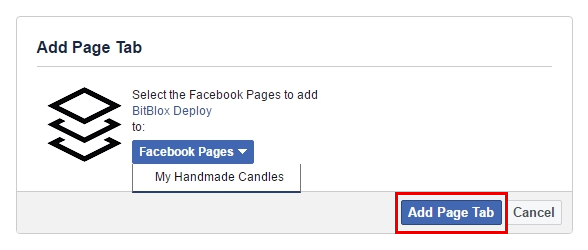

========
Publishing on Facebook Tab
========

###########################################

1. In your BitBlox account, click the **Facebook** icon

    .. class:: screenshot

		|bitblox-click-facebook-icon|

2. You will receive a message if you want to deploy your landing page on Facebook

    .. class:: screenshot

		|bitblox-click-facebook|
		
3. Select the preferred page from the drop-down menu. Click **Add Page Tab** 

    .. class:: screenshot
	
		|bitblox-choose-your-page|
		

4. Your Landing Page will be automatically published in your Facebook Tabs

For more help with settings in your Crazy Domain account, contact their `support team <https://www.crazydomains.com/help/>`__ . 

