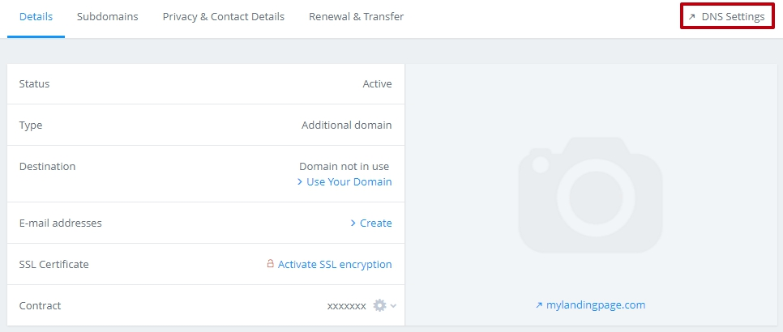
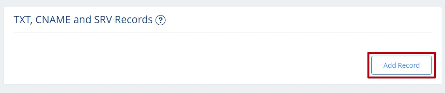
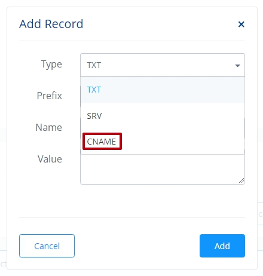

=====================
Set up your domain with 1and1.com
=====================

If you purchased a domain from 1and1.com, you can use it for your BitBlox Landing Page by following a process called domain/subdomain mapping. In this process, you'll change a few settings in your 1and1.com account to tell the domain/subdomain where to point.

		
.. contents::
    :local:
    :backlinks: top

	

	
1. `Log in to your BitBlox account <https://www.bitblox.me/welcome//>`__ 	
2. In your dashboard, click **Edit Page** on your Landing Page

    .. class:: screenshot

		|edit-my-landing-page-bitblox|
	
	
3. Open the **Side Bar** and click the **Settings** icon

	.. class:: screenshot

		|click-settings-bitblox|

		
4. Click **Settings** tab and then click **3rd Party Domain** tab

		
	.. class:: screenshot

		|click-3rd-party-domain-bitblox|

5. In the **Domain Name** box, enter the full domain name you want to link (ex: ``www.mylandingpage.com``)
6. Click **Connect Domain** button		
		
		
    .. class:: screenshot

		|click-connect-domain-bitblox|	
		
7. A new panel will be opened with the records from your provider domain account. Copy the name of your page (ex: ``bitbloxkb-lzj29.bitblox.online``) under the **required** row		
		
			
		
    .. class:: screenshot

		|copy-bitblox-page-name|	

	
8. `Log in to your 1and1.com account <https://www.1and1.com/login?__lf=Static/>`__ 
9. In **Your domain** section, click **Manage Domain**

	.. class:: screenshot

		|click-manage-domain-1and1|
		
10. Click on the **DNS Settings** tab in the right corner of the page

	.. class:: screenshot

		|click-dns-settings-1and1|
		
11. Scroll down to **TXT, CNAME and SRV Records** section and click **Add Record**	button	
	
	
	
	.. class:: screenshot

		|click-add-record-1and1|
	
	
12. From the drop down menu, select CNAME record
	
	
	.. class:: screenshot

		|select-cname-record|	
	

	
	

.. note::

	After you've claimed your domain, it can take up to 48 hours for changes to take effect. If it takes more than 48 hours, you should contact your custom domain provider.
		

Getting more help
------

For more help with settings in your 1and1.com account, contact their `support team <http://help.1and1.com/?hc=website>`__ . 

.. |edit-my-landing-page-bitblox| image:: _images/edit-my-landing-page-bitblox.jpg
.. |click-settings-bitblox| image:: _images/click-settings-bitblox.jpg
.. |click-3rd-party-domain-bitblox| image:: _images/click-3rd-party-domain-bitblox.jpg
.. |click-connect-domain-bitblox| image:: _images/click-connect-domain-bitblox.jpg
.. |copy-bitblox-page-name| image:: _images/copy-bitblox-page-name.jpg

.. |click-manage-domain-1and1| image:: _images/click-manage-domain-1and1.jpg

