=====================
Set up your domain with 1and1.com
=====================

If you purchased a domain from 1and1.com, you can use it for your BitBlox Landing Page by following a process called domain/subdomain mapping. In this process, you'll change a few settings in your 1and1.com account to tell the domain/subdomain where to point.

		
.. contents::
    :local:
    :backlinks: top

	

	
1. `Log in to your BitBlox account <https://www.bitblox.me/welcome//>`__ 	
2. In your dashboard, click **Edit Page** on your Landing Page

    .. class:: screenshot

		|edit-my-landing-page-bitblox|
	
	
3. Open the **Side Bar** and click the **Settings** icon

	.. class:: screenshot

		|click-settings-bitblox|

		
4. Click **Settings** tab and then click **3rd Party Domain** tab

		
	.. class:: screenshot

		|click-3rd-party-domain-bitblox|

5. In the **Domain Name** box, enter the full domain name you want to link (ex: ``www.mylandingpage.com``)
6. Click **Connect Domain** button		
		
		
    .. class:: screenshot

		|click-connect-domain-bitblox|	
		
7. A new panel will be opened with the records from your provider domain account. Copy the name of your page (ex: ``bitbloxkb-lzj29.bitblox.online``) under the **required** row		
		
			
		
    .. class:: screenshot

		|copy-bitblox-page-name|	

	
8. `Log in to your 1and1.com account <https://www.1and1.com/login?__lf=Static/>`__ 
9. In **Your domain** section, click **Manage Domain**

	.. class:: screenshot

		|click-manage-domain-1and1|
		

		
		
		
		
		
		
		
		
		
		
		
		
3. In the **Domains** page, click **Edit DNS Settings**

	.. class:: screenshot

		|1and1-click-manage-dns-settings|

4. Scroll down to **A/AAAA** and **CNAME Records** section, click **Other IP address (also valid for Managed Cloud Hosting)**

	.. class:: screenshot

		|1and1-click-other-ip|

5. In the box to the right of **IPv4 Address**, enter BitBlox's IP address ``162.243.77.151``. Leave any other boxes blank	

    .. class:: screenshot

		|1and1-edit-a-record|

6. Scroll down and click **Save** 

    .. class:: screenshot

		|1and1-save-a-record|

7. In the **Domains** page, click **Create rd PaSubdomain**
	
	.. class:: screenshot

		|1and1-click-create-subdomain|
	
	
8. In the **Create Subdomain** box, enter **www**
9. Click **Create Subdomain**
	
    .. class:: screenshot

		|1and1-create-subdomain|
	

10. In your BitBlox account, click **Edit Page** on your landing page 

     .. class:: screenshot

		|bitblox-click-edit-page|

		
11. Open the **Sidebar** and click the **Settings** icon

    .. class:: screenshot

		|bitblox-click-settings|

		
12. Click **Settings** tab and then click **3rd Party Domain** tab

    .. class:: screenshot

		|bitblox-click-3-rd-party-domain|

13. In the **Domain Name** box, enter the full domain name you want to link (ex: ``mylandingpage.com``), and then click **Connect Domain** button

    .. class:: screenshot

		|bitblox-connect-domain|
    
14. After you've claimed your domain, a new panel will be opened with the records from your provider domain account (it can take up to 48 hours for changes to take effect)

	
    .. class:: screenshot

		|bitblox-dns-settings|
	
15. If your records are entered correctly, the **Current Data** will be green

    .. class:: screenshot

		|bitblox-click-refresh|

    .. note::

		After you've claimed your domain, it can take up to 48 hours for changes to take effect. If it takes more than 48 hours, you should contact your custom domain provider.

		

Set up your subdomain with 1and1.com
------

1. `Log in to your 1and1.com account <https://www.1and1.com/login?__lf=Static/>`__ 
2. In **Your domain** section, click **Manage Domain**

	.. class:: screenshot

		|1and1-click-manage-subdomain|
		
		
		
3. In the **Domains** page, click **Create Subdomain**  
	
	.. class:: screenshot

		|1and1-select-subdomain|	
		
		
		
4. In the **Create Subdomain** box, enter subdomain prefix (if you picked ``promo.mydomain.com`` as your sudomain, enter ``promo``)
5. Click  **Create Subdomain**

	.. class:: screenshot

		|1and1-save-create-subdomain|

	
6. In the **Domains** page, click **Edit DNS Settings**

	.. class:: screenshot

		|1and1-click-edit-settings-subdomain|

7. Scroll down to **A/AAAA** and **CNAME Records**, click **Other IP address (also valid for Managed Cloud Hosting)**

	.. class:: screenshot

		|1and1-click-other-ip|

		
8. In the box to the right of **IPv4 Address**, enter BitBlox's IP address ``162.243.77.151``. Leave any other boxes blank	

    .. class:: screenshot

		|1and1-edit-a-record|

		
9. Scroll down and click **Save** 

    .. class:: screenshot

		|1and1-save-a-record|

10. In your BitBlox account, click **Edit Page** on your landing page 

     .. class:: screenshot

		|bitblox-click-edit-page|

		
		
11. Open the **Sidebar** and click the **Settings** icon

    .. class:: screenshot

		|bitblox-click-settings|
		
12. Click **Settings** tab and then click **3rd Party Domain** tab

    .. class:: screenshot

		|bitblox-click-3-rd-party-domain|

13. In the **Domain Name** box enter the full domain name you want to link (ex: ``promo.mydomain.com``), and then click **Connect Domain** button

    .. class:: screenshot

		|bitblox-subdomain-click-connect-domain|
    
14. After you've claimed your domain, a new panel will be opened with the records from your provider domain account (it can take up to 48 hours for changes to take effect)

	
    .. class:: screenshot

		|bitblox-subdomain-dns-settings|
	
15. If your records are entered correctly, the **Current Data** will be green

    .. class:: screenshot

		|bitblox-subdomain-refresh|

.. note::

	After you've claimed your domain, it can take up to 48 hours for changes to take effect. If it takes more than 48 hours, you should contact your custom domain provider.
		

Getting more help
------

For more help with settings in your 1and1.com account, contact their `support team <http://help.1and1.com/?hc=website>`__ . 

.. |edit-my-landing-page-bitblox| image:: _images/edit-my-landing-page-bitblox.jpg
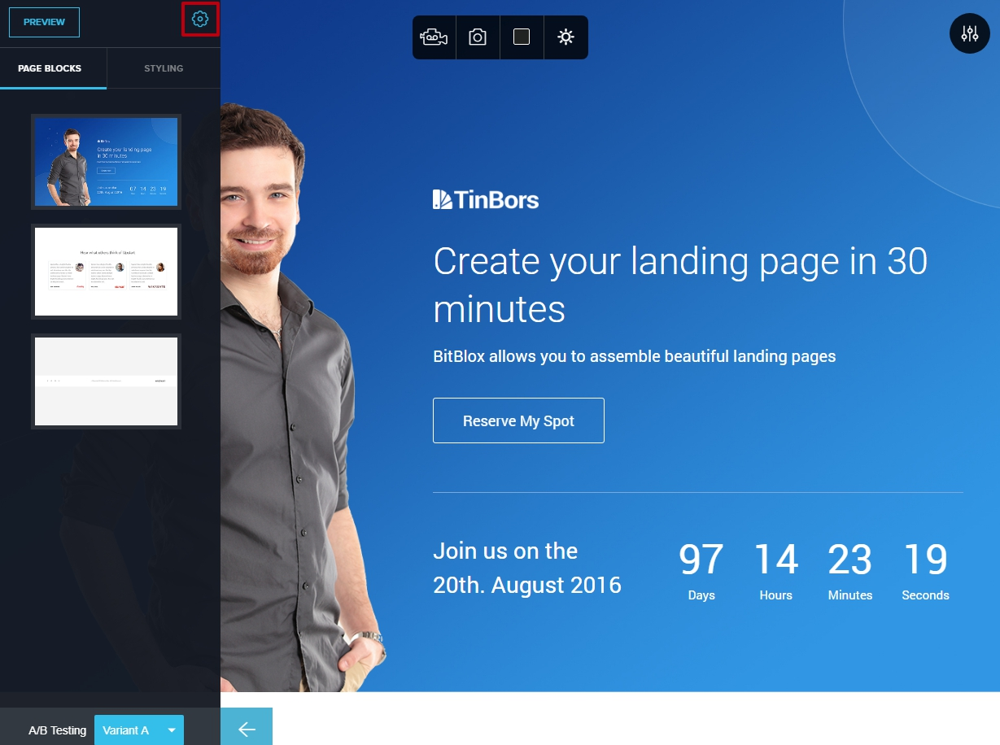
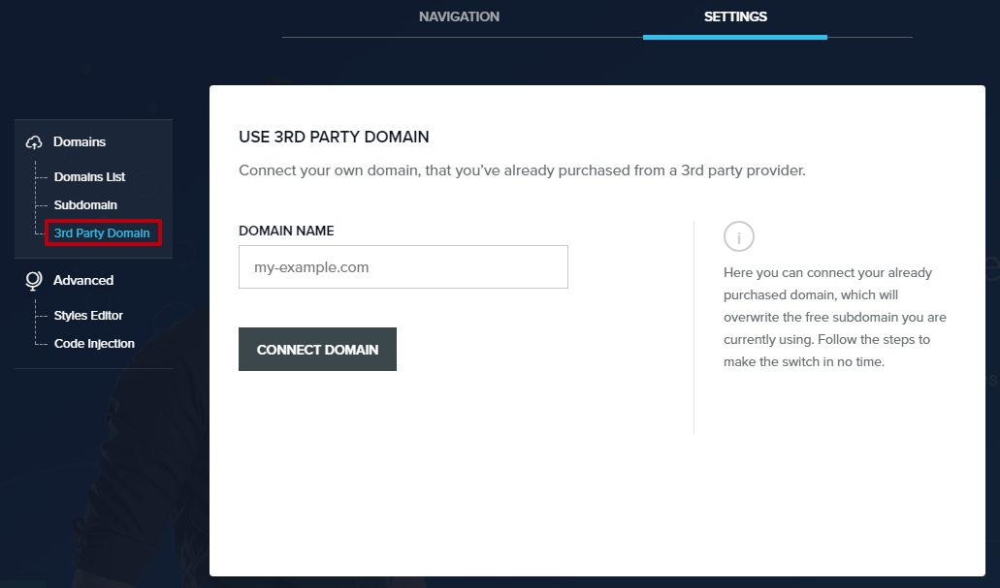
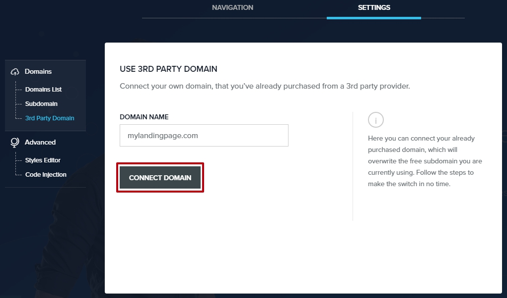
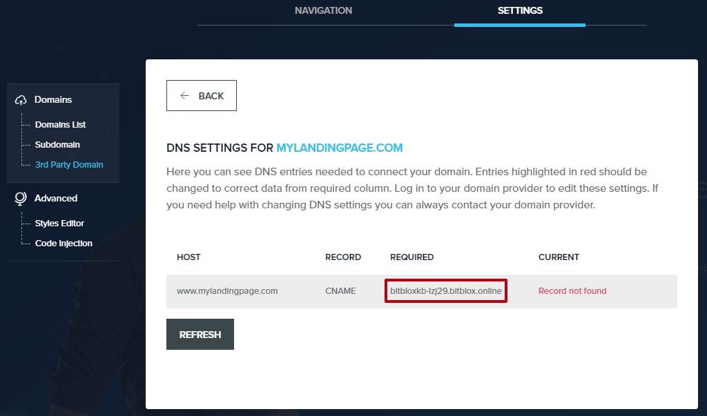

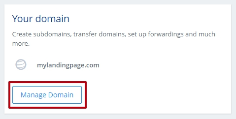

.. |1and1-click-manage-domain| image:: _images/1and1-click-manage-domain.png
.. |1and1-click-manage-dns-settings| image:: _images/1and1-click-manage-dns-settings.png
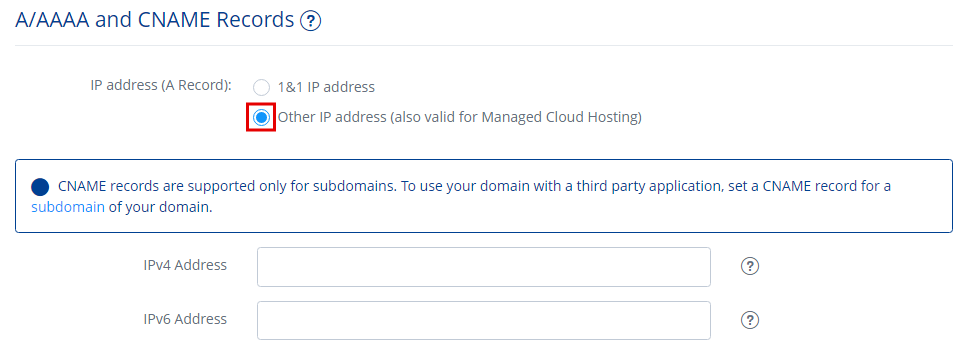
.. |1and1-edit-a-record| image:: _images/1and1-edit-a-record.png
.. |1and1-save-a-record| image:: _images/1and1-save-a-record.png
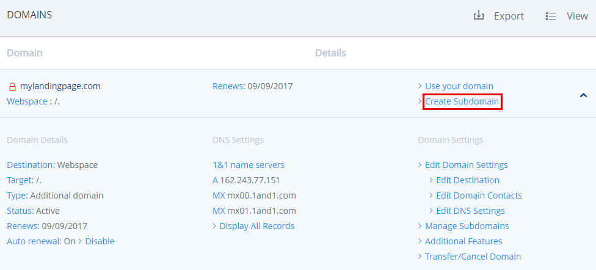
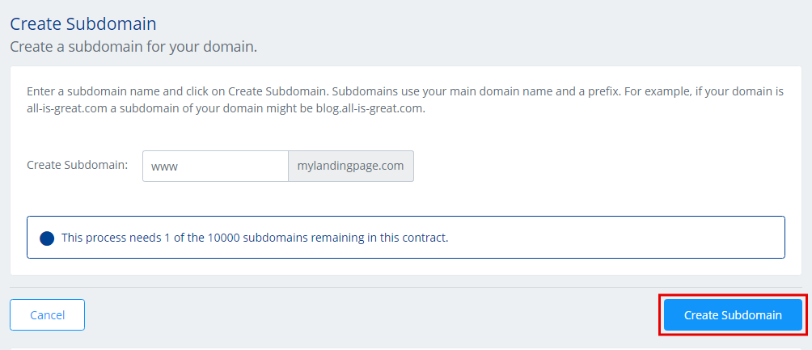

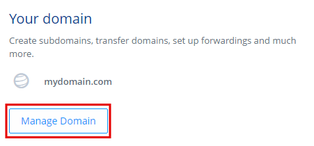
.. |1and1-select-subdomain|	image:: _images/1and1-select-subdomain.png
.. |1and1-save-create-subdomain| image:: _images/1and1-save-create-subdomain.png
.. |1and1-click-edit-settings-subdomain| image:: _images/1and1-click-edit-settings-subdomain.png

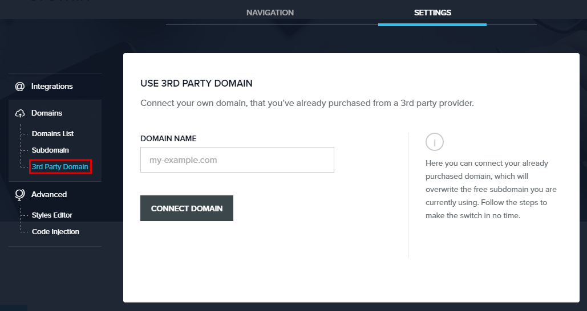
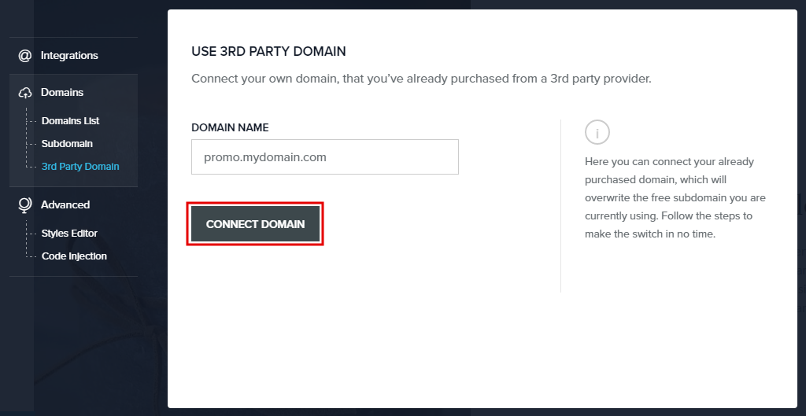
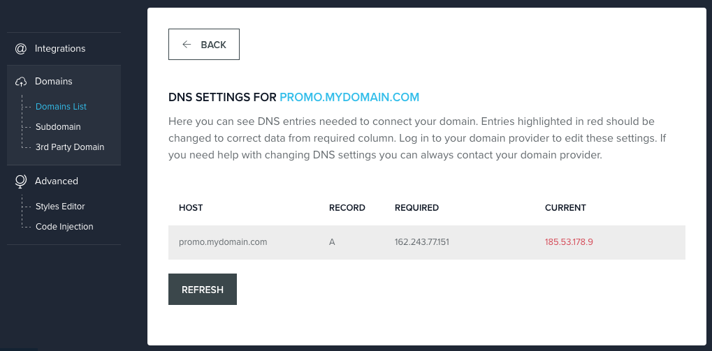
.. |bitblox-click-edit-page| image:: _images/bitblox-click-edit-page.png
.. |bitblox-subdomain-refresh| image:: _images/bitblox-subdomain-refresh.png
.. |bitblox-connect-domain| image:: _images/bitblox-connect-domain.png
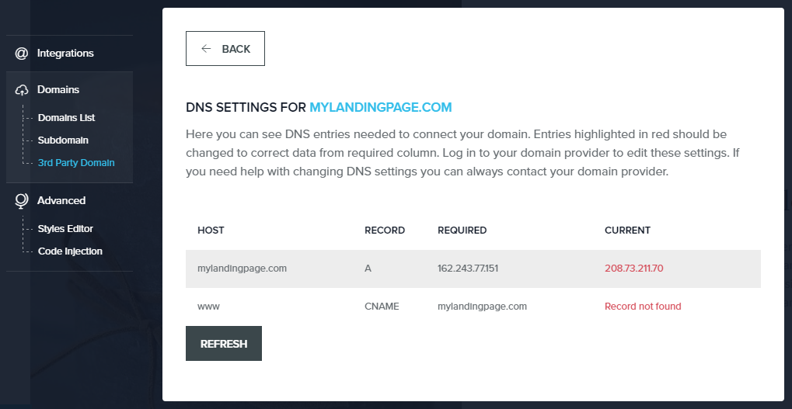
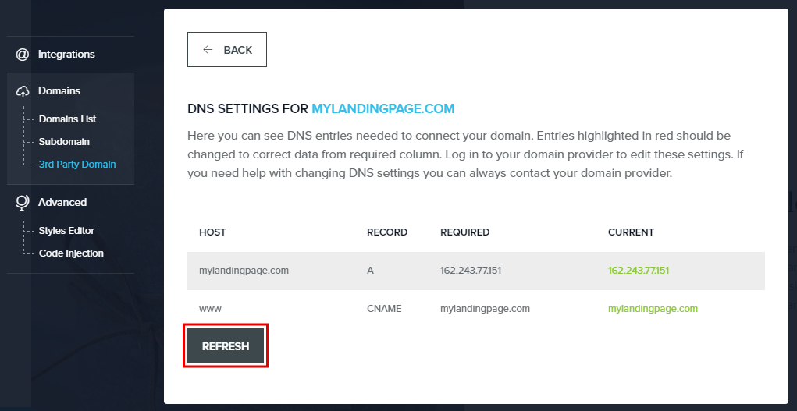
.. |bitblox-click-settings| image:: _images/bitblox-click-settings.jpg