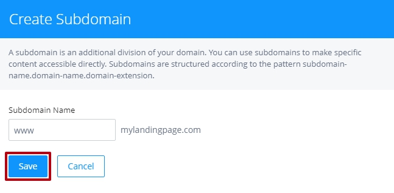
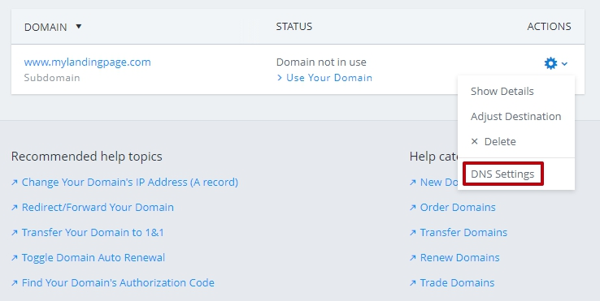

=====================
Set up your domain with 1and1.com
=====================

If you purchased a domain from 1and1, then you will have to configure your DNS Settings so that your domain points to your landing page.

		
.. contents::
    :local:
    :backlinks: top

	

	
1. `Log in to your BitBlox account <https://www.bitblox.me/welcome//>`__ 	
2. In your dashboard, click **Edit Page** on your Landing Page

    .. class:: screenshot

		|edit-my-landing-page-bitblox|
	
	
3. Open the **Side Bar** and click the **Settings** icon

	.. class:: screenshot

		|click-settings-bitblox|

		
4. Click **Settings** tab and then click **3rd Party Domain** tab

		
	.. class:: screenshot

		|click-3rd-party-domain-bitblox|

5. In the **Domain Name** box, enter the full domain name you want to link (ex: ``mylandingpage.com``)
6. Click **Connect Domain** button		
		
		
    .. class:: screenshot

		|click-connect-domain-bitblox|	
		
7. Under the **Required** row, copy the name of your page (ex: ``bitbloxkb-lzj29.bitblox.online``)	
		
			
		
    .. class:: screenshot

		|copy-bitblox-page-name|	

	
8. `Log in to your 1and1.com account <https://www.1and1.com/login?__lf=Static/>`__ 
9. In **Your domain** section, click **Manage Domain**

	.. class:: screenshot

		|click-manage-domain-1and1|

10. Open the **Subdomains** tab 

	.. class:: screenshot

		|open-subdomains-tab|

11. Click **Add Subdomain**

	.. class:: screenshot

		|click-add-subdomain|

12. In the **Subdomain Name** text box add **www** extension and click **Save** button

	
	.. class:: screenshot

		|add-www|

13. Click on the **DNS Settings** in the right corner of the page		
	
.. class:: screenshot

		|click-dns-settings-1and1|

	
14. Scroll down to **A/AAA and CNAME Records** section, click on the **CNAME** record

.. class:: screenshot

		|click-cname-record|

15. In the **Alias** text box, paste the name of your page (ex: ``bitbloxkb-lzj29.bitblox.online``) and click **Save** button
	

.. class:: screenshot

		|enter-the-name-of-bitblox-page|

16. In the 3rd Party Domain tab, click **Refresh** button 

.. class:: screenshot

		|click-refresh-bitblox|

		
17. If your records are entered correctly, the Current Data will be green

.. class:: screenshot

		|click-refresh-bitblox|

		.. note::

			After you've claimed your domain, it can take up to 48 hours for changes to take effect. If it takes more than 48 hours, you should contact your custom domain provider.
		

For more help with 3rd party domain connection,  contact our `support team <https://www.bitblox.me/support>`__ . 

.. |edit-my-landing-page-bitblox| image:: _images/edit-my-landing-page-bitblox.jpg
.. |click-settings-bitblox| image:: _images/click-settings-bitblox.jpg
.. |click-3rd-party-domain-bitblox| image:: _images/click-3rd-party-domain-bitblox.jpg
.. |click-connect-domain-bitblox| image:: _images/click-connect-domain-bitblox.jpg
.. |copy-bitblox-page-name| image:: _images/copy-bitblox-page-name.jpg

.. |click-refresh-bitblox| image:: _images/click-refresh-bitblox.jpg
