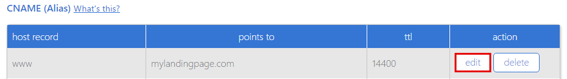
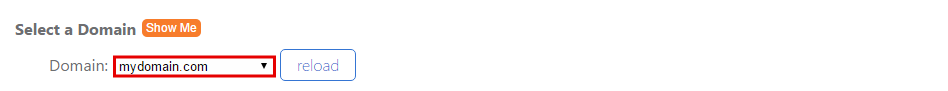
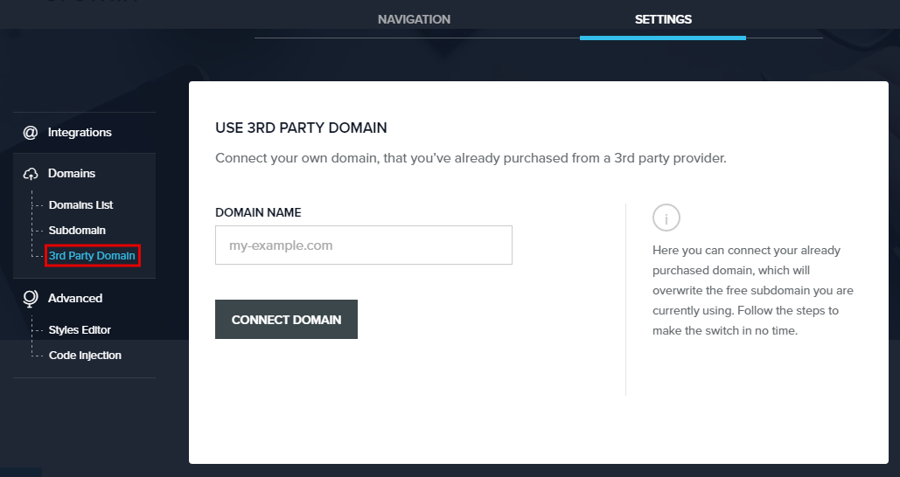

=====================
Set up your domain with BlueHost
=====================

If you purchased a domain from BlueHost, you can use it for your BitBlox Landing Page by following a process called domain/subdomain mapping. In this process, you'll change a few settings in your BlueHost account to tell the domain/subdomain where to point.

.. contents::
    :local:
    :backlinks: top

Set up your domain with BlueHost
------

1. `Log in to your BlueHost account <https://www.bluehost.com/>`__
2. In the **domains** section, click **zone editor**

	.. class:: screenshot

		|bluehost-click-zone-editor|

3. In the **Select a Domain** section, select domain you want to update from the drop-down menu

	.. class:: screenshot

		|bluehost-select-domain|

4. Click **reload** button

5. In the **A (Host)** table, click **edit** on the ``@`` row

    .. class:: screenshot

		|bluehost-edit-a-record|

6. Change the **points to** field to BitBlox's IP address ``162.243.77.151``
7. Click **save**

    .. class:: screenshot

		|bluehost-save-a-record|

8. In the **CNAME (Alias)** table, click **edit** on the **www** row:

	.. class:: screenshot

		|bluehost-edit-cname-record|

9. In the **points to** field, enter your domain name (ex: ``mylandingpage.com``)
10. Click **save**

	.. class:: screenshot

		|bluehost-save-cname-record|

11. In your BitBlox account, click **Edit Page** on your landing page

     .. class:: screenshot

		|bitblox-click-edit-page|

12. Open the **Sidebar** and click the **Settings** icon

    .. class:: screenshot

		|bitblox-click-settings|

13. Click **Settings** tab and then click **3rd Party Domain** tab

    .. class:: screenshot

		|bitblox-click-3-rd-party-domain|

14. In the **Domain Name** box enter the full domain name you want to link (ex: ``my-landing-page.com``) and then click **Connect Domain** button

    .. class:: screenshot

		|bitblox-connect-domain|

15. After you've claimed your domain, a new panel will be opened with the records from your provider domain account (it can take upt o 48 hours for changes to take effect)

    .. class:: screenshot

		|bitblox-dns-settings|

16. If your records are entered correctly, the **Current Data** will be green 

    .. class:: screenshot

		|bitblox-click-refresh|

    .. note::

		After you've claimed your domain, it can take up to 48 hours for changes to take effect. If it takes more than 48 hours, you should contact your custom domain provider.

Set up your subdomain with BlueHost
------

1. `Log in to your BlueHost account <https://www.bluehost.com>`__
2. In the **domains** section, click **zone editor**

	.. class:: screenshot

		|bluehost-click-zone-editor|

3. In the **Select a Domain** section, select domain you want to update from the drop-down

	.. class:: screenshot

		|bluehost-select-subdomain|

4. In the **A (Host)** table, click **edit** on the  ``@`` row

	.. class:: screenshot

		|bluehost-edit-a-subdomain|

5. In the **host record** column, enter your subdomain prefix (if you picked ``promo.mydomain.com`` as your sudomain, enter ``promo``)
6. In the **points to** column, enter BitBlox's IP address ``162.243.77.151``
7. Click **save**

	.. class:: screenshot

		|bluehost-a-record-save-subdomain|

8. In your BitBlox account, click **Edit Page** on your landing page

     .. class:: screenshot

		|bitblox-click-edit-page|

9.  Open the **Sidebar** and click the **Settings** icon

    .. class:: screenshot

		|bitblox-click-settings|

10. Click **Settings** tab and then click **3rd Party Domain** tab

    .. class:: screenshot

		|bitblox-click-3-rd-party-domain|

11. In the **Domain Name** box enter the full domain name you want to link ``promo.my-landing-page.com``, and then click **Connect Domain** button

    .. class:: screenshot

		|bitblox-subdomain-click-connect-domain|

12. After you've claimed your domain, a new panel will be opened with the records from your provider domain account (it can take upt o 48 hours for changes to take effect)

    .. class:: screenshot

		|bitblox-subdomain-dns-settings|

13. If your records are enetered correctly, the **Current Data** will be green

    .. class:: screenshot

		|bitblox-subdomain-refresh|

    .. note::

	After you've claimed your domain, it can take up to 48 hours for changes to take effect. If it takes more than 48 hours, you should contact your custom domain provider.

Getting more help
------

For more help with settings in your Bluehost account, contact their `support team <https://my.bluehost.com/hosting/help>`__ .

.. |bluehost-click-zone-editor| image:: _images/bluehost-click-zone-editor.png

.. |bitblox-subdomain-dns-settings| image:: _images/bitblox-subdomain-dns-settings.png
.. |bitblox-click-edit-page| image:: _images/bitblox-click-edit-page.png
.. |bitblox-subdomain-refresh| image:: _images/bitblox-subdomain-refresh.png
.. |bitblox-connect-domain| image:: _images/bitblox-connect-domain.png
.. |bitblox-dns-settings| image:: _images/bitblox-dns-settings.png
.. |bitblox-click-refresh| image:: _images/bitblox-click-refresh.png
.. |bitblox-click-settings| image:: _images/bitblox-click-settings.jpg
