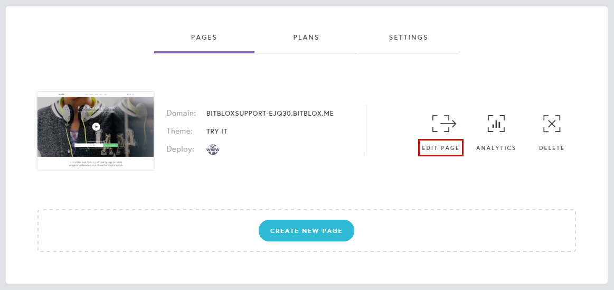
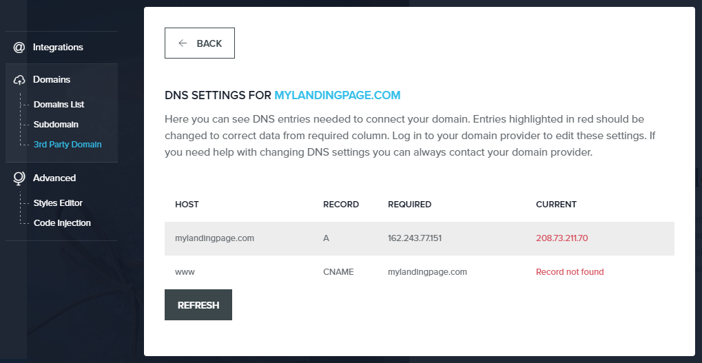

========
Set up your domain with Crazy Domains
========

If you purchased a domain from Crazy Domains, you can use it for your BitBlox Landing Page by following a process called domain/subdomain mapping. In this process, you'll change a few settings in your Crazy Domains account to tell the domain/subdomain where to point.

		
.. contents::
    :local:
    :backlinks: top

	
Set up your domain with Crazy Domains 
------

1. `Log in to your Crazy Domains account <https://www.crazydomains.com/>`__ 
2.  In the **Main Menu**, click **Domains**

    .. class:: screenshot

		|crazydomains-click-domains|
		

3. In the main page, scroll down to **DNS Settings** section and click **Add Record** 

    .. class:: screenshot

		|crazydomain-add-record|

4. Select **A Record** from the drop-down menu, then click **Add** 

    .. class:: screenshot

		|crazydomain-add-a-record|

5. Leave the **Sub Domain** box blank
6. In the **Alias For** box, enter	BitBlox's IP address ``162.243.77.151``
7. Click **Update**

    .. class:: screenshot
	
	    |crazydomain-save-a-record|

8. In the **DNS Setting** , select **Add Record** 

    .. class:: screenshot

		|crazydomain-add-cname-record|

9. Select **CNAME Record** from the drop-down menu, then click **Add** 

    .. class:: screenshot

		|crazydomain-add-cname|

		
10. In the **Sub Domain** box, enter **www**
11. In the **Alias For** box, enter your domain name (ex: ``mylandingpage.com``)
12. Click **Update**

    .. class:: screenshot

		|crazydomain-save-cname-record|

		
13. In your BitBlox account, click **Edit Page** on your landing page. 

     .. class:: screenshot

		|bitblox-click-edit-page|

		

14. Open the **Sidebar** and click the **Settings** icon

    .. class:: screenshot

		|bitblox-click-settings|

		
15. Click **Settings** tab and then click **3rd Party Domain** tab

    .. class:: screenshot

		|bitblox-click-3-rd-party-domain|

16. In the **Domain Name** box enter the full domain name you want to link ``mylandingpage.com``, and then click **Connect Domain** button

    .. class:: screenshot

		|bitblox-connect-domain|
    
17. After you've claimed your domain, a new panel will be opened with the records from your provider domain account (it can take upt o 48 hours for changes to take effect)

	
    .. class:: screenshot

		|bitblox-dns-settings|
	
18. If your records are enetered correctly, the **Current Data** will be green

    .. class:: screenshot

		|bitblox-click-refresh|

    .. note::

		After you've claimed your domain, it can take up to 48 hours for changes to take effect. If it takes more than 48 hours, you should contact your custom domain provider

		

Set up your subdomain with Crazy Domains
------

1. `Log in to your Crazy Domains account <https://www.crazydomains.com/>`__ 
2. In the **Main Menu**, click **Domains**:

    .. class:: screenshot

		|crazydomains-click-domains|
		

3. In the main page, scroll down to **DNS Settings** section and click **Add Record** 

    .. class:: screenshot

		|crazydomain-add-record|

4. Select **A Record** from the drop-down menu, then click **Add** 

    .. class:: screenshot

		|crazydomain-add-a-record|

5. In the **Sub Domain** box, enter your subdomain prefix (if you picked ``promo.mydomain.com`` as your sudomain, enter ``promo``)
6. In the **Alias For** box, enter	BitBlox's IP address ``162.243.77.151``
7. Click **Update**
		
    .. class:: screenshot

		|crazydomain-save-subdomain|	

		
8. In your BitBlox account, click **Edit Page** on your landing page. 

     .. class:: screenshot

		|bitblox-click-edit-page|

		
		
9.  Open the **Sidebar** and click the **Settings** icon

    .. class:: screenshot

		|bitblox-click-settings|
		
10. Click **Settings** tab and then click **3rd Party Domain** tab

    .. class:: screenshot

		|bitblox-click-3-rd-party-domain|

11. In the **Domain Name** box enter the full domain name you want to link ``promo.mylandingpage.com``, and then click **Connect Domain** button

    .. class:: screenshot

		|bitblox-subdomain-click-connect-domain|
    
12. After you've claimed your domain, a new panel will be opened with the records from your provider domain account (it can take upt o 48 hours for changes to take effect)

	
    .. class:: screenshot

		|bitblox-subdomain-dns-settings|
	
13. If your records are enetered correctly, the **Current Data** will be green

    .. class:: screenshot

		|bitblox-subdomain-refresh|

    .. note::

	After you've claimed your domain, it can take up to 48 hours for changes to take effect. If it takes more than 48 hours, you should contact your custom domain provider.
		

Getting more help
------

For more help with settings in your Crazy Domain account, contact their `support team <https://www.crazydomains.com/help/>`__ . 

.. |crazydomains-click-domains| image:: _images/crazydomains-click-domains.png

.. |crazydomains-click-domains| image:: _images/crazydomains-click-domains.png

.. |bitblox-click-3-rd-party-domain| image:: _images/bitblox-click-3-rd-party-domain.png
.. |bitblox-subdomain-click-connect-domain| image:: _images/bitblox-subdomain-click-connect-domain.png
.. |bitblox-subdomain-dns-settings| image:: _images/bitblox-subdomain-dns-settings.png

.. |bitblox-subdomain-refresh| image:: _images/bitblox-subdomain-refresh.png
.. |bitblox-connect-domain| image:: _images/bitblox-connect-domain.png

.. |bitblox-click-refresh| image:: _images/bitblox-click-refresh.png
.. |bitblox-click-settings| image:: _images/bitblox-click-settings.jpg