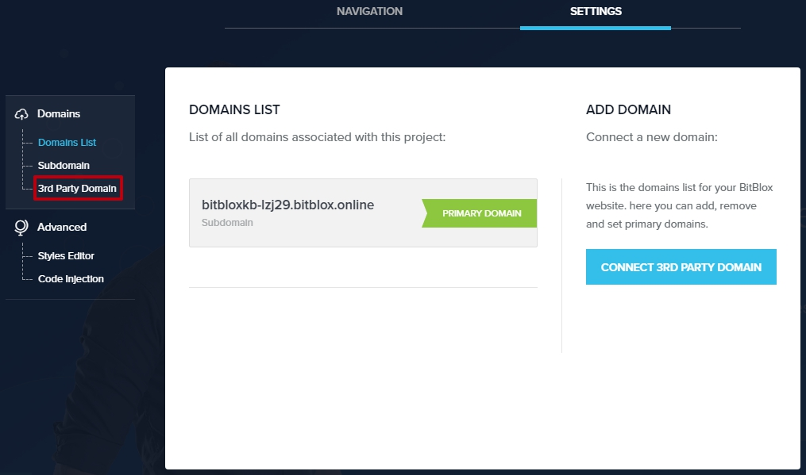
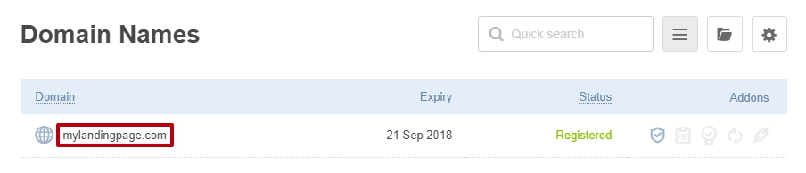
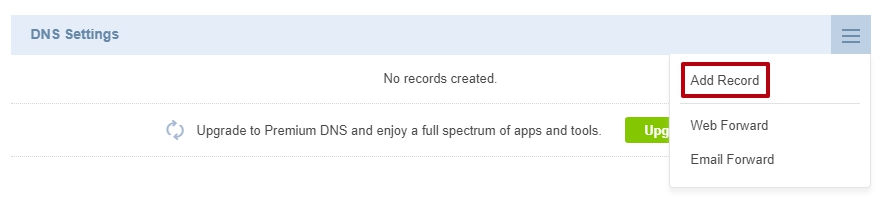
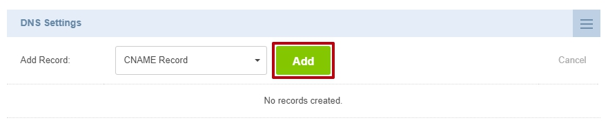
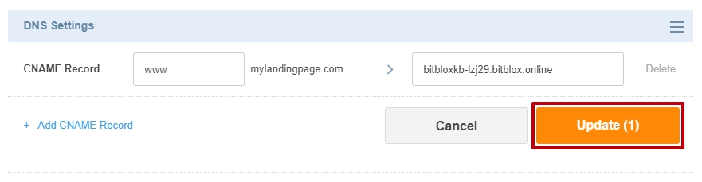

========
Set up your domain with Crazy Domains
========

If you purchased a domain from Crazy Domains, you can use it for your BitBlox Landing Page by following a process called domain/subdomain mapping. In this process, you'll change a few settings in your Crazy Domains account to tell the domain/subdomain where to point.

		
.. contents::
    :local:
    :backlinks: top

	
	
1. `Log in to your BitBlox account <https://www.bitblox.me/welcome//>`__ 	
2. In your dashboard, click **Edit Page** on your Landing Page

    .. class:: screenshot

		|edit-my-landing-page-bitblox|
	
	
3. Open the **Side Bar** and click the **Settings** icon

	.. class:: screenshot

		|click-settings-bitblox|

		
4. Click **Settings** tab and then click **3rd Party Domain** tab

		
	.. class:: screenshot

		|click-3rd-party-domain-bitblox|

5. In the **Domain Name** box, enter the full domain name you want to link (ex: ``mylandingpage.com``)
6. Click **Connect Domain** button		
		
		
    .. class:: screenshot

		|click-connect-domain-bitblox|	
		
7. A new panel will be opened with the records from your provider domain account. Copy the name of your page (ex: ``bitbloxkb-lzj29.bitblox.online``) under the **required** row		
		
			
		
    .. class:: screenshot

		|copy-bitblox-page-name|	
	
	
	
8. `Log in to your Crazy Domains account <https://www.crazydomains.com/>`__ 	
	
9. 	In the **Main Menu**, click **Domains**
	
	
    .. class:: screenshot

		|crazydomains-click-domains|	
	
	
	
10. Click on your selected Domain Name

	
	.. class:: screenshot

		|crazydomains-click-domain-name|	
	
	
11. In the main page, scroll down to **DNS Settings** section. Delete **A Record** and then click **Update**

	.. class:: screenshot

		|crazydomains-delete-a-record|	

	
12. Click **Add Record** 

    .. class:: screenshot

		|crazydomain-add-record|

13. Select **CNAME** from the drop-down menu, then click **Add** 

    .. class:: screenshot

		|crazydomains-add-cname|

		
14. Enter the name of your page (ex: ``bitbloxkb-lzj29.bitblox.online``) and click **Save** button
	
	.. class:: screenshot

		|crazydomain-enter-bitblox-page|

15. In your BitBlox account, click **Refresh** button on the DNS Settings:

.. class:: screenshot

		|click-refresh-bitblox|

14. If your records are entered correctly, the Current Data will be green   
	
	
	.. class:: screenshot

		|bitblox-green|	
	
	
	
	.. note::

	After you've claimed your domain, it can take up to 48 hours for changes to take effect. If it takes more than 48 hours, you should contact your custom domain provider.
		

Getting more help
------

For more help with settings in your Crazy Domain account, contact their `support team <https://www.crazydomains.com/help/>`__ . 

.. |edit-my-landing-page-bitblox| image:: _images/edit-my-landing-page-bitblox.jpg
.. |click-settings-bitblox| image:: _images/click-settings-bitblox.jpg

.. |click-connect-domain-bitblox| image:: _images/click-connect-domain-bitblox.jpg
.. |copy-bitblox-page-name| image:: _images/copy-bitblox-page-name.jpg

.. |crazydomains-click-domains| image:: _images/crazydomains-click-domains.png

.. |crazydomains-delete-a-record|	image:: _images/detelete-a-record.jpg

.. |click-refresh-bitblox| image:: _images/click-refresh-bitblox.jpg
.. |bitblox-green|	image:: _images/bitblox-green.jpg