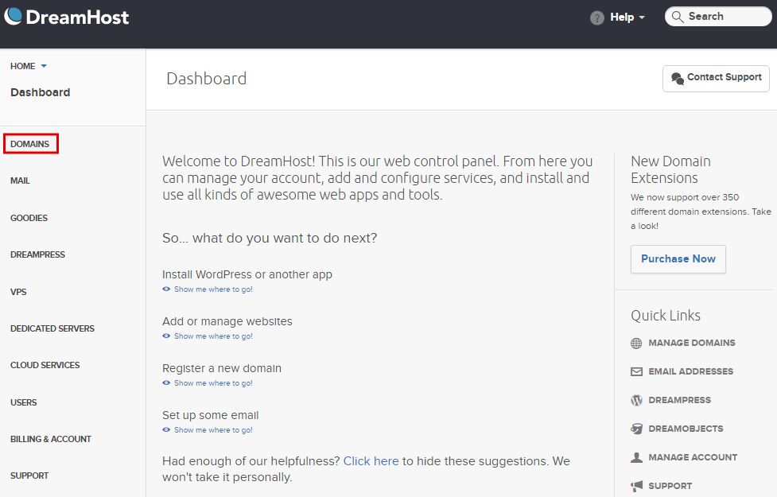
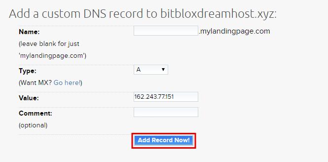
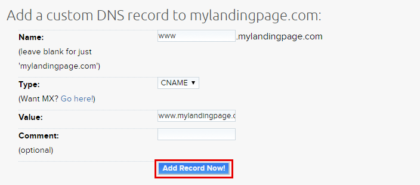
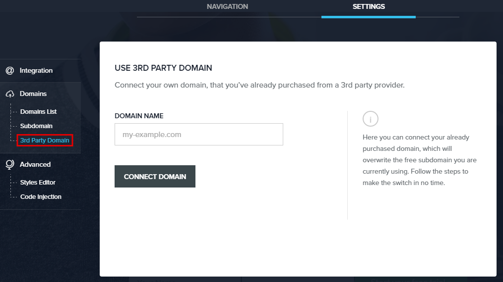
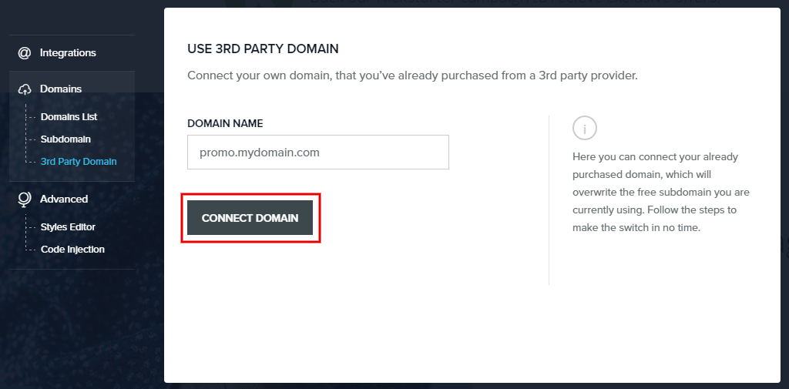
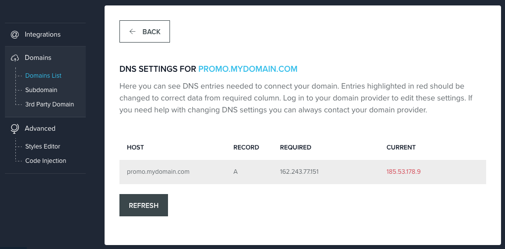
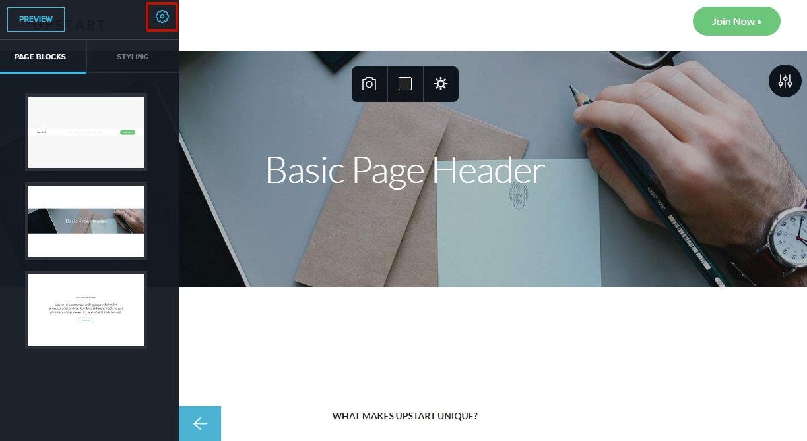

========
Set up your domain with DreamHost
========

If you purchased a domain from DreamHost, you can use it for your BitBlox Landing Page by following a process called domain/subdomain mapping. In this process, you'll change a few settings in your DreamHost account to tell the domain/subdomain where to point.

		
.. contents::
    :local:
    :backlinks: top

	
Set up your domain with DreamHost
------

1. `Log in to your DreamHost account <https://panel.dreamhost.com/>`__ 
2. In the **Main Menu**, click **Domains**

    .. class:: screenshot

		|dreamhost-open-domains|
		

3. Click **Manage Domains**

    .. class:: screenshot

		|dreamhost-click-manage-domains|

4. Under your domain, click **DNS**

    .. class:: screenshot

		|dreamhost-click-dns|

		
5. In the **Name** box, leave the white blank 
6. In the **Type** drop down menu, select **A** Record
7. In the **Value** box, enter BitBlox's IP address ``162.243.77.151``  
8. Click **Add Record Now!**  

    .. class:: screenshot

		|dreamhost-enter-ip|

9. In the **Name** box, enter **www**
10. In the **Type** drop down menu, select **CNAME** Record
11. In the **Value** box, enter your domain name (ex: ``mylandingpage.com``). 
12. Click **Add Record Now**

    .. class:: screenshot

		|dreamhost-save-cname-record|
	
13. In your BitBlox account, click **Edit Page** on your landing page. 

     .. class:: screenshot

		|bitblox-click-edit-page|

		

14. Open the Page panel and click the **Settings** icon

    .. class:: screenshot

		|bitblox-click-settings|

		
15. Click **Settings** tab and then click **3rd Party Domain** tab

    .. class:: screenshot

		|bitblox-click-3-rd-party-domain|

16. In the **Domain Name** box enter the full domain name you want to link, and then click **Connect Domain** button

    .. class:: screenshot

		|bitblox-connect-domain|
    
17. After you connect your domain, a new panel will open with the records you need to enter in your provider account so your domain connects to BitBlox.

	
    .. class:: screenshot

		|bitblox-dns-settings|
	
18. After changing the records in your domain provider, return to BitBlox **Domain List** and click **Refresh** button. If your records are enetered correctly, the **Current Data** will be in green color.

    .. class:: screenshot

		|bitblox-click-refresh|

    .. note::

		After you've claimed your domain, it can take up to 48 hours for changes to take effect. If it takes more than 48 hours, you should contact your custom domain provider.

		

Set up your subdomain with DreamHost
------

1. `Log in to your DreamHost account <https://panel.dreamhost.com/>`__  
2. In the **Main Menu**, click **Domains**

    .. class:: screenshot

		|dreamhost-open-domains|
		

3. Click **Manage Domains**

    .. class:: screenshot

		|dreamhost-click-manage-domains|

4. Under your domain, click **DNS**

    .. class:: screenshot

		|dreamhost-click-dns-subdomain|

5. In the **Name** box, enter your subdomain prefix (if you picked ``promo.mydomain.com`` as your sudomain, enter ``promo``)
6. In the **Type** drop down menu, select **A** Record
7. In the **Value** text box, enter BitBlox's IP address ``162.243.77.151`` 
8. Click  **Add Record Now!**  

    .. class:: screenshot

		|dreamhost-add-ip-subdomain|	

		
9. In your BitBlox account, click **Edit Page** on your landing page. 

     .. class:: screenshot

		|bitblox-click-edit-page|

		
		
10.  Open the Page panel and click the **Settings** icon

    .. class:: screenshot

		|bitblox-click-settings|
		
11. Click **Settings** tab and then click **3rd Party Domain** tab

    .. class:: screenshot

		|bitblox-click-3-rd-party-domain|

12. In the **Domain Name** box enter the full domain name you want to link, and then click **Connect Domain** button

    .. class:: screenshot

		|bitblox-subdomain-click-connect-domain|
    
13. After you connect your domain, a new panel will open with the records you need to enter in your provider account so your domain connects to BitBlox.

	
    .. class:: screenshot

		|bitblox-subdomain-dns-settings|
	
14. After changing the records in your domain provider, return to BitBlox **Domain List** and click **Refresh** button. If your records are enetered correctly, the **Current Data** will be in green color.

    .. note::

	After you've claimed your domain, it can take up to 48 hours for changes to take effect. If it takes more than 48 hours, you should contact your custom domain provider.
		

Getting more help
------

For more help with settings in your DreamHost account, contact their `support team <https://help.dreamhost.com/hc/en-us>`__ . 

.. |dreamhost-click-manage-domains| image:: _images/dreamhost-click-manage-domains.png
.. |dreamhost-click-dns| image:: _images/dreamhost-click-dns.png

.. |dreamhost-click-dns-subdomain| image:: _images/dreamhost-click-dns-subdomain.png
.. |dreamhost-add-ip-subdomain| image:: _images/dreamhost-add-ip-subdomain.png

.. |bitblox-click-edit-page| image:: _images/bitblox-click-edit-page.png
.. |bitblox-subdomain-refresh| image:: _images/bitblox-subdomain-refresh.png
.. |bitblox-connect-domain| image:: _images/bitblox-connect-domain.png
.. |bitblox-dns-settings| image:: _images/bitblox-dns-settings.png
.. |bitblox-click-refresh| image:: _images/bitblox-click-refresh.png

