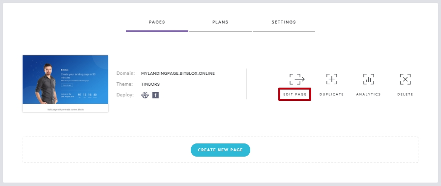
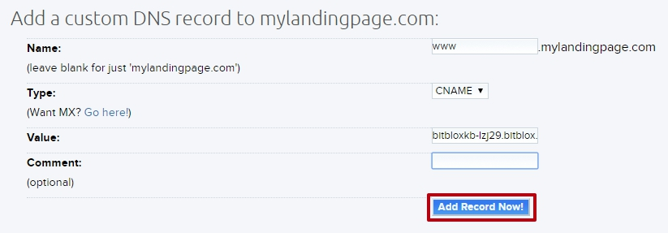

========
Set up your domain with DreamHost
========

If you purchased a domain from DreamHost, then you will have to configure your DNS Settings so that your domain points to your landing page.

		
.. contents::
    :local:
    :backlinks: top

1. `Log in to your BitBlox account <https://www.bitblox.me/welcome//>`__ 	
2. In your dashboard, click **Edit Page** on your Landing Page

    .. class:: screenshot

		|edit-my-landing-page-bitblox|
	
	
3. Open the **Side Bar** and click the **Settings** icon

	.. class:: screenshot

		|click-settings-bitblox|

		
4. Click **Settings** tab and then click **3rd Party Domain** tab

		
	.. class:: screenshot

		|click-3rd-party-domain-bitblox|

5. In the **Domain Name** box, enter the full domain name you want to link (ex: ``mylandingpage.com``)
6. Click **Connect Domain** button		
		
		
    .. class:: screenshot

		|click-connect-domain-bitblox|	
		
7. Under the **Required** row, copy the name of your page (ex: ``bitbloxkb-lzj29.bitblox.online``)		
		
			
		
    .. class:: screenshot

		|copy-bitblox-page-name|	
	
	
	
8. `Log in to your DreamHost account <https://panel.dreamhost.com/>`__ 	
	
9. In the **Main Menu**, click **Domains**

    .. class:: screenshot

		|dreamhost-open-domains|
		

10. Click **Manage Domains**

    .. class:: screenshot

		|dreamhost-click-manage-domains|

11. Under your domain, click the **DNS** link

    .. class:: screenshot

		|dreamhost-click-dns|	
	
	
12. In the **Name** text box, enter the **www** extension
13. In the **Type** drop down menu, select **CNAME** Record
14. In the **Value** text box, paste the name of your page (ex: ``bitbloxkb-lzj29.bitblox.online``) 
15. Click **Add Record Now** button

    .. class:: screenshot

		|dreamhost-save-cname-record|	

	
16. In the 3rd Party Domain tab, click **Refresh** button

	.. class:: screenshot

		|click-refresh-bitblox|

17. If your records are entered correctly, the Current Data will be green   
	
	
	.. class:: screenshot

		|bitblox-green|	
	
	
		.. note::

			After you've claimed your domain, it can take up to 48 hours for changes to take effect. If it takes more than 48 hours, you should contact your custom domain provider.
		

For more help with 3rd party domain connection,  contact our `support team <https://www.bitblox.me/support>`__ . 	
	

		
	
	

.. |click-settings-bitblox| image:: _images/click-settings-bitblox.jpg
.. |click-3rd-party-domain-bitblox| image:: _images/click-3rd-party-domain-bitblox.jpg
.. |click-connect-domain-bitblox| image:: _images/click-connect-domain-bitblox.jpg
.. |copy-bitblox-page-name| image:: _images/copy-bitblox-page-name.jpg	

.. |dreamhost-open-domains| image:: _images/dreamhost-open-domains.png
.. |dreamhost-click-manage-domains| image:: _images/dreamhost-click-manage-domains.png
.. |dreamhost-click-dns| image:: _images/dreamhost-click-dns.png	

	
	
	
	
	
.. |click-refresh-bitblox| image:: _images/click-refresh-bitblox.jpg
.. |bitblox-green|	image:: _images/bitblox-green.jpg	
	