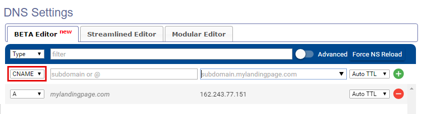
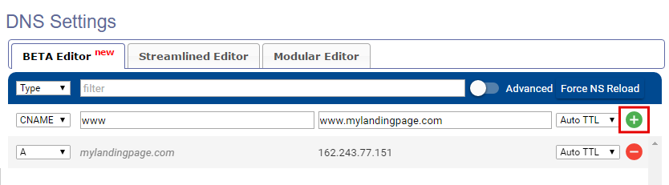
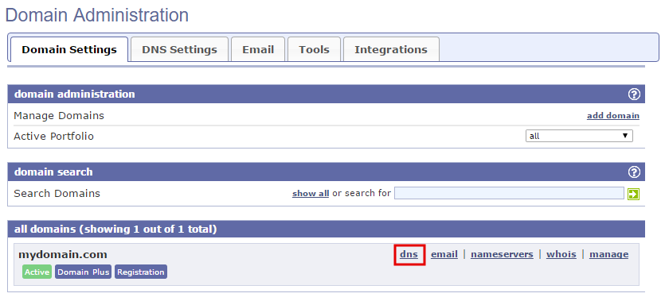

========
Set up your domain with EasyDNS
========

If you purchased a domain from EasyDNS, you can use it for your BitBlox Landing Page by following a process called domain/subdomain mapping. In this process, you'll change a few settings in your EasyDNS account to tell the domain/subdomain where to point.

		
.. contents::
    :local:
    :backlinks: top

	
Set up your domain with EasyDNS
------

1. `Log in to your EasyDNS account <https://cp.easydns.com/login.php>`__ 
2. Click **dns** next to your domain name

	.. class:: screenshot

		|easydns-open-domain|
		

3. In the **Type** drop-down menu, select **A** Record

	.. class:: screenshot

		|easydns-select-a-record|

4. In the **subdomain or @** box, enter ``@``
5. In the **IPv4 address** box enter BitBlox's IP address ``162.243.77.151``
6. Click **+** icon

	.. class:: screenshot

		|easydns-save-a-record|

7. In the **Type** drop-down menu, select **CNAME** Record 

    .. class:: screenshot

		|easydns-select-cname-record|
		
		
8. In the **subdomain or @** box, enter **www**
9. In the **subdomain.mylandingpage.com** box, enter your domain name  (ex: ``mylandingpage.com``)
10. Click **+** icon

	.. class:: screenshot

		|easydns-save-cname-record|

	
		
11. In your BitBlox account, click **Edit Page** on your landing page. 

     .. class:: screenshot

		|bitblox-click-edit-page|

		

12. Open the **Sidebar** and click the **Settings** icon

    .. class:: screenshot

		|bitblox-click-settings|

		
13. Click **Settings** tab and then click **3rd Party Domain** tab

    .. class:: screenshot

		|bitblox-click-3-rd-party-domain|

14. In the **Domain Name** box enter the full domain name you want to link (ex: ``mylandingpage.com``) and then click **Connect Domain** button

    .. class:: screenshot

		|bitblox-connect-domain|
    
15. After you've claimed your domain, a new panel will be opened with the records from your provider domain account (it can take upt o 48 hours for changes to take effect)

	
    .. class:: screenshot

		|bitblox-dns-settings|
	
16. If your records are entered correctly, the **Current Data** will be green

    .. class:: screenshot

		|bitblox-click-refresh|

    .. note::

		After you've claimed your domain, it can take up to 48 hours for changes to take effect. If it takes more than 48 hours, you should contact your custom domain provider.

		

Set up your subdomain with EasyDNS
------

1. `Log in to your EasyDNS account <https://cp.easydns.com/login.php>`__
2. Click **dns** next to your domain name

	.. class:: screenshot

		|easydns-open-subdomain|
		

3. In the **Type** drop-down menu, select **A** Record

	.. class:: screenshot

		|easydns-select-a-record-subdomain|

4. In the **subdomain or @** box enter your subdomain prefix, (if you picked ``promo.mydomain.com`` as your sudomain, enter ``promo``)
5. In the **IPv4 address** box enter BitBlox's IP address ``162.243.77.151``

6. Click **+** icon

	.. class:: screenshot

		|easydns-save-a-record-subdomain|

		
7. In your BitBlox account, click **Edit Page** on your landing page. 

    .. class:: screenshot

		|bitblox-click-edit-page|

		
		
8. Open the **Sidebar** and click the **Settings** icon

    .. class:: screenshot

		|bitblox-click-settings|
		
9. Click **Settings** tab and then click **3rd Party Domain** tab

    .. class:: screenshot

		|bitblox-click-3-rd-party-domain|

10. In the **Domain Name** box enter the full domain name you want to link (ex: ``promo.mylandingpage.com``), and then click **Connect Domain** button

    .. class:: screenshot

		|bitblox-subdomain-click-connect-domain|
    
11. After you've claimed your domain, a new panel will be opened with the records from your provider domain account (it can take upt o 48 hours for changes to take effect)

	
    .. class:: screenshot

		|bitblox-subdomain-dns-settings|
	
12. If your records are entered correctly, the **Current Data** will be green

    .. note::

	After you've claimed your domain, it can take up to 48 hours for changes to take effect. If it takes more than 48 hours, you should contact your custom domain provider.
		

Getting more help
------

For more help with settings in your EasyDNS account, contact their `support team <https://www.easydns.com/support-3/>`__ . 

.. |bitblox-click-3-rd-party-domain| image:: _images/bitblox-click-3-rd-party-domain.png
.. |bitblox-subdomain-click-connect-domain| image:: _images/bitblox-subdomain-click-connect-domain.png
.. |bitblox-subdomain-dns-settings| image:: _images/bitblox-subdomain-dns-settings.png
.. |bitblox-click-edit-page| image:: _images/bitblox-click-edit-page.png
.. |bitblox-subdomain-refresh| image:: _images/bitblox-subdomain-refresh.png
.. |bitblox-connect-domain| image:: _images/bitblox-connect-domain.png
.. |bitblox-dns-settings| image:: _images/bitblox-dns-settings.png
.. |bitblox-click-refresh| image:: _images/bitblox-click-refresh.png
.. |bitblox-click-settings| image:: _images/bitblox-click-settings.jpg

