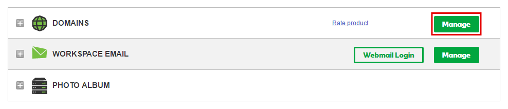
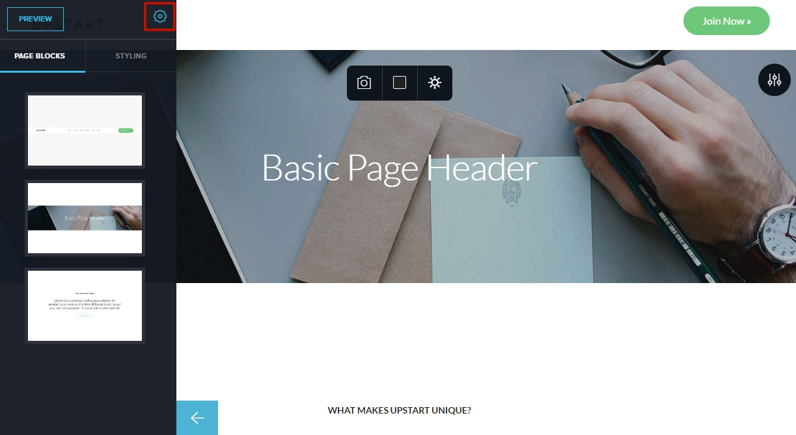

========
Set up your domain with GoDaddy
========

If you purchased a domain from GoDaddy, you can use it for your BitBlox Landing Page by following a process called domain/subdomain mapping. In this process, you'll change a few settings in your GoDaddy account to tell the domain/subdomain where to point.

.. contents::
    :local:
    :backlinks: top

Set up your domain with GoDaddy
------

1. `Log in to your GoDaddy account <https://sso.godaddy.com/?realm=idp&app=mya&path=?ci=>`__
2.  In the **Domains** section, click **Manage**

	.. class:: screenshot

		|godaddy-click-manage|

3. Select the domain you would like to connect and click the **Settings** icon, and select **Manage DNS**

	.. class:: screenshot

		|godaddy-manage-dns|

4. In the **Records** section, click the **Edit Record** icon for the **A** record

	.. class:: screenshot

		|godaddy-edit-a-record|

5. In the **Points to** text box, enter BitBlox's IP address ``162.243.77.151``
6. Click **Save**

    .. class:: screenshot

	    |godaddy-enter-ip|

7. In the row of the **www** host, click the **Edit Record** icon

	.. class:: screenshot

		|godaddy-edit-cname|

8. In the **Points to** text box, enter your domain name (ex: ``mylandingpage.com``)
9. Click **Save**

	.. class:: screenshot

		|godaddy-enter-www|

.. include:: ../general/bitblox-thirt-party-domain.rst

Set up your subdomain with GoDaddy
------

1. `Log in to your GoDaddy account <https://sso.godaddy.com/?realm=idp&app=mya&path=?ci=>`__
2. In the **Domains** section, click **Manage**

	.. class:: screenshot

		|godaddy-click-manage|

3. Select the domain you would like to connect and click the **Settings** icon, and select **Manage DNS**

	.. class:: screenshot

		|godaddy-manage-dns-subdomain|

4. In the **Records** section, click the **ADD** icon

	.. class:: screenshot

		|godaddy-add-new-record-subdomain|

5. In the **Type** column, use the drop-down menu to select **A Record**
6. In the **Host** text box, enter your subdomain prefix (if you picked ``promo.mydomain.com`` as your subdomain, enter ``promo``)
7. In the **Points To** text box, enter BitBlox's IP address ``162.243.77.151``
8. Click **Save**

    .. class:: screenshot

		|godaddy-enter-subdomain|

.. include:: ../general/bitblox-thirt-party-subdomain.rst

Getting more help
------

For more help with settings in your GoDaddy account, contact their `support team <https://uk.godaddy.com/help>`__ .

.. |godaddy-manage-dns| image:: _images/godaddy-manage-dns.png

.. |bitblox-click-3-rd-party-domain| image:: _images/bitblox-click-3-rd-party-domain.png
.. |bitblox-subdomain-click-connect-domain| image:: _images/bitblox-subdomain-click-connect-domain.png
.. |bitblox-subdomain-dns-settings| image:: _images/bitblox-subdomain-dns-settings.png
.. |bitblox-click-edit-page| image:: _images/bitblox-click-edit-page.png
.. |bitblox-subdomain-refresh| image:: _images/bitblox-subdomain-refresh.png
.. |bitblox-connect-domain| image:: _images/bitblox-connect-domain.png
.. |bitblox-dns-settings| image:: _images/bitblox-dns-settings.png
.. |bitblox-click-refresh| image:: _images/bitblox-click-refresh.png

