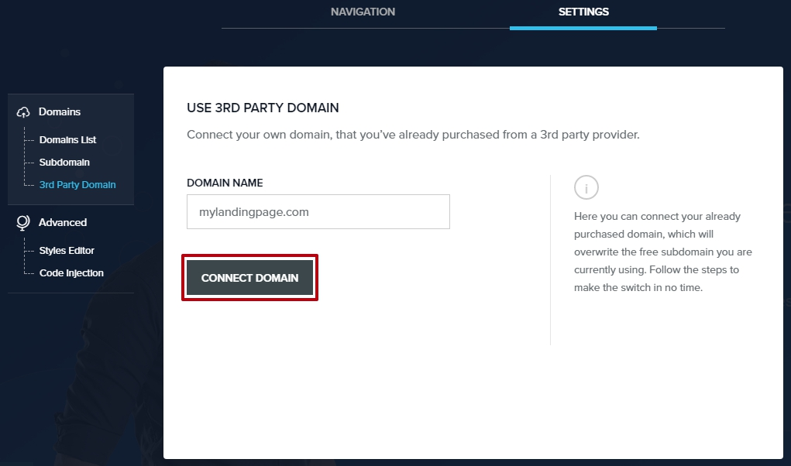
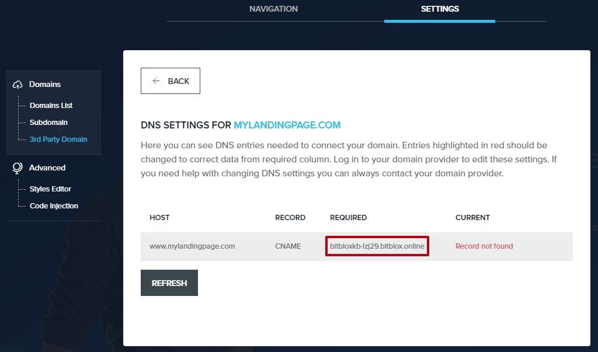
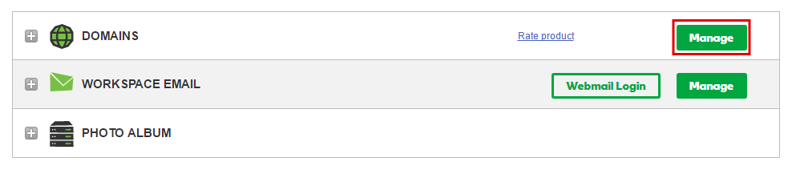
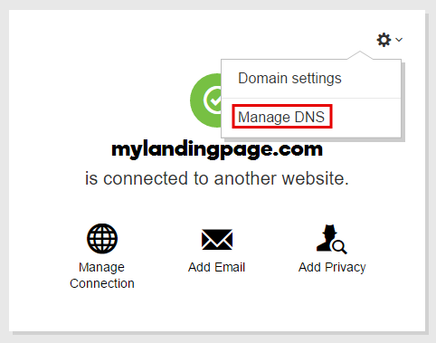
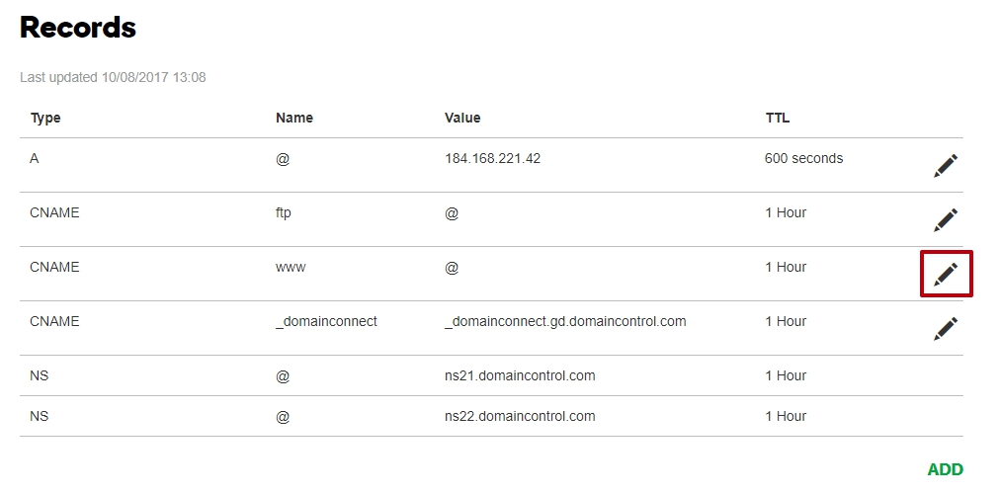
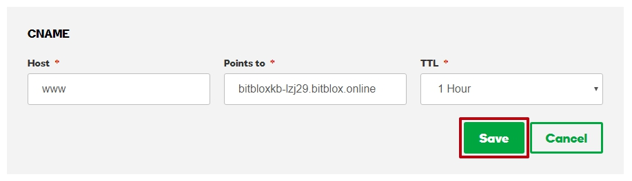
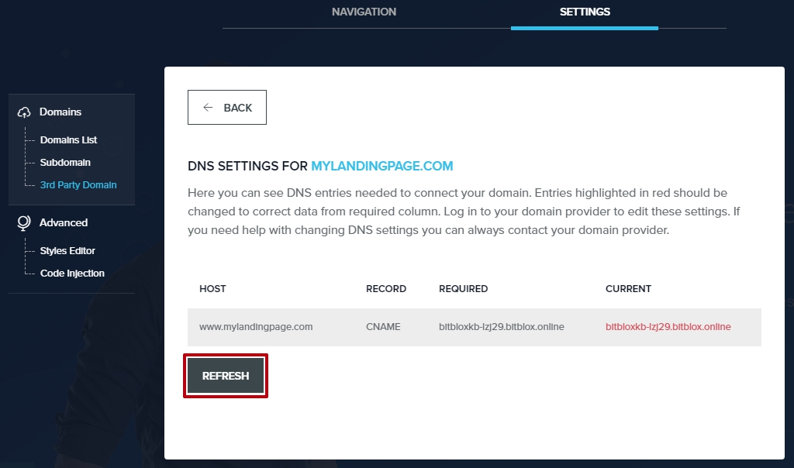
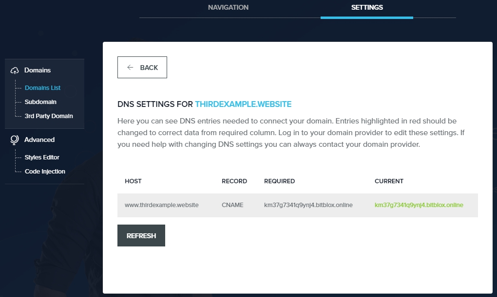

========
Set up your domain with GoDaddy
========

If you purchased a domain from GoDaddy, then you will have to configure your DNS Settings so that your domain points to your landing page.

.. contents::
    :local:
    :backlinks: top

	

1. `Log in to your BitBlox account <https://www.bitblox.me/welcome//>`__ 	
2. In your dashboard, click **Edit Page** on your landing page

     .. class:: screenshot

		|edit-my-landing-page-bitblox|

3. Open the **Side bar** and click the **Settings** icon

     .. class:: screenshot

		|click-settings-bitblox|

4. Click **Settings** tab and then click **3rd Party Domain** tab
 
    .. class:: screenshot

		|click-3rd-party-domain-bitblox|

		
5. In the **Domain Name** box, enter the full domain name you want to link (ex: ``mylandingpage.com``) 
6. Click **Connect Domain** button

    .. class:: screenshot

		|click-connect-domain-bitblox|
		
7. Under the **Required** row, copy the name of your page (ex: ``bitbloxkb-lzj29.bitblox.online``) 

    .. class:: screenshot

		|copy-bitblox-page-name|
		
8. `Log in to your GoDaddy account <https://sso.godaddy.com/?realm=idp&app=mya&path=?ci=>`__
9. In the **Domains** section, click **Manage**

	.. class:: screenshot

		|godaddy-click-manage|
		
10. Select the domain you want to use, click the **Settings** icon, and select **Manage DNS**
	
	.. class:: screenshot

		|godaddy-manage-dns|
		
11. In the **Records** section, click the **Edit** Icon for the CNAME record

	.. class:: screenshot

		|godaddy-manage-cname|

12. In the **Points** to text box, enter the name of your page (ex: ``bitbloxkb-lzj29.bitblox.online``)
13. Click **Save** button

	.. class:: screenshot

		|bitblox-save-cname-record|

14. In the 3rd Party Domain, click **Refresh** button

	.. class:: screenshot

		|click-refresh-bitblox|

15. If your records are entered correctly, then Current Data will be green

	.. class:: screenshot

		|bitblox-green|	

		.. note::

			After you've claimed your domain, it can take up to 48 hours for changes to take effect. If it takes more than 48 hours, you should contact your custom domain provider.

For more help with settings in your GoDaddy account, contact their `support team <https://uk.godaddy.com/help>`__ .

.. |edit-my-landing-page-bitblox| image:: _images/edit-my-landing-page-bitblox.jpg
.. |click-settings-bitblox| image:: _images/click-settings-bitblox.jpg
.. |click-3rd-party-domain-bitblox| image:: _images/click-3rd-party-domain-bitblox.jpg

