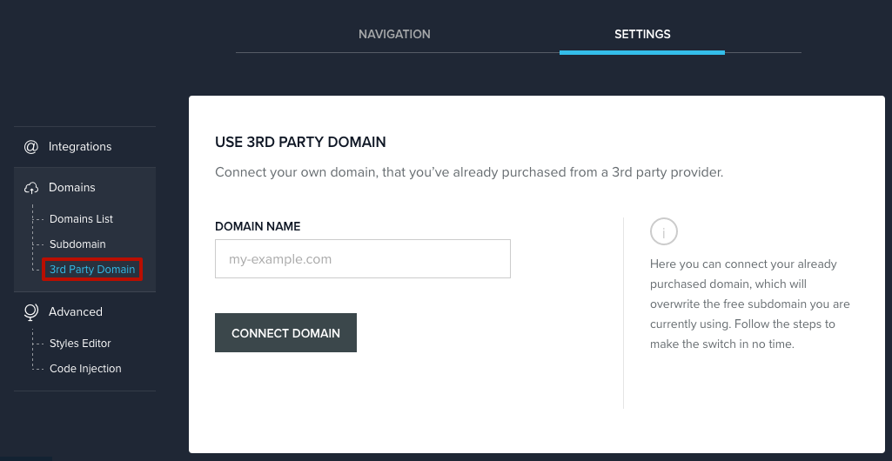
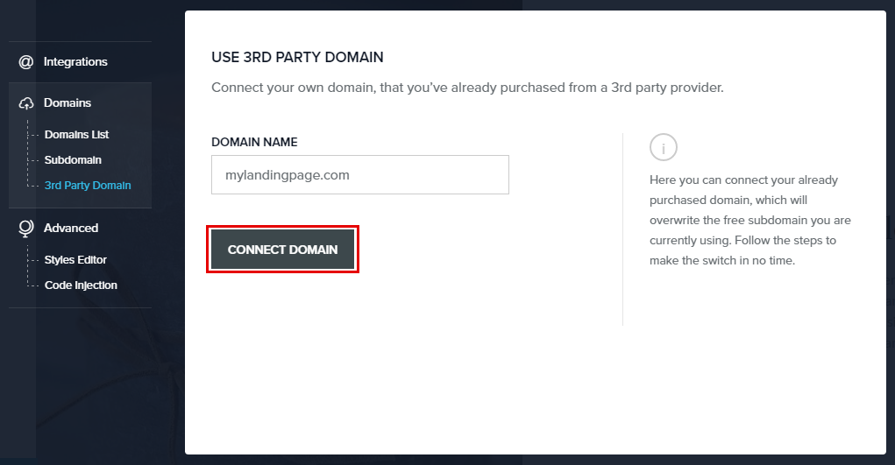
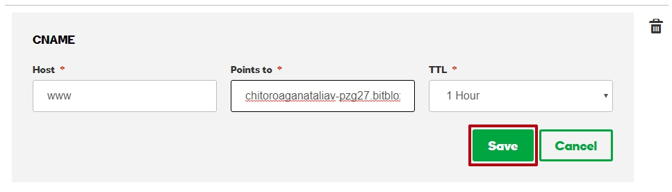
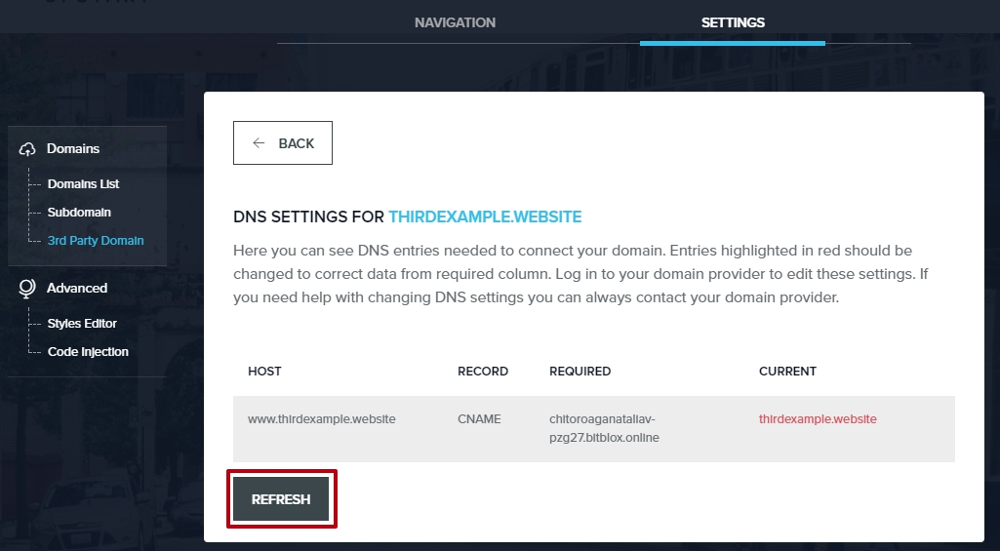

========
Set up your domain with GoDaddy
========

If you purchased a domain from GoDaddy, you can use it for your BitBlox Landing Page by following a process called domain/subdomain mapping. In this process, you’ll change a few settings in your GoDaddy account to tell the subdomain where to point.

.. contents::
    :local:
    :backlinks: top

	
Set up your domain with GoDaddy

1. `Log in to your BitBlox account <https://www.bitblox.me/welcome//>`__ 	
2. In your dashboard, click **Edit Page** on your landing page

     .. class:: screenshot

		|bitblox-click-edit-page|

3. Open the **SideBar** and click the **Settings** icon

     .. class:: screenshot

		|bitblox-click-settings|

4. Click **Settings** tab and then click **3rd Party Domain** tab

    .. class:: screenshot

		|bitblox-click-3-rd-party-domain|

5. In the **Domain Name** box, enter the full domain name you want want to link (ex: ``www.mylandingpage.com``)
and then click Connect Domain button

    .. class:: screenshot

		|bitblox-connect-domain| 
		
6. A new panel will be opened with the records from your provider domain account. Copy the name of your page, under the **REQUIRED** row:

    .. class:: screenshot

		|bitblox-dns-settings|
		
7. `Log in to your GoDaddy account <https://sso.godaddy.com/?realm=idp&app=mya&path=?ci=>`__
8. In the **Domains** section, click **Manage**

	.. class:: screenshot

		|godaddy-click-manage|
		
9. Select the domain you would like to connect and click the **Settings** icon, and select **Manage DNS**
	
	.. class:: screenshot

		|godaddy-manage-dns|
		
10. In the **Records** section, click the **Edit** record Icon for the CNAME record, www host

	.. class:: screenshot

		|godaddy-manage-cname|

11. In the **Points** to text box, enter the name of your page (ex: ``chitoroaganataliav-pzg27.bitblox.online``)
12. Click Save

	.. class:: screenshot

		|godaddy-save-cname|

13. In your BitBlox account, click **Refresh** button on the DNS Settings:

	.. class:: screenshot

		|godaddy-bitblox-refresh|

14. If your records are entered correctly, the Current Data will be green

	.. class:: screenshot

		|bitblox-green|

For more help with settings in your GoDaddy account, contact their `support team <https://uk.godaddy.com/help>`__ .

.. |bitblox-click-edit-page| image:: _images/bitblox-click-edit-page.png
.. |bitblox-click-settings| image:: _images/bitblox-click-settings.png

.. |bitblox-dns-settings| image:: _images/bitblox-dns-settings.png
.. |godaddy-click-manage| image:: _images/godaddy-click-manage.jpg
.. |godaddy-manage-dns| image:: _images/godaddy-manage-dns.jpg
.. |godaddy-manage-cname| image:: _images/godaddy-manage-cname.jpg

.. |bitblox-green| image:: _images/bitblox-green.jpg
