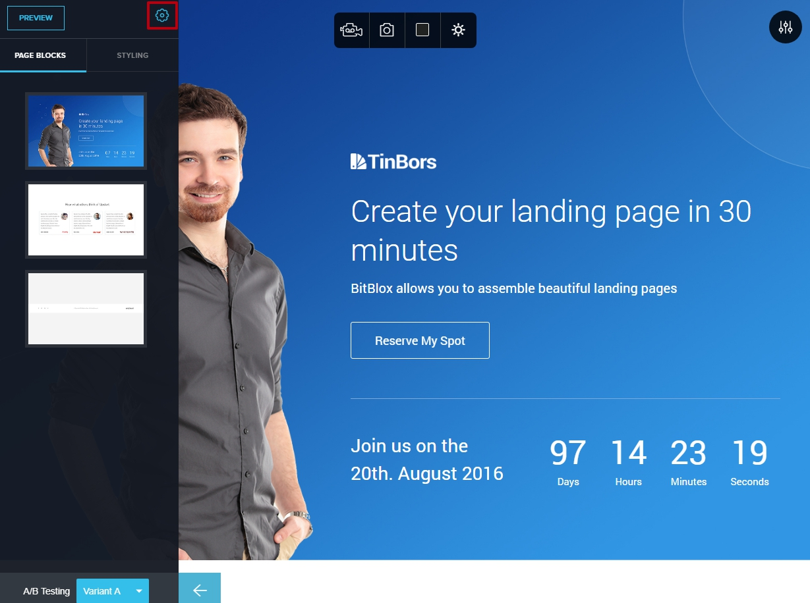

=====================
Set up your domain with Google
=====================

If you purchased a domain from Google, then you will have to configure your DNS Settings so that your domain points to your landing page.

		
.. contents::
    :local:
    :backlinks: top

	

	
1. `Log in to your BitBlox account <https://www.bitblox.me/welcome//>`__ 	
2. In your dashboard, click **Edit Page** on your Landing Page

    .. class:: screenshot

		|edit-my-landing-page-bitblox|
	
	
3. Open the **Side Bar** and click the **Settings** icon

	.. class:: screenshot

		|click-settings-bitblox|

		
4. Click **Settings** tab and then click **3rd Party Domain** tab

		
	.. class:: screenshot

		|click-3rd-party-domain-bitblox|

5. In the **Domain Name** box, enter the full domain name you want to link (ex: ``mylandingpage.com``)
6. Click **Connect Domain** button		
		
		
    .. class:: screenshot

		|click-connect-domain-bitblox|	
		
7. Under the **Required** row, copy the name of your page (ex: ``bitbloxkb-lzj29.bitblox.online``)	
		
			
		
    .. class:: screenshot

		|copy-bitblox-page-name|	

	
8. `In the google domains account <https://domains.google/>`__  click on the **Manage My Domains** section

	.. class:: screenshot

		|google-manage-my-domain|

	

9. Click on the **DNS** tab 

	.. class:: screenshot

		|google-click-dns|

10. Scroll down to the **Synthetic records** section
11. In the **Subdomain** text box enter **@** extension
12. In the **Destination URL** text box, enter your domain name (ex: ``mylandingpage.com``)
13. Select **Permanent redirect (301)** option
14. Click **Add** button

	.. class:: screenshot

		|google-click-add-synthetic-records|

15. Scroll down to the **Custom resource records** section
16. In the **Name** text box, enter the **www** extension
17. In the **Type** drop-down menu, select **CNAME** record
18. In the **Data** text box, enter the name of your page (ex: ``bitbloxkb-lzj29.bitblox.online``) 
19. Click **Add** button	
	
	.. class:: screenshot

		|google-click-add-custom-resource|

19. In the 3rd Party Domain tab, click **Refresh** button 

.. class:: screenshot

		|click-refresh-bitblox|

		
20. If your records are entered correctly, the Current Data will be green

.. class:: screenshot

		|bitblox-green|

		.. note::

			After you've claimed your domain, it can take up to 48 hours for changes to take effect. If it takes more than 48 hours, you should contact your custom domain provider.
		

For more help with 3rd party domain connection,  contact our `support team <https://www.bitblox.me/support>`__ . 

.. |edit-my-landing-page-bitblox| image:: _images/edit-my-landing-page-bitblox.jpg

.. |click-3rd-party-domain-bitblox| image:: _images/click-3rd-party-domain-bitblox.jpg
.. |click-connect-domain-bitblox| image:: _images/click-connect-domain-bitblox.jpg
.. |copy-bitblox-page-name| image:: _images/copy-bitblox-page-name.jpg

.. |click-manage-domain-1and1| image:: _images/click-manage-domain-1and1.jpg

.. |google-click-add-synthetic-records| image:: _images/google-click-add-synthetic-records.jpg

.. |click-refresh-bitblox| image:: _images/click-refresh-bitblox.jpg
.. |bitblox-green| image:: _images/bitblox-green.jpg