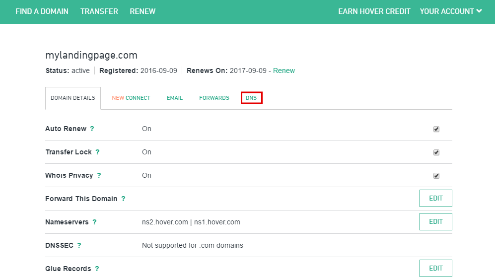
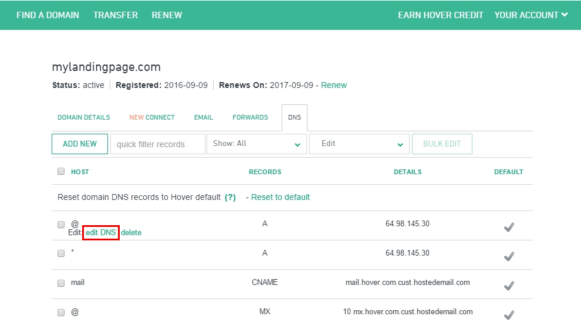
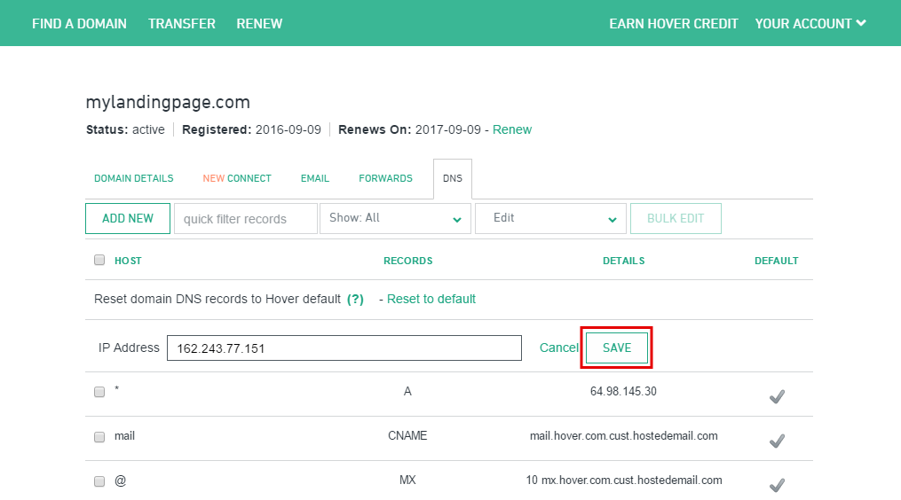
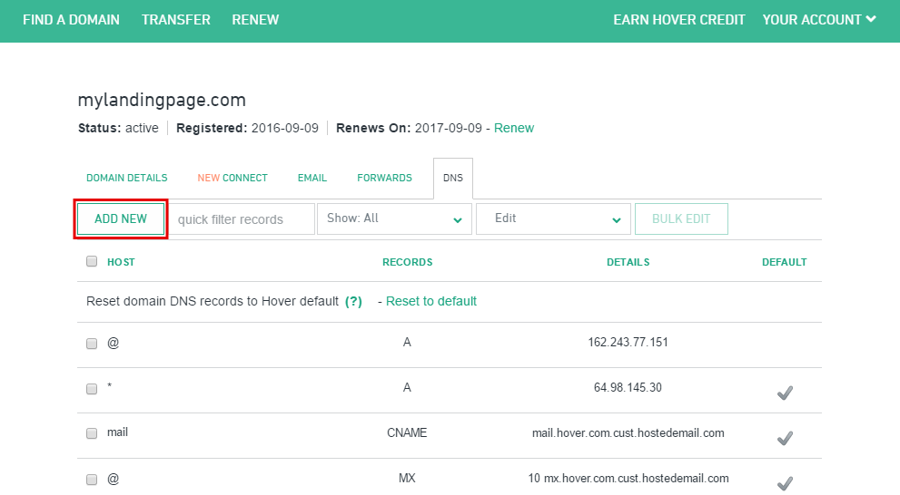
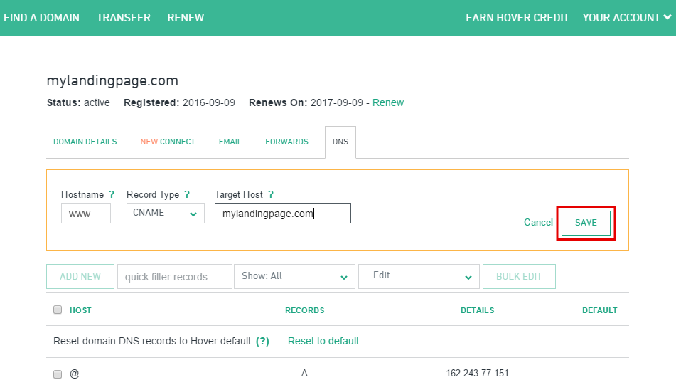
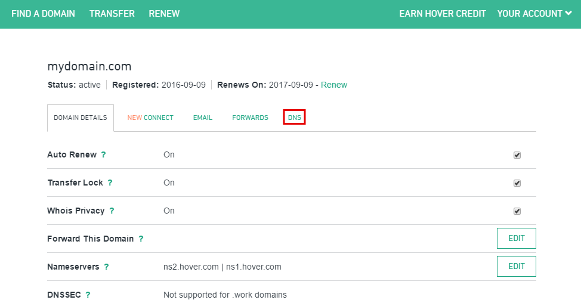
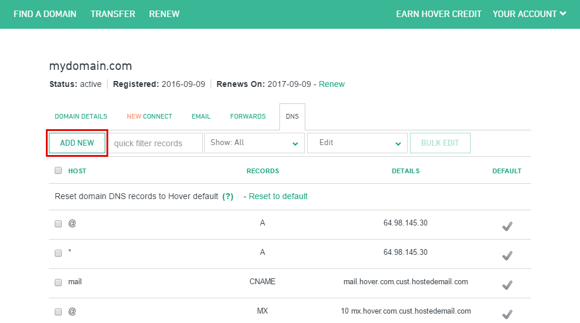
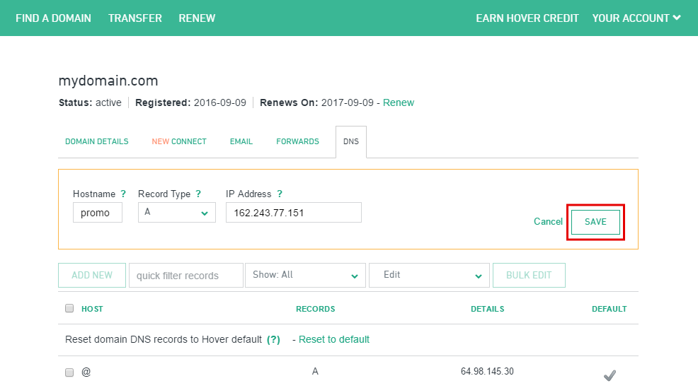

========
Set up your domain with Hover
========

If you purchased a domain from Hover, you can use it for your BitBlox Landing Page by following a process called domain/subdomain mapping. In this process, you'll change a few settings in your Hover account to tell the domain/subdomain where to point.

.. contents::
    :local:
    :backlinks: top

Set up your domain with Hover
------

1. `Log in to your Hover account <https://www.hover.com/signin>`__
2. From the Domains page, click the **DNS** tab 

	.. class:: screenshot

		|hover-click-dns|

3. In the **@** column, click **edit DNS**

	.. class:: screenshot

		|hover-click-edit-dns|

4. In **IP Address** text box, enter BitBlox's IP address ``162.243.77.151`` 
5. Click the **SAVE** button:

	.. class:: screenshot

		|hover-click-save|

6. In the **DNS** tab, click **ADD NEW**

	.. class:: screenshot
  
        |hover-click-add-new-cname|

		
		
7. In the **Hostname** text box, enter ``www``
8. In the **Record Type** text box, enter **CNAME**
9. In the **Target Host** text box, enter your domain name (ex: ``mylandingpage.com``)
10. Click the **SAVE** button:

	.. class:: screenshot

		|hover-click-save-cname|

11. Claim your custom domain in BitBlox [LINK]

    .. note::

		After you've claimed your domain, it can take up to 48 hours for changes to take effect. If it takes more than 48 hours, you should contact your custom domain provider.

Set up your subdomain with Hover
------

1. `Log in to your Hover account <https://www.hover.com/signin>`__
2.  From the Domains page, click the **DNS** tab

	.. class:: screenshot

		|hover-click-dns-subdomain|

3. In the **DNS** tab, click **ADD NEW**

	.. class:: screenshot

		|hover-click-add-new-subdomain|

		
				
4. In the **Hostname** text box, enter your subdomain prefix (if you picked ``promo.mydomain.com`` as your subdomain, enter ``promo``)
5. In the **Record Type** text box, enter **A**
6. In the **IP Address** text box, enter BitBlox's IP address ``162.243.77.151``
7. Click the **SAVE** button:

	.. class:: screenshot

		|h v over-click-save-subdomain|

8. Claim your custom domain in BitBlox [LINK]

.. note::

	After you've claimed your domain, it can take up to 48 hours for changes to take effect. If it takes more than 48 hours, you should contact your custom domain provider.

Getting more help
------

For more help with settings in your Hover account, contact their `support team <https://help.hover.com/hc/en-us>`__ .

