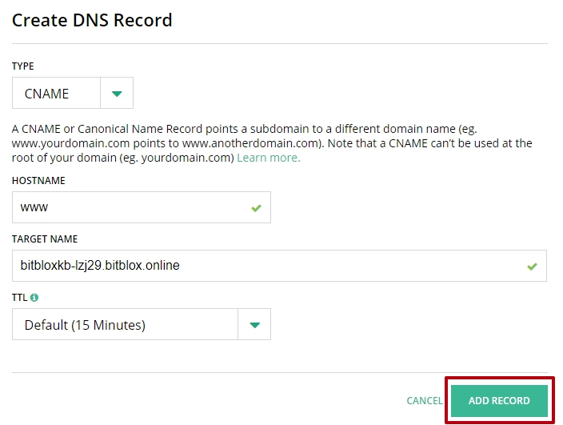
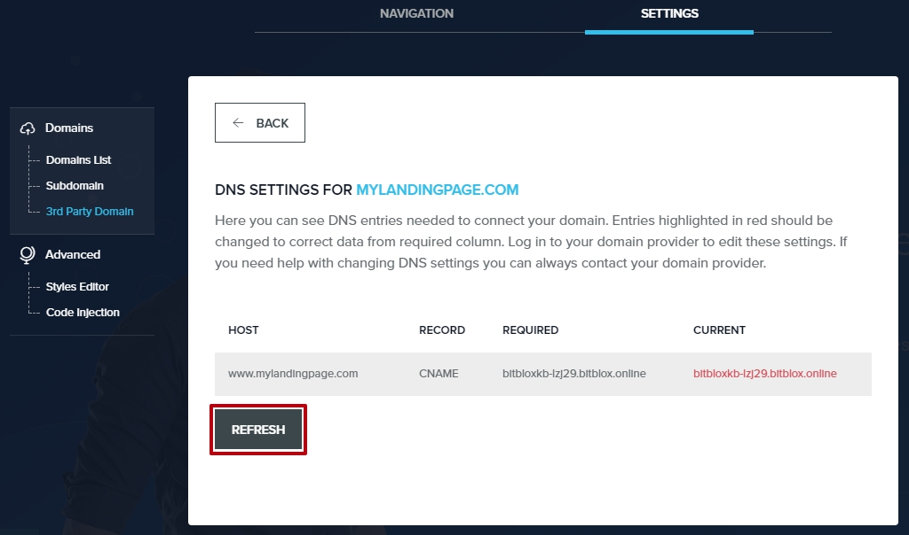

========
Set up your domain with Hover
========

If you purchased a domain from Hover, you can use it for your BitBlox Landing Page by following a process called domain/subdomain mapping. In this process, you'll change a few settings in your Hover account to tell the domain/subdomain where to point.

.. contents::
    :local:
    :backlinks: top

	

1. `Log in to your BitBlox account <https://www.bitblox.me/welcome//>`__ 	
2. In your dashboard, click **Edit Page** on your Landing Page

    .. class:: screenshot

		|edit-my-landing-page-bitblox|
	
	
3. Open the **Side Bar** and click the **Settings** icon

	.. class:: screenshot

		|click-settings-bitblox|

		
4. Click **Settings** tab and then click **3rd Party Domain** tab

		
	.. class:: screenshot

		|click-3rd-party-domain-bitblox|

5. In the **Domain Name** box, enter the full domain name you want to link (ex: ``mylandingpage.com``)
6. Click **Connect Domain** button		
		
		
    .. class:: screenshot

		|click-connect-domain-bitblox|	
		
7. A new panel will be opened with the records from your provider domain account. Copy the name of your page (ex: ``bitbloxkb-lzj29.bitblox.online``) under the **required** row		
		
			
		
    .. class:: screenshot

		|copy-bitblox-page-name|	
	
	
	
8. `Log in to your Hover account <https://www.hover.com/signin>`__	

9. From **Your  Account** drop-down menu, select **Domains**
10. From the right corner tab, select **DNS** tab

11. Click **Add a Record**
	
	
    .. class:: screenshot

		|hover-add-a-record|		

		
12. In the **Type** drop-down menu, select **CNAME** record
13. In the **Hostname** text box, enter **www** prefix
14. In the **Target Name** enter the name of your page (ex: ``bitbloxkb-lzj29.bitblox.online``)
15. Click **Add Record** Button
	
    .. class:: screenshot

		|hover-save-button|	
	
	
	
16. In your BitBlox account, click **Refresh** button in the DNS Settings

	.. class:: screenshot

		|click-refresh-bitblox|

17. If your records are entered correctly, the Current Data will be green   
	
	
	.. class:: screenshot

		|bitblox-green|	
	
	
	
	.. note::

	After you've claimed your domain, it can take up to 48 hours for changes to take effect. If it takes more than 48 hours, you should contact your custom domain provider.
		

For more help with 3rd party domain connection,  contact our `support team <https://www.bitblox.me/support>`__ . 	

	
.. |edit-my-landing-page-bitblox| image:: _images/edit-my-landing-page-bitblox.jpg
.. |click-settings-bitblox| image:: _images/click-settings-bitblox.jpg
.. |click-3rd-party-domain-bitblox| image:: _images/click-3rd-party-domain-bitblox.jpg
.. |click-connect-domain-bitblox| image:: _images/click-connect-domain-bitblox.jpg
.. |copy-bitblox-page-name| image:: _images/copy-bitblox-page-name.jpg	

	
.. |hover-add-a-record| image:: _images/add-a-record.jpg

.. |bitblox-green|	image:: _images/bitblox-green.jpg
		
	