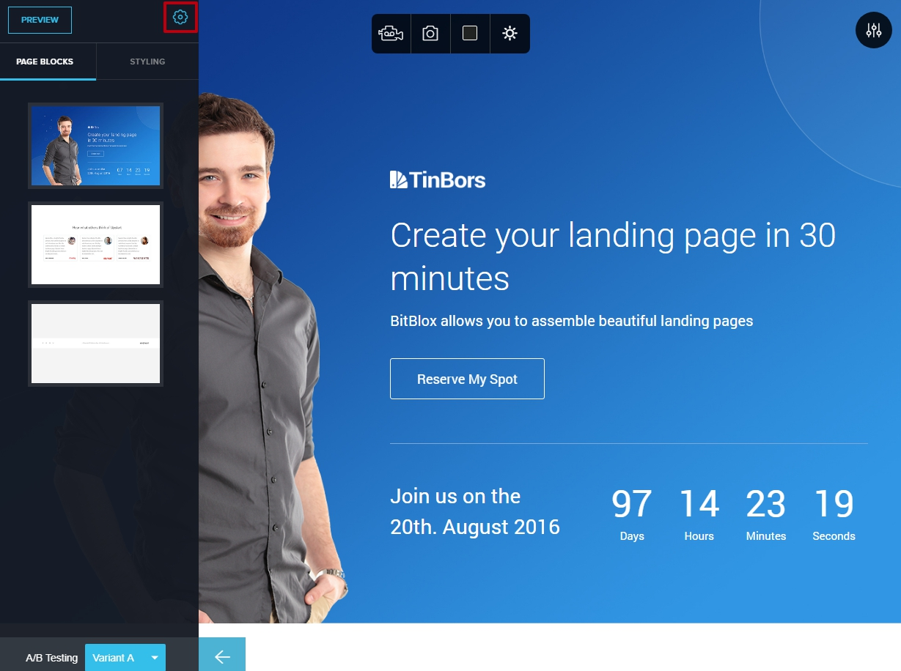
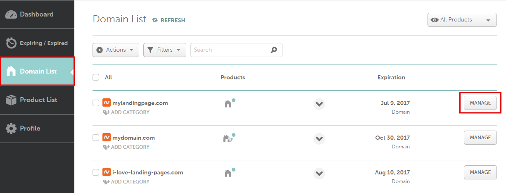
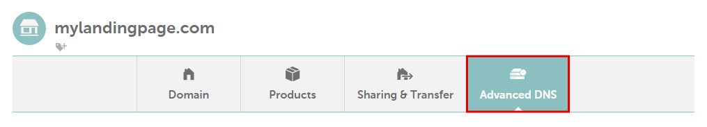
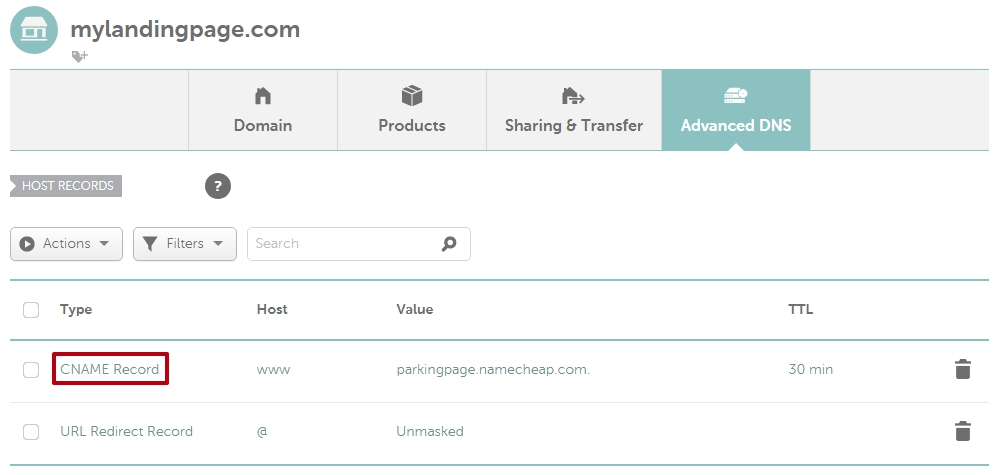
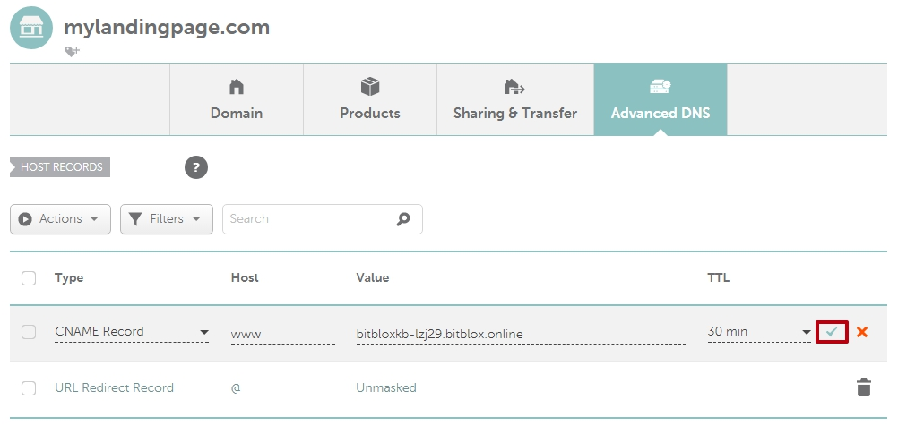
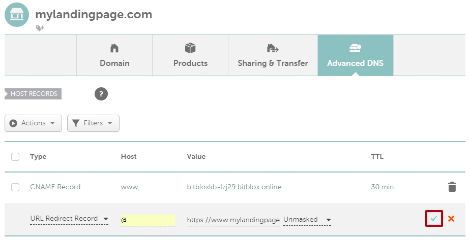

========
Set up your domain with Namecheap
========

If you purchased a domain from Namecheap, then you will have to configure your DNS Settings so that your domain points to your landing page.

.. contents::
    :local:
    :backlinks: top

1. `Log in to your BitBlox account <https://www.bitblox.me/welcome//>`__ 	
2. In your dashboard, click **Edit Page** on your Landing Page

    .. class:: screenshot

		|edit-my-landing-page-bitblox|
	
	
3. Open the **Side Bar** and click the **Settings** icon

	.. class:: screenshot

		|click-settings-bitblox|

		
4. Click **Settings** tab and then click **3rd Party Domain** tab

		
	.. class:: screenshot

		|click-3rd-party-domain-bitblox|

5. In the **Domain Name** box, enter the full domain name you want to link (ex: ``mylandingpage.com``)
6. Click **Connect Domain** button		
		
		
    .. class:: screenshot

		|click-connect-domain-bitblox|	
		
7. Under the **Required** row, copy the name of your page (ex: ``bitbloxkb-lzj29.bitblox.online``)
		
			
		
    .. class:: screenshot

		|copy-bitblox-page-name|		
	
	
	
8. `Log in to your Namecheap account <https://namecheap.com/myaccount/login.aspx>`__	
	
9. Click **Domain list** tab, and then click **Manage** next to your domain name

	.. class:: screenshot

		|namecheap-manage-dns|	
	

10. On the domain **Details** page, click **Advanced DNS**

	.. class:: screenshot

		|namecheap-dns-panel|

11. In the **Type** column, click **CNAME Record**:

	.. class:: screenshot

		|namecheap-click-cname-record|

		
		
12. In the **Host** text box, enter **www** extension		
13. In the **Value** text box, enter your domain name (ex: ``bitbloxkb-lzj29.bitblox.online``)	
14. Click the **Save Changes** icon

	.. class:: screenshot

		|namecheap-click-save|

15. In the **Type** column, click **URL Redirect Record**
16. In the **Host** text box, enter **@** prefix
17. In the **Value** text box, enter the url of your page (ex: ``https://mylandingpage.com``)
18. Click the **Save Changes** icon

	.. class:: screenshot

		|namecheap-click-save-url|

		
19. In the 3rd Party Domain, click **Refresh** button

	.. class:: screenshot

		|click-refresh-bitblox|

16. If your records are entered correctly, then Current Data will be green   
	
	
	.. class:: screenshot

		|bitblox-green|	

		.. note::

			After you've claimed your domain, it can take up to 48 hours for changes to take effect. If it takes more than 48 hours, you should contact your custom domain provider.

	
	
	

For more help with 3rd party domain connection,  contact our `support team <https://www.bitblox.me/support>`__ . 

.. |edit-my-landing-page-bitblox| image:: _images/edit-my-landing-page-bitblox.jpg

.. |click-3rd-party-domain-bitblox| image:: _images/click-3rd-party-domain-bitblox.jpg
.. |click-connect-domain-bitblox| image:: _images/click-connect-domain-bitblox.jpg
.. |copy-bitblox-page-name| image:: _images/copy-bitblox-page-name.jpg

.. |click-refresh-bitblox| image:: _images/click-refresh-bitblox.jpg
.. |bitblox-green|	image:: _images/bitblox-green.jpg	