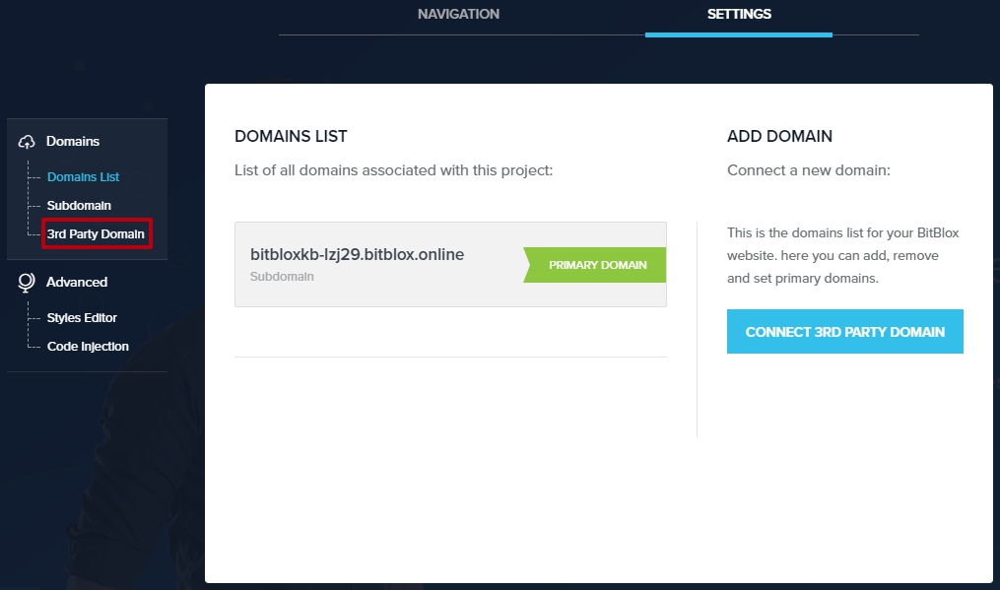
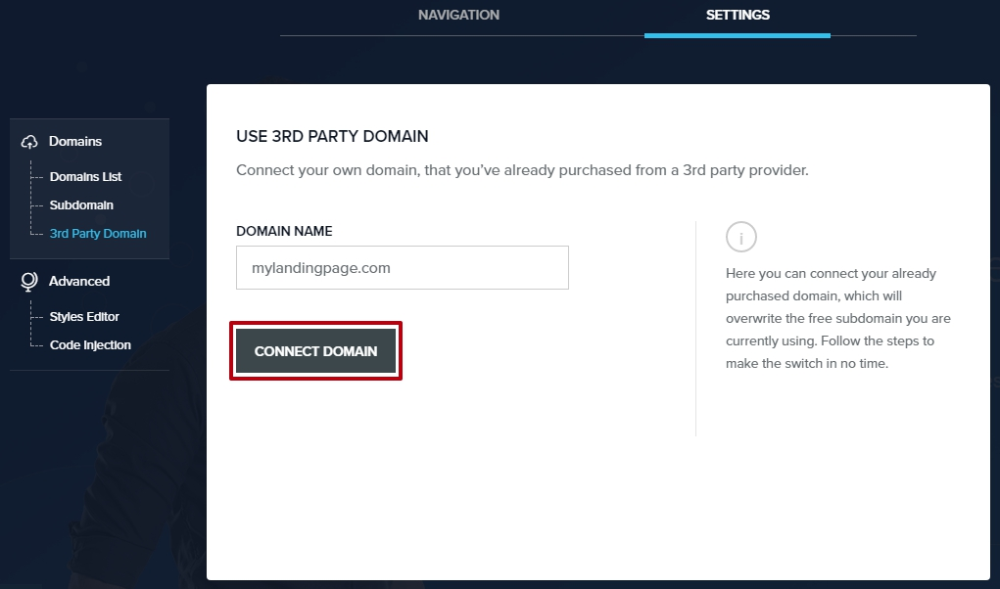
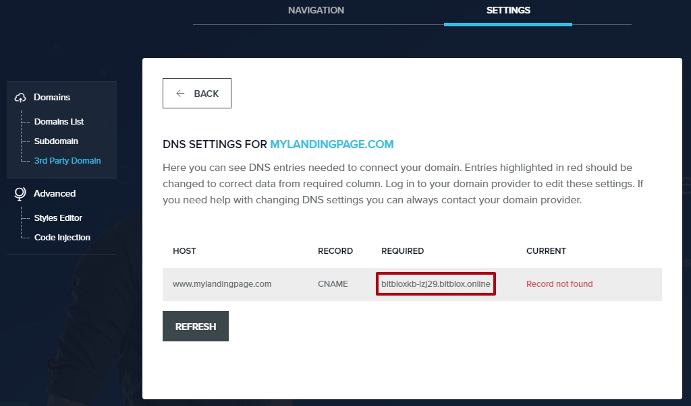
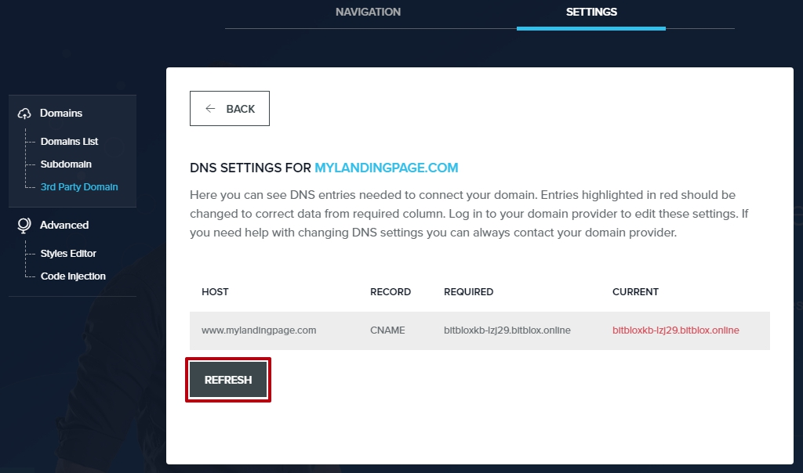
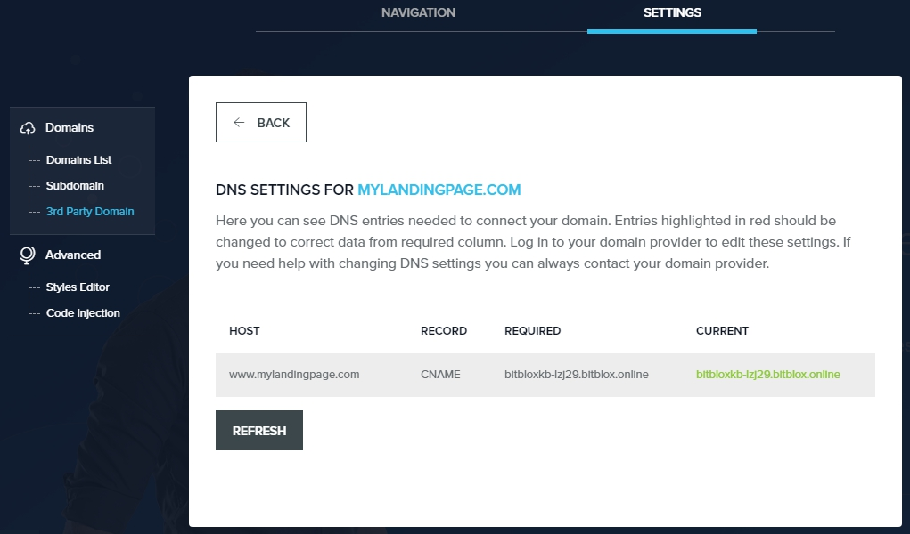

========
Set up your domain with Namecheap
========

If you purchased a domain from Namecheap, you can use it for your BitBlox Landing Page by following a process called domain/subdomain mapping. In this process, you'll change a few settings in your Namecheap account to tell the domain/subdomain where to point.

.. contents::
    :local:
    :backlinks: top

1. `Log in to your BitBlox account <https://www.bitblox.me/welcome//>`__ 	
2. In your dashboard, click **Edit Page** on your Landing Page

    .. class:: screenshot

		|edit-my-landing-page-bitblox|
	
	
3. Open the **Side Bar** and click the **Settings** icon

	.. class:: screenshot

		|click-settings-bitblox|

		
4. Click **Settings** tab and then click **3rd Party Domain** tab

		
	.. class:: screenshot

		|click-3rd-party-domain-bitblox|

5. In the **Domain Name** box, enter the full domain name you want to link (ex: ``mylandingpage.com``)
6. Click **Connect Domain** button		
		
		
    .. class:: screenshot

		|click-connect-domain-bitblox|	
		
7. A new panel will be opened with the records from your provider domain account. Copy the name of your page (ex: ``bitbloxkb-lzj29.bitblox.online``) under the **required** row		
		
			
		
    .. class:: screenshot

		|copy-bitblox-page-name|		
	
	
	
8. `Log in to your Namecheap account <https://namecheap.com/myaccount/login.aspx>`__	
	
9. Click **Domain list** tab, and then click **Manage** next to your domain name

	.. class:: screenshot

		|namecheap-manage-dns|	
	

10. On the domain **Details** page, click **Advanced DNS**

	.. class:: screenshot

		|namecheap-dns-panel|

11. In the **Type** column, click **CNAME Record**:

	.. class:: screenshot

		|namecheap-click-cname-record|

		
		
		
		
		
		
		
		
		
10. In the **Value** text box, enter your domain name (ex: ``mylandingpage.com``)
11. Click the **Save Changes** icon

	.. class:: screenshot

		|namecheap-cname-record-save|

12. Next to the **URL Redirect Record** click on the trashcan icon		
		
		
    .. class:: screenshot	
		
		|namecheap-remove-url-records|
		
13. In your BitBlox account, click **Edit Page** on your landing page 

     .. class:: screenshot

		|bitblox-click-edit-page|

		
		
14. Open the **Sidebar** and click the **Settings** icon

     .. class:: screenshot

		|bitblox-click-settings|

15. Click **Settings** tab and then click **3rd Party Domain** tab

    .. class:: screenshot

		|bitblox-click-3-rd-party-domain|

16. In the **Domain Name** box enter the full domain name you want to link (ex: ``mylandingpage.com``) and then click **Connect Domain** button

    .. class:: screenshot
 
		|bitblox-connect-domain|
    
17. After you've claimed your domain, a new panel will be opened with the records from your provider domain account (it can take upt o 48 hours for changes to take effect)

	
    .. class:: screenshot

		|bitblox-dns-settings|
	
18. If your records are entered correctly, the **Current Data** will be green

    .. class:: screenshot

		|bitblox-click-refresh|

    .. note::

		After you've claimed your domain, it can take up to 48 hours for changes to take effect. If it takes more than 48 hours, you should contact your custom domain provider.

Set up your subdomain with Namecheap
------

1. `Log in to your Namecheap account <https://namecheap.com/myaccount/login.aspx>`__
2. Click **Domain list** tab and then click **Manage** next to your domain name

	.. class:: screenshot

		|namecheap-manage-dns-subdomain|

3. On the domain **Details** page, click **Advanced DNS**

	.. class:: screenshot

		|namecheap-dns-panel-subdomain|

4. Click **Add new record**

	.. class:: screenshot

		|namecheap-add-new-record-subdomain|

5. In the **Type** column, use the drop-down menu to select **A Record**
6. In the **Host** text box, enter your subdomain prefix (if you picked ``promo.mydomain.com`` as your subdomain, enter ``promo``)
7. In the **Value** text box , enter BitBlox's IP address ``162.243.77.151``
8. Click the **Save Changes** icon

	.. class:: screenshot

		|namecheap-a-record-save-subdomain|

9. Next to the **URL Redirect Record** click on the trashcan icon		
		
		
    .. class:: screenshot	
		
		|namecheap-remove-url-records-subdomain|
			
		
10. In your BitBlox account, click **Edit Page** on your landing page. 

    .. class:: screenshot

		|bitblox-click-edit-page|

11. Open the **Sidebar** and click the **Settings** icon

    .. class:: screenshot

		|bitblox-click-settings|		
		
12. Click **Settings** tab and then click **3rd Party Domain** tab

    .. class:: screenshot

		|bitblox-click-3-rd-party-domain|

13. In the **Domain Name** box enter the full domain name you want to link (ex: ``promo.mydomain.com``), and then click **Connect Domain** button

    .. class:: screenshot

		|bitblox-subdomain-click-connect-domain|
    
14. After you've claimed your domain, a new panel will be opened with the records from your provider domain account (it can take upt o 48 hours for changes to take effect)

	
    .. class:: screenshot

		|bitblox-subdomain-dns-settings|
	
15. If your records are entered correctly, the **Current Data** will be green

    .. class:: screenshot

		|bitblox-subdomain-refresh|

.. note::

	After you've claimed your domain, it can take up to 48 hours for changes to take effect. If it takes more than 48 hours, you should contact your custom domain provider.

For more help with settings in your Namecheap account, contact their `support team <https://www.namecheap.com/support.aspx>`__ .

.. |edit-my-landing-page-bitblox| image:: _images/edit-my-landing-page-bitblox.jpg
.. |click-settings-bitblox| image:: _images/click-settings-bitblox.jpg

.. |namecheap-manage-dns| image:: _images/namecheap-manage-dns.png

.. |namecheap-click-cname-record| image:: _images/namecheap-click-cname-record.jpg

