========
Set up your domain with Register.com
========

If you purchased a domain from Register.com, you can use it for your BitBlox Landing Page by following a process called domain/subdomain mapping. In this process, you'll change a few settings in your Register.com account to tell the domain/subdomain where to point.

		
.. contents::
    :local:
    :backlinks: top

	
Set up your domain with Register.com 
------

1. `Log in to your Register.com account <https://www.register.com/myaccount/productdisplay.rcmx/>`__ 
2.  Click **Account Manager**, then click **Domains** 

    .. class:: screenshot

		|registercom-select-domain|
		
3. From the drop-down menu, select **Manage**

    .. class:: screenshot

		|registercom-select-manage|
		
4. Click **Manage** for the domain your want to use

    .. class:: screenshot

		|registercom-select-manage-domain|

5. Scroll down to **Advanced Technical Settings**, click **Edit IP Address Records** 

	.. class:: screenshot

		|registercom-edit-a-record|

6. In the first row, add ``@`` to the left of your domain
7. In the right of **points to** , enter BitBlox's IP address ``162.243.77.151`` 
8. Click **Continue**

    .. class:: screenshot
	
	    |registercom-enter-a-record|
		
9. Click **Continue**
   
    .. class:: screenshot
	
	    |registercom-enter-continue|
		

10. Scroll down to **Advanced Technical Settings**, click **Edit Domain Aliases Records**

    .. class:: screenshot
	
	    |registercom-select-cname|

11. In the box to left of your domain name, enter **www** 
12. In the box to right of **points to**, enter you domain name (ex: ``mylandingpage.com``) 
13. Click **Continue**

    .. class:: screenshot

		|registercom-enter-cname-record|

14. Click **Continue**

	.. class:: screenshot

		|registercom-click-continue-cnam|

		
	
15. In your BitBlox account, click **Edit Page** on your landing page. 

    .. class:: screenshot

		|bitblox-click-edit-page|

		
		
16. Open the **Sidebar** and click the **Settings** icon

    .. class:: screenshot

		|bitblox-click-settings|

17. Click **Settings** tab and then click **3rd Party Domain** tab

    .. class:: screenshot

		|bitblox-click-3-rd-party-domain|

18. In the **Domain Name** box enter the full domain name you want to link (ex: ``mylandingpage.com``) and then click **Connect Domain** button

    .. class:: screenshot
 
		|bitblox-connect-domain|
    
19. After you've claimed your domain, a new panel will be opened with the records from your provider domain account (it can take upt o 48 hours for changes to take effect)

	
    .. class:: screenshot

		|bitblox-dns-settings|
	
20. If your records are entered correctly, the **Current Data** will be green

    .. class:: screenshot

		|bitblox-click-refresh|

    .. note::

		After you've claimed your domain, it can take up to 48 hours for changes to take effect. If it takes more than 48 hours, you should contact your custom domain provider.

		

Set up your subdomain with Register.com
------

1. `Log in to your Register.com account <https://www.register.com/myaccount/productdisplay.rcmx/>`__ 
2.  Click **Account Manager**, then click **Domains** 

	.. class:: screenshot

		|registercom-select-domain|
		

3. From the drop-down menu, select **Manage**

    .. class:: screenshot

		|registercom-select-manage|

4. Click **Manage** for the domain your want to use

    .. class:: screenshot

		|registercom-select-subdomain|

5. Scroll down to **Advanced Technical Settings**. click **Edit IP Address Records**

    .. class:: screenshot

		|registercom-edit-a-record|

6. In the first row,  enter your subdomain prefix (if you picked ``promo.mydomain.com`` as your sudomain, enter ``promo``)
7. In the right of **points to** box, add BitBlox's IP address ``162.243.77.151`` 
8. Click **Continue**
	
	.. class:: screenshot

		|registercom-enter-a-subdomain|	

9. Click **Continue**
	
	.. class:: screenshot

		|registercom-click-continue-subdomain|		
		
		
10. In your BitBlox account, click **Edit Page** on your landing page 

    .. class:: screenshot

		|bitblox-click-edit-page|

11. Open the **Sidebar** and click the **Settings** icon

    .. class:: screenshot

		|bitblox-click-settings|		
		
12. Click **Settings** tab and then click **3rd Party Domain** tab

    .. class:: screenshot

		|bitblox-click-3-rd-party-domain|

13. In the **Domain Name** box enter the full domain name you want to link (ex: ``promo.mydomain.com``), and then click **Connect Domain** button

    .. class:: screenshot

		|bitblox-subdomain-click-connect-domain|
    
14. After you've claimed your domain, a new panel will be opened with the records from your provider domain account (it can take upt o 48 hours for changes to take effect)

	
    .. class:: screenshot

		|bitblox-subdomain-dns-settings|
	
15. If your records are entered correctly, the **Current Data** will be green

    .. class:: screenshot

		|bitblox-subdomain-refresh|

    .. note::

	After you've claimed your domain, it can take up to 48 hours for changes to take effect. If it takes more than 48 hours, you should contact your custom domain provider
		

Getting more help
------

For more help with settings in your Register.com account, contact their `support team <https://www.register.com/customersupport/index.rcmx>`__ . 

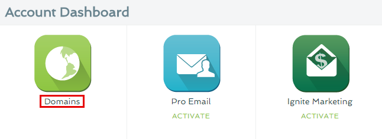
.. |registercom-select-manage| image:: _images/registercom-select-manage.png
.. |registercom-select-manage-domain| image:: _images/registercom-select-manage-domain.png
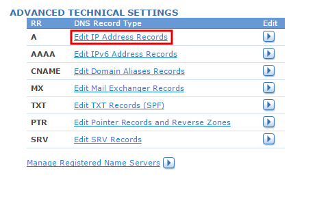
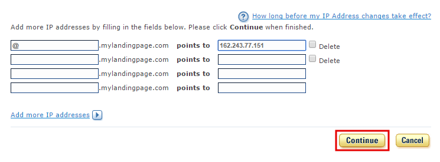
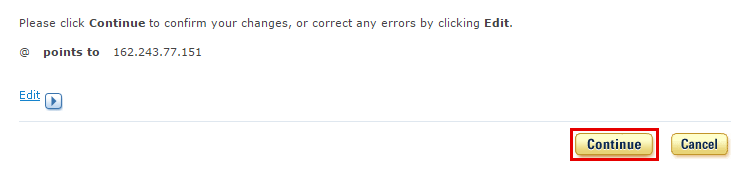
.. |registercom-select-cname| image:: _images/registercom-select-cname.png
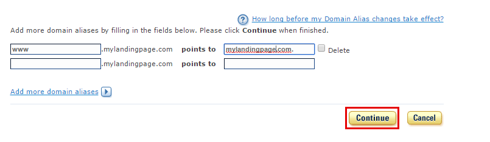
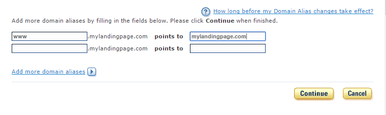
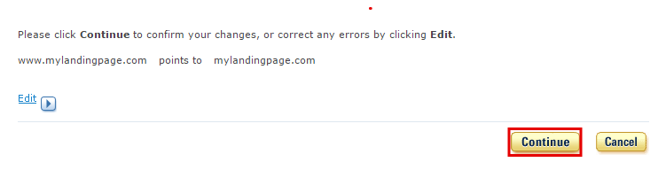
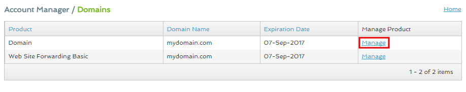
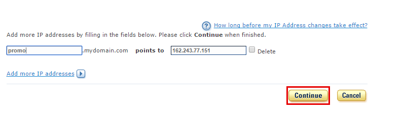
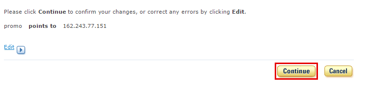

.. |bitblox-click-3-rd-party-domain| image:: _images/bitblox-click-3-rd-party-domain.png
.. |bitblox-subdomain-click-connect-domain| image:: _images/bitblox-subdomain-click-connect-domain.png
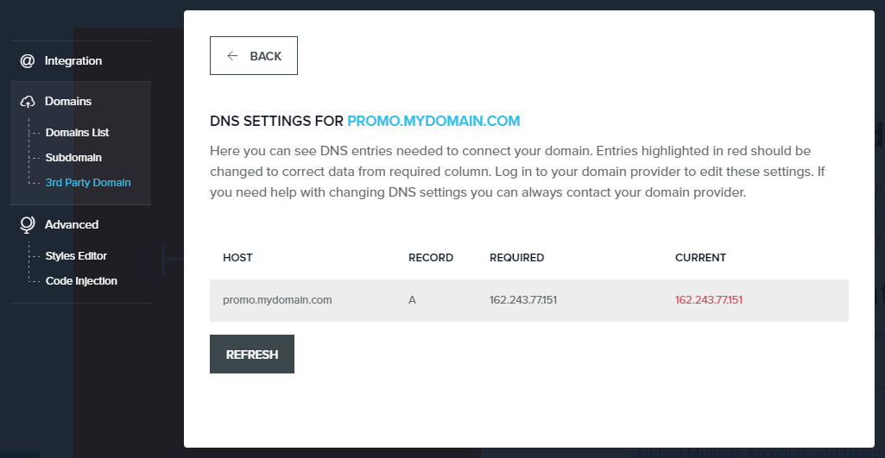
.. |bitblox-click-edit-page| image:: _images/bitblox-click-edit-page.png
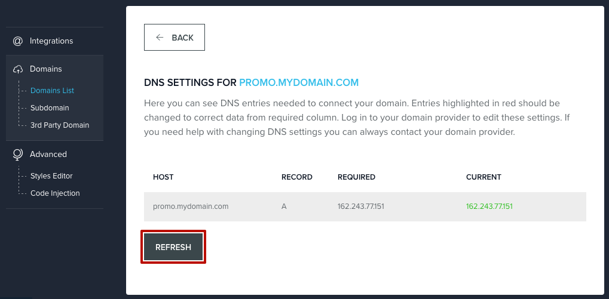
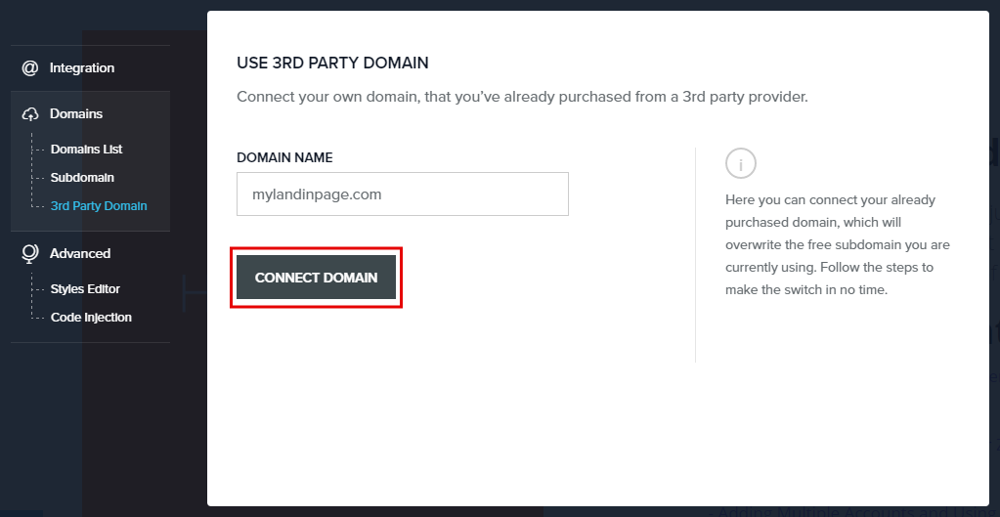
.. |bitblox-dns-settings| image:: _images/bitblox-dns-settings.png
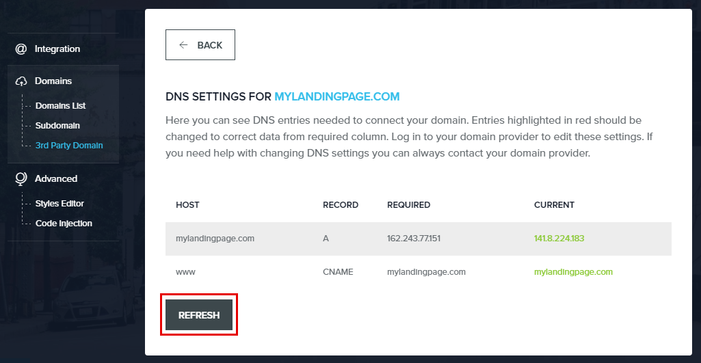
.. |bitblox-click-settings| image:: _images/bitblox-click-settings.jpg