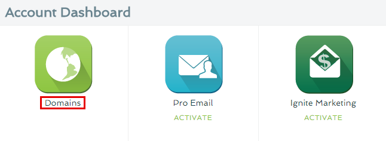

========
Set up your domain with Register.com
========

If you purchased a domain from Register.com, then you will have to configure your DNS Settings so that your domain points to your landing page.

		
.. contents::
    :local:
    :backlinks: top

	
1. `Log in to your BitBlox account <https://www.bitblox.me/welcome//>`__ 		
2. In your dashboard, click **Edit Page** to your landing page

    .. class:: screenshot

		|edit-my-landing-page-bitblox|

3. 	Open the **Side bar** and click **Settings** icon
	
	
    .. class:: screenshot

		|click-settings-bitblox|
	
	
4. Click **Settings** tab and then click **3rd Party Domain** tab

    .. class:: screenshot

		|click-3rd-party-domain-bitblox|

5. In the **Domain Name** box enter the full domain name you want to link (ex: ``mylandingpage.com``) 
6. Click **Connect Domain** button

    .. class:: screenshot
 
		|click-connect-domain-bitblox|		
	
7. Under the **Required** row, copy the name of your page (ex: ``bitbloxkb-lzj29.bitblox.online``)	
	
    .. class:: screenshot

		|copy-bitblox-page-name|

8. `Log in to your Register.com account <https://www.register.com/myaccount/productdisplay.rcmx/>`__ 		

9.  Click **Account Manager**, then click **Domains** 

    .. class:: screenshot

		|registercom-select-domain|
		
10. From the drop-down menu, select **Manage**

    .. class:: screenshot

		|registercom-select-manage|
		
11. Click **Manage** for the domain your want to use

    .. class:: screenshot

		|registercom-select-manage-domain|

12. Scroll down to **Advanced Technical Settings**, click **Edit Domain Aliases Records** 

	.. class:: screenshot

		|registercom-select-cname|

		
13. In the first row, enter **www** extension
14. In the right ot **points to** , enter the name of your page	(ex: ``bitbloxkb-lzj29.bitblox.online``)
15. Click on **Continue** button	
		
		
	.. class:: screenshot

		|edit-cname-register|
	
	
16. In the 3rd Party Domain tab, click **Refresh** button 

	.. class:: screenshot

		|click-refresh-bitblox|

		
17. If your records are entered correctly, the Current Data will be green

	.. class:: screenshot

		|bitblox-green|

		.. note::

			After you've claimed your domain, it can take up to 48 hours for changes to take effect. If it takes more than 48 hours, you should contact your custom domain provider.
			

	
.. |edit-my-landing-page-bitblox| image:: _images/edit-my-landing-page-bitblox.jpg
.. |click-settings-bitblox| image:: _images/click-settings-bitblox.jpg
.. |click-3rd-party-domain-bitblox| image:: _images/click-3rd-party-domain-bitblox.jpg
.. |click-connect-domain-bitblox| image:: _images/click-connect-domain-bitblox.jpg
.. |copy-bitblox-page-name| image:: _images/copy-bitblox-page-name.jpg

.. |bitblox-green| image:: _images/bitblox-green.jpg
